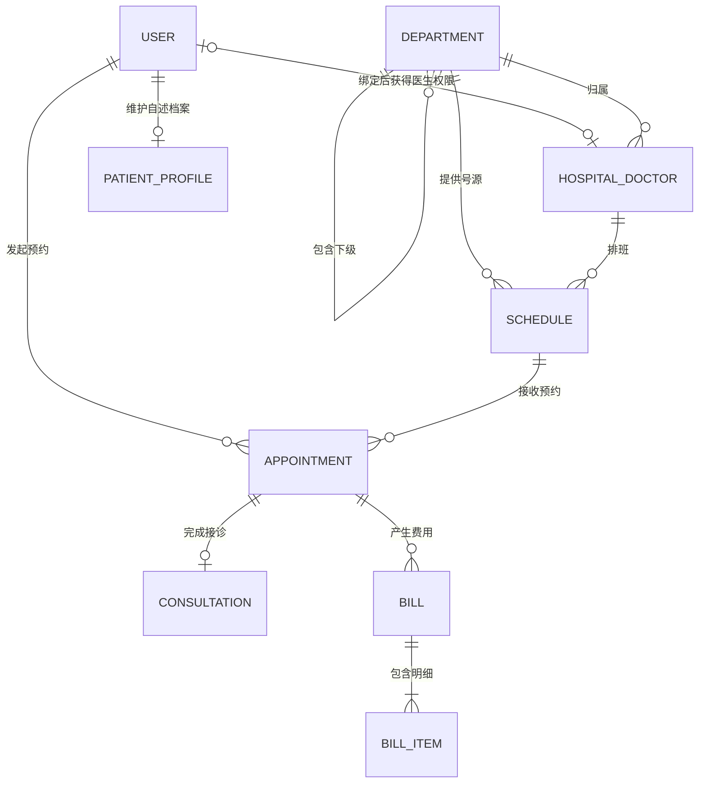

# 校医院模块数据字典

> 对应 Epic：[#4 医院模块：医生排班与预约](https://github.com/qlaxyy/JAVA-Campus-software/issues/4)
>
> 状态：医院现有业务数据已接入 Access；诊疗记录、检查单、文字报告及四条临床状态事务已实现
>
> 初版日期：2026-08-26；本次修订：2026-09-05

## 1. 文档用途和边界

本文档定义医院模块拥有的数据表、字段、关系、状态、索引、约束和虚构演示数据。医生申请、医生档案、科室、排班/号源、预约、诊疗轮次、挂号账单、患者自述档案、诊疗记录、检查单和文字检查报告均由 Access 保存。运行期不再同步内存影子，内存 Repository 仅在初始化时提供缺失的虚构种子数据。

医院科室、医生、排班、预约和诊疗数据已经接入服务器统一的 Access 数据库。运行数据库仍不提交 Git，由停服后的重建命令生成。

医院模块允许引用公共用户的稳定 `userId`，但不复制或更新用户模块的账号、密码、姓名和角色数据。所有健康档案和诊疗文本都只能使用明确标记的虚构演示内容；公开仓库不保存真实病历、处方、联系方式或支付隐私。

## 2. 零基础概念说明

### 2.1 表、行和字段

数据库中的表类似有严格规则的表格：

```text
tblHospitalDepartment
┌──────────────┬────────────────┬────────┐
│ departmentId │ departmentName │ status │  ← 字段/列
├──────────────┼────────────────┼────────┤
│ DEP-001      │ 内科           │ ACTIVE │  ← 一行记录
│ DEP-002      │ 外科           │ ACTIVE │
└──────────────┴────────────────┴────────┘
```

- 表：保存同一类数据，例如全部科室。
- 字段/列：描述这一类数据有哪些属性，例如科室名称。
- 行/记录：一个具体对象，例如“内科”这一条科室记录。
- 数据类型：限制字段能保存什么，例如文本、整数或日期时间。

### 2.2 主键

主键是每一行独一无二的标识。医生档案直接使用全局 `userId` 作为主键，因此即使姓名相同也不会混淆：

```text
U-DOCTOR-001  张医生
U-DOCTOR-002  张医生
```

程序使用 ID 找记录，不依赖可能重复或变化的显示名称。

### 2.3 外键

外键用一个表中的 ID 引用另一个表。例如医生记录中的 `departmentId = DEP-001` 表示该医生属于内科：

```text
tblHospitalDepartment.departmentId
               ↑
               └── tblHospitalDoctor.departmentId
```

外键防止出现“医生属于一个根本不存在的科室”。跨模块的 `userId` 先记录为逻辑外键，医院模块只能引用，不能更新用户表。

### 2.4 约束和索引

- 约束：数据库或服务器必须遵守的规则，例如容量必须大于0。
- 唯一索引：保证某个值或字段组合不能重复。
- 普通索引：帮助数据库更快找到数据，不要求唯一。
- 状态字段：使用 `ACTIVE/CLOSED/CANCELLED` 等值保留历史记录，避免随意物理删除。

## 3. 表清单和关系

| 表名 | 业务含义 | 主键 | 重要约束 |
|---|---|---|---|
| `tblHospitalDepartment` | 校医院科室 | `departmentId` | 科室代码唯一；使用状态停用 |
| `tblHospitalDoctor` | 医生专业档案和可选账号绑定 | `doctorId` | `userId` 非空时唯一；有效绑定才能进入医生模式 |
| `tblHospitalDoctorApplication` | 医院管理员提交、超级管理员审核的新增医生申请 | `requestId` | 已有账号不得重复绑定有效医生档案 |
| `tblHospitalSchedule` | 某医生在某科室的一段排班及其容量 | `scheduleId` | 时间合法；同一医生排班不能重叠 |
| `tblHospitalAppointment` | 患者对某条排班的预约 | `appointmentId` | 患者和排班必须存在；候诊号在排班内唯一 |
| `tblHospitalPatientProfile` | 患者自述健康摘要 | `patientUserId` | 每个公共用户最多一份；不等同于医生诊断 |
| `tblHospitalConsultation` | 医生对一次预约签署的诊断与处置 | `consultationId` | `appointmentId` 唯一；签署后不直接覆盖 |
| `tblHospitalBill` | 挂号或诊疗费用主单 | `billId` | 同一预约的账单类型唯一 |
| `tblHospitalBillItem` | 账单内的费用明细 | `billItemId` | 数量大于0；单价不得为负 |

关系图：

```text
公共用户 tblUser（只逻辑引用）
        0..1 ─── 0..1 tblHospitalDoctor
        1 ─── 0..1 tblHospitalPatientProfile
        1 ─── N    tblHospitalAppointment

tblHospitalDepartment
        1 ─── N 下级 tblHospitalDepartment
        1 ─── N tblHospitalDoctor

tblHospitalDoctor 1 ─── N tblHospitalSchedule
tblHospitalDepartment 1 ─── N tblHospitalSchedule
tblHospitalSchedule 1 ─── N tblHospitalAppointment
tblHospitalAppointment 1 ─── 0..1 tblHospitalConsultation
tblHospitalAppointment 1 ─── N tblHospitalBill 1 ─── N tblHospitalBillItem
```

通俗理解：

```text
一个分类科室可以有多个下级科室，只有可挂号的末级细分科室能关联医生和排班
一个可挂号细分科室可以有多名医生
一名医生可以有多条排班
一条排班可以有多条预约
一个用户可以有多条预约
一条预约最多产生一份签署后的诊疗记录
一条预约可以有挂号费和诊疗费等不同类型的账单
```



## 4. 字段字典

### 4.1 `tblHospitalDepartment`：科室

| 字段 | Access 类型 | 必填 | 默认值 | 说明 |
|---|---|---:|---|---|
| `departmentId` | Short Text(36) | 是 | 无 | 主键；程序稳定 ID，例如 `DEP-001` 或 UUID |
| `departmentCode` | Short Text(20) | 是 | 无 | 业务代码，例如 `INTERNAL`；唯一 |
| `departmentName` | Short Text(50) | 是 | 无 | 页面显示名称，例如“骨关节外科”；同一上级下名称不可重复 |
| `parentDepartmentId` | Short Text(36) | 否 | `null` | 自关联外键；根分类为空，例如“骨科”的上级是“外科” |
| `bookable` | Yes/No | 是 | `False` | 是否可以直接挂号；分类节点为 `False`，末级细分科室为 `True` |
| `description` | Long Text | 否 | `null` | 科室简介，不保存医疗诊断规则 |
| `status` | Short Text(20) | 是 | `ACTIVE` | `ACTIVE` 或 `INACTIVE` |
| `createdAt` | Date/Time | 是 | 新建时间 | 创建时间 |
| `updatedAt` | Date/Time | 是 | 新建时间 | 最近更新时间 |

业务规则：

- `departmentCode`、`departmentName` 去除首尾空格后不能为空。
- `parentDepartmentId` 不能等于自身，服务器还要检查父子链不存在循环。
- 只有 `bookable=True` 的末级细分科室可以关联医生、创建排班和接受预约；有下级的分类节点不能直接挂号。
- 挂号页按树形结构展示，例如“外科 → 骨科 → 骨关节外科”，请求只提交最终选中的细分科室 ID。
- 已被医生或排班引用的科室不物理删除；停用时改为 `INACTIVE`。
- 停用科室不能创建新排班；已有历史记录保留。

### 4.2 `tblHospitalDoctor`：医生档案（已有简化 Access 版）

| 字段 | Access 类型 | 必填 | 默认值 | 说明 |
|---|---|---:|---|---|
| `doctorId` | Short Text(36) | 是 | 无 | 主键；医生业务档案的稳定 ID |
| `userId` | Short Text(36) | 否 | `null` | 逻辑外键；绑定公共账号后唯一 |
| `departmentId` | Short Text(36) | 是 | 无 | 外键，引用 `tblHospitalDepartment.departmentId` |
| `doctorName` | Short Text(100) | 是 | 无 | 办理时姓名快照；当前展示优先按 `userId` 从公共用户目录取名 |
| `doctorTitle` | Short Text(50) | 是 | 无 | 页面显示职称，例如“主治医师” |
| `active` | Yes/No | 是 | `Yes` | 是否具有医生业务资格 |
| `createdAt` | Date/Time | 是 | 新建时间 | 创建时间 |
| `updatedAt` | Date/Time | 是 | 新建时间 | 最近更新时间 |

业务规则：

- 最终演示库不保留 `UNBOUND_*` 或无账号医生；每名有效医生必须绑定一个存在的公共 `userId`。
- 医生入驻申请通过后，把唯一公共 `userId` 绑定到医生档案；一个账号最多绑定一名医生。
- 全局 `Role` 不包含医生；医生模式必须按当前 `userId` 找到 `active = Yes` 的医生档案。
- 登录名、密码和当前姓名由用户模块拥有，医院模块不更新用户表；历史医疗记录可以保留办理时姓名快照。
- 停用医生不能创建新排班，但历史排班和预约保留。

### 4.3 `tblHospitalDoctorApplication`：新增医生申请（已实现）

| 字段 | Access 类型 | 必填 | 说明 |
|---|---|---:|---|
| `requestId` | Short Text(40) | 是 | 主键，`DAR-` 加 UUID |
| `applicationType` | Short Text(20) | 是 | `EXISTING_ACCOUNT` 或 `EXTERNAL_DOCTOR` |
| `username` | Short Text(50) | 是 | 技术字段名；已有账号保存一卡通号，外来医生待批准时保存内部占位值，批准后写入自动生成的一卡通号 |
| `displayName` | Short Text(100) | 是 | 已有账号使用账户原名称；外来医生使用申请姓名 |
| `departmentId` | Short Text(36) | 是 | 申请进入的科室 |
| `doctorTitle` | Short Text(50) | 是 | 医生职称 |
| `requestedByUserId` | Short Text(36) | 是 | 提交申请的医院管理员 |
| `applicationStatus` | Short Text(20) | 是 | `PENDING`、`APPROVED` 或 `REJECTED` |
| `targetUserId` | Short Text(36) | 否 | 已有账号提交时即锁定；外来医生批准后写入新账号 ID |
| `reviewedByUserId` | Short Text(36) | 否 | 审核该申请的超级管理员 |
| `createdAt` | Date/Time | 是 | 提交时间 |

规则：医院管理员只能提交申请，不能直接写入有效医生档案。关联已有账号时必须明确选择该类型，服务器校验一卡通号存在、启用且尚未绑定医生档案，并在申请中锁定 `userId`。新建外来医生时不接收一卡通号，超级管理员批准后由用户模块以“当前年份 + 当年最大流水号加一”生成唯一一卡通号。医院模块随后用确定的 `userId` 保存医生档案。拒绝不创建账号；已审核申请不能重复处理；禁止因为姓名相同而自动复用账户。

### 4.4 `tblHospitalSchedule`：排班和号源

第一版把“一名医生在一段时间内可接诊若干人”保存为一行，而不是为每个名额建立一行。例如容量为5表示这一段排班最多接受5条非取消预约。

| 字段 | Access 类型 | 必填 | 默认值 | 说明 |
|---|---|---:|---|---|
| `scheduleId` | Short Text(36) | 是 | 无 | 主键；对应 `SlotView.scheduleId` |
| `departmentId` | Short Text(36) | 是 | 无 | 外键，引用排班发生的科室 |
| `doctorId` | Short Text(36) | 是 | 无 | 外键，引用 `tblHospitalDoctor.doctorId` |
| `startTime` | Date/Time | 是 | 无 | 开始时间 |
| `endTime` | Date/Time | 是 | 无 | 结束时间，必须晚于开始时间 |
| `registrationFeeCents` | Long Integer | 是 | `0` | 挂号费，以分为单位，不得为负 |
| `capacity` | Long Integer | 是 | 无 | 总容量，必须大于0 |
| `status` | Short Text(20) | 是 | 无 | 当前实现使用 `PUBLISHED` 或 `CLOSED`；新建草稿先保存为 `CLOSED` |
| `createdAt` | Date/Time | 是 | 新建时间 | 创建时间 |
| `updatedAt` | Date/Time | 是 | 新建时间 | 最近更新时间 |

状态含义：

| 数据库状态 | 是否出现在普通查询 | 对应 `SlotAvailability` |
|---|---:|---|
| `PUBLISHED` 且有效预约数 `< capacity` | 是 | `AVAILABLE` |
| `PUBLISHED` 且有效预约数 `= capacity` | 是 | `FULL` |
| `CLOSED` | 仅管理员工作区可见 | `CLOSED` |

业务规则：

- `endTime` 必须晚于 `startTime`。
- `capacity > 0`。
- 有效预约数由预约表中 `BOOKED`、`COMPLETED` 和 `NO_SHOW` 记录实时统计，排班表不重复保存 `bookedCount`。
- 管理员不能把容量调整到小于当前有效预约数。
- 同一医生的排班不能发生时间重叠；Access 普通唯一索引无法判断时间区间重叠，服务器保存前必须检查。
- 同一医生、同一开始时间不允许出现两条排班。
- 排班的 `departmentId` 必须等于该医生记录的 `departmentId`，不能把医生排入其他科室而不先更新并评审医生归属。
- 有预约的排班不能物理删除，当前管理界面也不允许关闭；只能保留并履约。没有有效预约的未来排班可以在 `PUBLISHED` 与 `CLOSED` 间切换。
- 新建排班以 `CLOSED` 保存，因此发布前不会进入患者号源或医生工作台。当前 v1 不另设 `DRAFT` 状态，也不区分“从未发布”和“发布后关闭”。
- 创建预约时，“检查有效预约数、分配候诊号、写预约和挂号账单”必须在同一个服务器锁和数据库事务内完成。

### 4.5 `tblHospitalAppointment`：预约

| 字段 | Access 类型 | 必填 | 默认值 | 说明 |
|---|---|---:|---|---|
| `appointmentId` | Short Text(64) | 是 | 无 | 主键；稳定预约 ID，容纳 `appointment-` + UUID |
| `scheduleId` | Short Text(36) | 是 | 无 | 外键，引用 `tblHospitalSchedule.scheduleId` |
| `patientUserId` | Short Text(36) | 是 | 无 | 逻辑外键，引用当前登录用户 `userId` |
| `queueNumber` | Long Integer | 是 | 无 | 该排班内的候诊号，大于0 |
| `visitType` | Short Text(20) | 是 | `FIRST_VISIT` | `FIRST_VISIT`、`FOLLOW_UP` 或 `RESULT_REVIEW` |
| `sourceFirstVisitAppointmentId` | Short Text(64) | 否 | `null` | 普通复诊或结果回诊引用来源预约；字段名为兼容旧协议暂时保留 |
| `status` | Short Text(20) | 是 | `BOOKED` | `BOOKED`、`COMPLETED`、`CANCELLED` 或 `NO_SHOW` |
| `createdAt` | Date/Time | 是 | 新建时间 | 预约创建时间 |
| `cancelledAt` | Date/Time | 否 | `null` | 合法取消时间 |
| `completedAt` | Date/Time | 否 | `null` | 医生完成接诊的时间；P1 启用 |

状态流转：

```text
BOOKED ─────→ COMPLETED
   │
   ├────────→ CANCELLED
   │
   └────────→ NO_SHOW
```

业务规则：

- 创建预约时 `patientUserId` 必须由服务器从 token 会话读取，不能信任客户端上传的用户 ID。
- 一个患者不能同时拥有同一排班的另一条 `BOOKED`、`COMPLETED` 或 `NO_SHOW` 预约。
- v1 允许取消后重新预约同一排班，原 `CANCELLED` 记录保留。Access 不使用条件唯一索引，由单服务器的排班级锁和事务内查询拒绝重复有效预约。
- 只能从 `BOOKED` 取消、完成或在排班结束后由负责医生标记 `NO_SHOW`；`COMPLETED`、`CANCELLED` 和 `NO_SHOW` 不允许再次直接变更。
- 取消预约与挂号账单退款必须在同一个事务中完成，失败时两者都不修改。
- 标记 `NO_SHOW` 时挂号账单保持 `PAID`，不生成诊疗费用；候诊号继续作为历史凭证占用，不释放号源。
- 首诊或普通复诊被标记 `NO_SHOW` 后，对应 Episode 转为 `CANCELLED`；检查结果回诊被标记 `NO_SHOW` 后，原 Episode 与待回看的检查结果保持不变，以便患者重新申请回诊。
- 预约记录不物理删除，用状态保存过程证据。
- `cancelledAt` 只在 `CANCELLED` 时非空；`completedAt` 只在 `COMPLETED` 时非空。
- `FOLLOW_UP` 必须引用属于当前患者、预约与最终诊疗记录均已完成的来源预约；可选择来源科室内任一医生的新排班，创建新的 Episode 并正常收取挂号费。
- `RESULT_REVIEW` 引用开检查的来源预约，沿用来源 Episode，并由专用结果回诊流程安排；`FIRST_VISIT` 时来源字段必须为空。
- 候诊号按同一排班历史最大号加1分配，取消后不重用，从而保证历史记录不会出现同号。

### 4.6 `tblHospitalPatientProfile`：患者自述健康摘要

| 字段 | Access 类型 | 必填 | 默认值 | 说明 |
|---|---|---:|---|---|
| `patientUserId` | Short Text(36) | 是 | 无 | 主键；逻辑引用公共用户 `userId` |
| `bloodType` | Short Text(10) | 否 | `null` | 患者自述血型，不作为诊疗依据 |
| `allergies` | Long Text | 否 | `null` | 过敏信息 |
| `medicalHistory` | Long Text | 否 | `null` | 既往情况 |
| `longTermMedication` | Long Text | 否 | `null` | 长期用药自述 |
| `emergencyContact` | Short Text(100) | 否 | `null` | 课程演示数据，不使用真实联系方式 |
| `updatedAt` | Date/Time | 是 | 新建时间 | 最近修改时间 |
| `profileVersion` | Long Integer | 是 | `0` | 乐观并发版本；每次成功保存加 1 |

该表由患者本人维护，医生只能在拥有合法待接诊预约时读取。空字符串入库前统一转为 `null`，避免两种“未填写”表示。客户端保存时提交其读取到的 `profileVersion`；版本不一致时服务器拒绝覆盖并要求重新载入。旧数据库启动时以增量迁移补列，历史记录从版本 `0` 开始。

### 4.7 `tblHospitalConsultation`：诊断与处置

| 字段 | Access 类型 | 必填 | 默认值 | 说明 |
|---|---|---:|---|---|
| `consultationId` | Short Text(64) | 是 | 无 | 主键，容纳 `consultation-` + UUID |
| `appointmentId` | Short Text(64) | 是 | 无 | 唯一外键；一次预约最多一份诊疗记录 |
| `doctorId` | Short Text(36) | 是 | 无 | 签署医生，由会话绑定和排班关系确定 |
| `patientUserId` | Short Text(36) | 是 | 无 | 患者，由预约关系确定 |
| `outcome` | Short Text(30) | 是 | 无 | `COMPLETED` 或 `WAITING_FOR_RESULTS`，决定正式记录或检查阶段记录 |
| `diagnosisOpinion` | Long Text | 是 | 无 | 诊断意见，服务层限制1000字符 |
| `examinationAdvice` | Long Text | 否 | `null` | 检查建议 |
| `treatmentAdvice` | Long Text | 条件必填 | `null` | 仅正式记录保存处置意见；检查阶段必须为空 |
| `interimCareAdvice` | Long Text | 否 | `null` | 仅检查阶段保存检查期间注意事项；正式记录为空 |
| `medicationAdvice` | Long Text | 否 | `null` | 课程演示用的简化用药建议 |
| `followUpAdvice` | Long Text | 否 | `null` | 复诊建议 |
| `createdAt` | Date/Time | 是 | 新建时间 | 医生完成并签署时间 |

`doctorId` 和 `patientUserId` 虽然可以通过预约间接查到，但作为签署时的身份快照保留，用于权限查询和审计。服务器必须校验它们与预约、排班关系一致。

为保持现有公共请求和 UI 不变，Java 领域模型及 DTO 的 `treatmentAdvice` 仍按 `outcome` 解释：阶段记录对应检查期间注意事项，最终记录对应正式处置。Repository 按 `outcome` 在 `interimCareAdvice` 与 `treatmentAdvice` 两列间映射，数据库不会把阶段建议保存为正式处置。可选空文本统一存 `null`，读取时由模型还原为空字符串；检查阶段不允许用药建议。

### 4.8 `tblHospitalBill`：费用主单

| 字段 | Access 类型 | 必填 | 默认值 | 说明 |
|---|---|---:|---|---|
| `billId` | Short Text(64) | 是 | 无 | 主键，容纳 `bill-` + UUID |
| `appointmentId` | Short Text(64) | 是 | 无 | 外键，引用预约 |
| `patientUserId` | Short Text(36) | 是 | 无 | 付费人，必须与预约患者一致 |
| `billType` | Short Text(20) | 是 | 无 | `REGISTRATION`、`EXAMINATION` 或 `TREATMENT` |
| `paymentStatus` | Short Text(20) | 是 | `UNPAID` | `UNPAID`、`PAID` 或 `REFUNDED` |
| `createdAt` | Date/Time | 是 | 新建时间 | 创建时间 |
| `paidAt` | Date/Time | 否 | `null` | 模拟支付时间 |
| `refundedAt` | Date/Time | 否 | `null` | 模拟退款时间 |

挂号时创建 `REGISTRATION` 账单，当前演示流程立即转为 `PAID`。医生开检查时创建独立 `EXAMINATION` 待缴账单，直接完成普通接诊、初诊或普通复诊时创建独立 `TREATMENT` 待缴账单；检查结果回诊不重复收费。三类账单互不改写支付状态，总额不重复保存，由明细的 `quantity * unitPriceCents` 求和。

当前课程演示固定检查费为 ¥30.00、固定诊疗处置费为 ¥18.00；这只是为验证业务闭环设置的项目目录价，不代表真实医院定价，也不会根据医生输入的自由文本推断药品、检验或治疗价格。v1 每张账单只创建一条明细，但主表—明细表结构保留了以后扩展多项目清单的能力。

时间字段与状态必须一致：`UNPAID` 时 `paidAt/refundedAt` 均为空；`PAID` 时只有 `paidAt` 非空；`REFUNDED` 时两者均非空且 `refundedAt >= paidAt`。

### 4.9 `tblHospitalBillItem`：费用明细

| 字段 | Access 类型 | 必填 | 默认值 | 说明 |
|---|---|---:|---|---|
| `billItemId` | Short Text(64) | 是 | 无 | 主键，容纳 `bill-item-` + UUID |
| `billId` | Short Text(64) | 是 | 无 | 外键，引用费用主单 |
| `itemCode` | Short Text(30) | 否 | `null` | 费用项目代码，第一版可为空 |
| `itemName` | Short Text(100) | 是 | 无 | 例如“挂号费” |
| `quantity` | Long Integer | 是 | `1` | 数量，必须大于0 |
| `unitPriceCents` | Long Integer | 是 | `0` | 单价，以分为单位，不得为负 |

金额统一使用整数“分”存储，避免浮点小数误差。客户端显示时再格式化为元。

## 5. 关联、索引与删除策略

### 5.1 外键关系

| 本表字段 | 引用目标 | 删除/更新策略 |
|---|---|---|
| `tblHospitalDepartment.parentDepartmentId` | `tblHospitalDepartment.departmentId` | 禁止级联删除；分类层级由服务器校验无环 |
| `tblHospitalDoctor.departmentId` | `tblHospitalDepartment.departmentId` | 禁止级联删除；使用科室状态停用 |
| `tblHospitalDoctorApplication.departmentId` | `tblHospitalDepartment.departmentId` | 逻辑引用；批准前必须再次校验科室有效 |
| `tblHospitalSchedule.departmentId` | `tblHospitalDepartment.departmentId` | 禁止级联删除；历史排班保留 |
| `tblHospitalSchedule.doctorId` | `tblHospitalDoctor.doctorId` | 禁止级联删除；使用医生档案状态停用 |
| `tblHospitalAppointment.scheduleId` | `tblHospitalSchedule.scheduleId` | 禁止级联删除；预约历史保留 |
| `tblHospitalAppointment.sourceFirstVisitAppointmentId` | `tblHospitalAppointment.appointmentId` | 禁止级联删除；只允许引用本人已完成初诊 |
| `tblHospitalConsultation.appointmentId` | `tblHospitalAppointment.appointmentId` | 禁止级联删除；一对零或一 |
| `tblHospitalConsultation.doctorId` | `tblHospitalDoctor.doctorId` | 禁止级联删除；保留签署医生记录 |
| `tblHospitalBill.appointmentId` | `tblHospitalAppointment.appointmentId` | 禁止级联删除；预约费用历史保留 |
| `tblHospitalBillItem.billId` | `tblHospitalBill.billId` | 禁止级联删除；账单明细保留 |
| `tblHospitalDoctor.userId` | 公共用户 `userId` | 可空且唯一的逻辑引用；已审核绑定才能进入医生模式 |
| `tblHospitalAppointment.patientUserId` | 公共用户 `userId` | 逻辑引用；医院模块不得更新用户表 |
| `tblHospitalPatientProfile.patientUserId` | 公共用户 `userId` | 逻辑引用；医院模块不得更新用户表 |
| `tblHospitalConsultation.patientUserId` | 公共用户 `userId` | 签署快照；必须与预约关系一致 |
| `tblHospitalBill.patientUserId` | 公共用户 `userId` | 必须与所属预约患者一致 |
| `tblHospitalExaminationOrder.episodeId` | `tblHospitalEpisode.episodeId` | 同一事务校验患者归属 |
| `tblHospitalExaminationOrder.orderedAppointmentId` | `tblHospitalAppointment.appointmentId` | 开检查的来源预约，当前演示一预约最多一单 |
| `tblHospitalExaminationReport.orderId` | `tblHospitalExaminationOrder.orderId` | 一检查单最多一份报告 |

当前新临床表的跨表关系由 Repository 在事务内校验，属于逻辑外键；主键、诊疗 `appointmentId`、检查 `orderedAppointmentId`、报告 `orderId` 的唯一性由 Access 索引强制保证。没有新增级联删除操作。

### 5.2 建议索引

| 表 | 索引字段 | 类型 | 用途 |
|---|---|---|---|
| `tblHospitalDepartment` | `departmentCode` | 唯一 | 防止科室代码重复 |
| `tblHospitalDepartment` | `(parentDepartmentId, departmentName)` | 组合普通/服务器唯一校验 | 防止同一分类下名称重复，同时允许不同分类出现同名门诊 |
| `tblHospitalDepartment` | `parentDepartmentId` | 普通 | 构建科室树并查询直接下级 |
| `tblHospitalDepartment` | `status` | 普通 | 查询有效科室 |
| `tblHospitalDoctor` | `doctorId` | 主键 | 医生业务档案稳定标识 |
| `tblHospitalDoctor` | `userId` | 唯一（允许空） | 一个账号最多绑定一份医生档案 |
| `tblHospitalDoctor` | `(departmentId, active)` | 组合普通 | 按科室查询有效医生 |
| `tblHospitalDoctorApplication` | `applicationStatus` | 普通 | 超级管理员查询待审核申请 |
| `tblHospitalSchedule` | `(doctorId, startTime)` | 组合唯一 | 防止同一医生同一开始时间重复排班 |
| `tblHospitalSchedule` | `(departmentId, startTime, status)` | 组合普通 | 按科室和日期查询号源 |
| `tblHospitalAppointment` | `(patientUserId, status)` | 组合普通 | 查询“我的预约” |
| `tblHospitalAppointment` | `(scheduleId, status)` | 组合普通 | 查询排班预约并检查容量 |
| `tblHospitalAppointment` | `(scheduleId, queueNumber)` | 组合唯一 | 保证一条排班内候诊号不重复 |
| `tblHospitalAppointment` | `sourceFirstVisitAppointmentId` | 普通 | 查询初诊关联的复诊 |
| `tblHospitalConsultation` | `appointmentId` | 唯一 | 一条预约最多一份诊疗记录 |
| `tblHospitalConsultation` | `(patientUserId, createdAt)` | 组合普通 | 按时间倒序查询患者问诊记录 |
| `tblHospitalBill` | `(appointmentId, billType)` | 组合唯一 | 每次预约每种账单最多一张 |
| `tblHospitalBill` | `(patientUserId, paymentStatus)` | 组合普通 | 查询个人缴费清单 |
| `tblHospitalBillItem` | `billId` | 普通 | 查询一张账单的明细 |
| `tblHospitalExaminationOrder` | `orderedAppointmentId` | 唯一 | 当前一预约最多一张检查单 |
| `tblHospitalExaminationOrder` | `(patientUserId, orderedAt)` | 普通 | 本人检查历史 |
| `tblHospitalExaminationOrder` | `(doctorId, status)` | 普通 | 开单医生的待报告/回诊列表 |
| `tblHospitalExaminationOrder` | `episodeId` | 普通 | 回诊上下文中的检查资料 |
| `tblHospitalExaminationReport` | `orderId` | 唯一 | 防止重复出具、覆盖报告 |

物理删除只允许用于尚未被引用且确认是误建的草稿数据；已产生排班、预约或历史关系的数据一律通过状态停用/关闭/取消。

## 6. 查询号源怎样组合业务数据

第一条 `HOSPITAL.SEARCH_SLOTS` 查询主要组合三张表：

```text
tblHospitalSchedule
    │ doctorId
    ├────────→ tblHospitalDoctor
    │
    │ departmentId
    └────────→ tblHospitalDepartment
```

对应 DTO 字段来源：

| `SlotView` 字段 | 数据来源/计算 |
|---|---|
| `scheduleId` | `tblHospitalSchedule.scheduleId` |
| `departmentId/name` | Schedule 的 departmentId + Department 的 departmentName |
| `doctorId/name/title` | Schedule 的 `doctorId` + Doctor 的 `doctorName/doctorTitle` |
| `startTime/endTime` | `tblHospitalSchedule` |
| `capacity` | `tblHospitalSchedule.capacity` |
| `remaining` | `capacity - 有效预约数`，由服务器计算 |
| `availability` | 根据 Schedule status、capacity 和有效预约数转换 |

`tblHospitalAppointment` 不返回患者明细；号源查询只对其中 `BOOKED`、`COMPLETED` 和 `NO_SHOW` 状态做分组计数。这样既不暴露预约人信息，也不会因为冗余计数与实际预约表不一致而显示错误余号。

## 7. 并发与一致性策略

### 7.1 为什么不能只“先查后写”

假设只剩一个号源，两个客户端几乎同时查询，都可能看到 `remaining = 1`。如果两边随后都直接创建预约，就会超过容量。

错误流程：

```text
客户端A查到剩1 ─┐
                 ├─→ A、B都预约成功，产生超卖
客户端B查到剩1 ─┘
```

正确策略：服务器处理预约时重新检查，并把以下操作作为一个不可分割的整体：

```text
获取该 scheduleId 的服务器锁
→ 开启 Access 事务
→ 检查会话、重复预约和排班状态
→ 统计 BOOKED + COMPLETED + NO_SHOW，检查小于 capacity
→ 用历史 MAX(queueNumber) + 1 分配候诊号
→ 创建预约、挂号账单和账单明细
→ 整体提交
```

第一轮内存实现已按 `scheduleId` 使用服务器临界区。Access v1 继续限定为单服务器进程，同时使用同一把排班级锁和 JDBC 事务；两个客户端抢最后一个号源时必须只能一个成功。多服务器实例不在本课程项目范围内。

### 7.2 不保存 `bookedCount`

v1 明确不在 Access 排班表中保存 `bookedCount`。该数字与预约表表达同一件事，容易在预约、取消或异常回滚时失去一致。课程项目数据量很小，通过 `(scheduleId, status)` 索引实时统计足够快，也能保证重启后余号一定由真实预约记录得出。

## 8. 隐私和数据归属

- 普通用户只能通过会话查看自己的预约；“我的预约”请求不接受可替换的 `patientUserId`。
- 医生查看患者信息属于 P1，必须由当前登录医生和有效 appointmentId 双重授权。
- 管理员可以维护基础数据和排班，但第一版数据字典不提供真实病历内容。
- 查询号源只返回科室、医生和排班公开信息，不返回预约患者列表。
- 所有创建预约的服务端路径都拒绝有效医生账号预约自己的排班：使用当前会话 `userId` 查询有效 `doctorId`，再与目标排班 `doctorId` 比对。首诊和普通复诊直接拒绝；检查结果回诊自动选择号源时排除本人排班。该规则已在服务端启用，不能只依赖客户端隐藏按钮。
- 日志可以记录 requestId、userId、action、结果和耗时，但不记录完整医疗描述。
- 表中只保存公共用户稳定 ID；姓名等展示信息通过已评审的公共接口读取或使用虚构演示数据。
- 不在公开仓库提交真实手机号、学号、病史、处方或支付数据。

## 9. Java 与 Access 类型对应草案

| 业务含义 | Java 类型 | Access 类型 | 说明 |
|---|---|---|---|
| 稳定 ID/状态/名称 | `String`/枚举名 | Short Text | 枚举以固定英文名称保存 |
| 日期和时刻 | `LocalDateTime` | Date/Time | JDBC 层负责与时间类型转换 |
| 容量和数量 | `int` | Long Integer | 服务器检查非负和上限 |
| 可选长说明 | `String` | Long Text | `null` 与空字符串语义要统一 |

查询请求中的 `LocalDate` 不一定直接保存到表中；服务器用它筛选 `startTime` 所在的校园当地日期。

## 10. 虚构演示数据计划

所有数据必须明确为课程演示数据。日期使用相对时间，避免固定日期过期后查询不到。

| 类型 | 最小演示数据 |
|---|---|
| 科室 | 外科→骨科→骨关节外科/运动医学科，以及内科、精神心理科等树形虚构数据 |
| 医生 | 每个可挂号细分科室至少1名；使用虚构姓名和代码 |
| 可用排班 | `今天+1天`，容量5，已预约2，显示 `AVAILABLE` |
| 同日多排班 | 同一虚构医生在同一天安排上午和下午两个不同 `scheduleId`，用于验证排班列表 |
| 已满排班 | `今天+1天`，容量2，已预约2，显示 `FULL` |
| 已关闭排班 | `今天+2天`，状态 `CLOSED` |
| 预约 | 使用公开演示账号对应的虚构 userId，不使用成员真实信息 |

第一轮内存实现使用 `LocalDate.now().plusDays(...)` 生成未来排班；后续 Access 初始化材料提供可重复生成或刷新演示日期的说明。

## 11. 当前代码与目标表的对应

| 当前 Java 模型 | 目标数据表 | 迁移时的处理 |
|---|---|---|
| `HospitalDepartment` | `tblHospitalDepartment` | 直接持久化树形科室 |
| `DoctorProfile` | `tblHospitalDoctor` | 作为入驻审核后的账号绑定命令，由 Repository 新建或更新医生档案 |
| `HospitalDoctor` | `tblHospitalDoctor` | 保留 `doctorId`、专业姓名和可选 `userId`，登录权限按 `userId + active` 查询 |
| `HospitalSlot` | `tblHospitalSchedule` + 医生/科室联表 | 排班表只存 ID 和自身字段；姓名、科室名由联表查询；`bookedCount` 改为预约计数 |
| `HospitalAppointment` | `tblHospitalAppointment` | 直接持久化，增加排班内候诊号唯一索引 |
| `HospitalPatientProfile` | `tblHospitalPatientProfile` | 直接持久化，空字符串统一转 `null` |
| `HospitalConsultation` | `tblHospitalConsultation` | 直接保留 `doctorId`；和预约完成在同一事务提交 |
| `HospitalBill` | `tblHospitalBill` | 增加 `patientUserId` 和 `billType`，支持个人费用清单 |
| `HospitalBillItem` | `tblHospitalBillItem` | 增加可选 `itemCode`，允许一张账单有多条明细 |
| `HospitalBooking` | 无独立表 | 它是代码中组合“预约+账单+明细”的业务聚合，不是新的数据库实体 |

## 12. 数据库写入的事务边界

### 12.1 预约并模拟支付

```text
排班级锁
→ connection.setAutoCommit(false)
→ 重查排班可预约、时间未开始
→ 检查本人没有同排班 BOOKED/COMPLETED/NO_SHOW 预约
→ 统计有效预约不超容量，分配新候诊号
→ INSERT Appointment
→ INSERT Registration Bill
→ INSERT BillItem
→ commit；任一步失败则 rollback
```

### 12.2 取消预约

```text
排班级锁 + Access 事务
→ 校验预约属于当前患者、仍为 BOOKED 且未开始
→ UPDATE Appointment = CANCELLED, cancelledAt = now
→ UPDATE Registration Bill = REFUNDED, refundedAt = now
→ commit；任一步失败则 rollback
```

### 12.3 完成接诊

```text
排班级锁 + Access 事务
→ 重新校验登录用户是排班医生
→ 校验预约仍为 BOOKED 且不存在 Consultation
→ INSERT Consultation
→ UPDATE Appointment = COMPLETED, completedAt = now
→ UPDATE Episode = COMPLETED（结果回诊还将原检查单更新为 REVIEWED）
→ commit；任一步失败则 rollback
```

所有连接都必须使用 `try-with-resources`关闭。异常时先 `rollback`，再转换为服务器内部错误；不向客户端泄露数据库路径、SQL 或医疗文本。

## 13. 实施顺序

1. **领域模型对齐**：保留医生 `doctorId`，将登录账号建模为可选唯一 `userId`；排班展示名由联表查询组合。
2. **基础表**：建立科室和排班表，迁移虚构科室、医生和相对日期排班演示数据。
3. **只读查询**：先让科室树、号源查询和医生排班从 Access 读取，界面不改。
4. **预约事务**：建立预约、账单和明细表，迁移预约/取消两个原子操作。
5. **诊疗数据**：建立患者自述档案和诊疗记录表，迁移接诊原子操作。
6. **管理功能与费用清单**：开放最小排班管理，以及患者费用清单、待缴提醒和模拟支付。

每一步都保持 `HospitalRepository` 接口不让 UI 直接执行 SQL，并在当步测试通过后再删除对应的内存委托。

当前进度：六步均已完成本课程项目所需的最小闭环，含诊疗记录、检查单与文字报告的联合事务、最小排班管理、科室目录维护、异常预约取消、诊疗/检查待缴费用、患者费用清单及模拟支付；预约、取消退款、候诊号、余号、临床历史和费用均以 Access 为准。运行期内存影子及恢复方法已删除。真实支付、医保、药品计价、批量改签和直接删除历史业务数据不在当前范围。

## 14. v1 验收条件

- [ ] 空白 `.accdb` 首次启动可自动创建全部医院表和索引，再次启动不重复建表或覆盖数据。
- [ ] 科室、排班、预约、账单、健康档案和诊疗记录在服务器重启后仍可读取。
- [ ] 医生权限只由 `tblHospitalDoctor.userId + active` 判定，医院管理权限只由公共 `AdminScope.HOSPITAL` 或 `SUPER_ADMIN` 判定。
- [ ] 同一患者不能拥有同排班的两条有效预约；并发抢最后一个号源时只有一个请求成功。
- [ ] 预约与挂号账单同成同败，取消与退款同成同败，诊疗记录与预约完成同成同败。
- [ ] 余号由预约表计算，不存在可与预约明细失去一致的持久化 `bookedCount`。
- [ ] 患者只能读取本人的预约、账单、档案和诊疗记录；医生只能打开属于本人排班的预约。
- [ ] `mvn clean verify` 全部通过，并增加“重连读取”、“事务回滚”和“并发抢号”集成测试。

## 15. 延后范围

结构化处方/药品库、AI 分诊记录、检查结果附件（影像或 PDF 文件）、真实支付接口、多服务器部署与完整医疗审计链不纳入本次 Access v1。如开发时间允许，只在不影响上述验收条件的前提下逐项评审。检查单和文字型检查报告因“检查结果回诊”闭环需要，纳入下面的 v2 最小扩展。

## 16. v2 最小扩展：诊疗过程、检查单与结果回诊

> 本节根据 2026-09-04 业务调研新增，2026-09-05 已实施到 Access。它修正 4.5 中只有 `FIRST_VISIT/FOLLOW_UP` 的设计，以及“提交任意诊疗记录即表示整个诊疗结束”的假设。

### 16.1 新增和调整的实体

| 表/调整 | 业务含义 | 核心关系 |
|---|---|---|
| 新增 `tblHospitalEpisode` | 围绕一个健康问题连续发生的一轮诊疗过程 | 一个过程包含一次初次就诊及零到多次后续接诊 |
| 调整 `tblHospitalAppointment` | 排班和候诊凭证 | 增加 `episodeId`；`visitType` 增加 `RESULT_REVIEW` |
| 调整 `tblHospitalConsultation` | 某一次接诊形成的检查阶段记录或最终记录 | 增加 `outcome`；仍与 `appointmentId` 一对一，多次接诊通过 `episodeId` 归组 |
| 新增 `tblHospitalExaminationOrder` | 医生开立的结构化检查单 | 属于一个诊疗过程，并记录开立它的接诊 |
| 新增 `tblHospitalExaminationReport` | 检查结果的文字型演示报告 | 一张检查单最多一份报告 |

关系变为：

```text
Patient 1 ── N Episode
Episode 1 ── N Appointment 1 ── 0..1 Consultation
Episode 1 ── N ExaminationOrder 1 ── 0..1 ExaminationReport
```

### 16.2 `tblHospitalEpisode`：诊疗过程

| 字段 | Access 类型 | 必填 | 说明 |
|---|---|---:|---|
| `episodeId` | Short Text(64) | 是 | 主键 |
| `patientUserId` | Short Text(36) | 是 | 患者，由服务器会话和预约关系确定 |
| `departmentId` | Short Text(36) | 是 | 首次接诊所属末级科室 |
| `status` | Short Text(30) | 是 | `IN_PROGRESS`、`WAITING_FOR_RESULTS`、`RESULT_READY`、`COMPLETED`、`CANCELLED` |
| `openedAt` | Date/Time | 是 | 初次就诊过程建立时间 |
| `completedAt` | Date/Time | 否 | 整轮诊疗关闭时间 |

`Appointment.status` 管候诊和号源，`Episode.status` 管临床流程。原预约可以已经 `COMPLETED`，同时 Episode 仍处于 `WAITING_FOR_RESULTS`。

### 16.3 预约字段调整

- 新增 `episodeId` 外键；初次就诊创建新 Episode，复诊创建新的 Episode，检查结果回诊沿用来源 Episode。
- `visitType` 允许 `FIRST_VISIT`、`FOLLOW_UP`、`RESULT_REVIEW`。
- 保留既有 `sourceFirstVisitAppointmentId` 字段和公共协议。`RESULT_REVIEW` 必须引用开检查的来源预约；`FOLLOW_UP` 可引用既往过程，但不继承免费回诊资格。
- 普通复诊排班的科室由服务器根据来源诊疗记录推导；患者可以选择该科室的原接诊医生或其他医生。预约成功后创建新的 Episode，允许同一来源记录在确有需要时产生多次普通复诊。
- `RESULT_REVIEW` 创建金额为 0、明细标记为“检查结果回诊（续诊减免）”的挂号单。
- 回诊号源使用服务器时钟选择，客户端不上传“当前时间”或自行决定是否免费；独立资格有效期配置为后续政策事项。

诊疗记录同步调整：

- `tblHospitalConsultation` 新增 `outcome`，允许 `COMPLETED` 和 `WAITING_FOR_RESULTS`。
- `COMPLETED` 是最终诊疗记录，必须有正式处置意见；`WAITING_FOR_RESULTS` 只是检查阶段记录，正式处置意见为空。
- 检查阶段记录保存初步判断、结构化检查单和可选的检查期间注意事项，不保存正式处置、用药方案；后续步骤固定指向检查结果回诊。
- `treatmentAdvice` 必填约束只适用于 `outcome = COMPLETED`；Access 字段允许空值，检查期间注意事项单独保存到 `interimCareAdvice`。

### 16.4 `tblHospitalExaminationOrder`：检查单

| 字段 | Access 类型 | 必填 | 说明 |
|---|---|---:|---|
| `orderId` | Short Text(64) | 是 | 主键 |
| `episodeId` | Short Text(64) | 是 | 所属诊疗过程 |
| `orderedAppointmentId` | Short Text(64) | 是 | 开立检查的那次接诊 |
| `doctorId` | Short Text(36) | 是 | 开立医生 |
| `patientUserId` | Short Text(36) | 是 | 患者身份快照 |
| `itemName` | Short Text(100) | 是 | 检查/检验项目名称 |
| `instructions` | Long Text | 否 | 注意事项 |
| `status` | Short Text(20) | 是 | `ORDERED`、`RESULT_READY`、`REVIEWED`、`CANCELLED` |
| `orderedAt` | Date/Time | 是 | 开立时间 |
| `reviewedAt` | Date/Time | 否 | 医生完成结果回看时间 |

### 16.5 `tblHospitalExaminationReport`：检查报告

| 字段 | Access 类型 | 必填 | 说明 |
|---|---|---:|---|
| `reportId` | Short Text(64) | 是 | 主键 |
| `orderId` | Short Text(64) | 是 | 唯一外键，一张检查单最多一份报告 |
| `summary` | Long Text | 是 | 虚构演示结果摘要，不保存真实医疗数据 |
| `reportedAt` | Date/Time | 是 | 出具时间 |
| `sourceType` | Short Text(20) | 是 | 第一版固定为 `DEMO`，表明不是实际设备或科室系统上传 |

### 16.6 两种接诊事务

**完成诊疗：**

```text
校验医生与当前预约关系
→ INSERT 最终 Consultation
→ UPDATE Appointment = COMPLETED
→ UPDATE Episode = COMPLETED
→ 结果回诊时 UPDATE 原 ExaminationOrder = REVIEWED, reviewedAt = now
→ commit；失败 rollback
```

**开检查并等待回诊：**

```text
校验医生与当前预约关系
→ INSERT outcome = WAITING_FOR_RESULTS 的阶段 Consultation
  （初步判断 + 可选检查期间注意事项，不含正式处置）
→ INSERT ExaminationOrder
→ UPDATE Appointment = COMPLETED
→ UPDATE Episode = WAITING_FOR_RESULTS
→ commit；失败 rollback
```

**报告出具：**同一事务先条件更新检查单 `ORDERED → RESULT_READY`，再新增 `sourceType = DEMO` 的文字报告，最后条件更新 Episode `WAITING_FOR_RESULTS → RESULT_READY`。任何一步失败都回滚，不留下没有报告的结果就绪状态。

**结果回诊完成：**同一事务校验预约为 `RESULT_REVIEW`、归属医生、来源预约与检查单一致、报告存在及 Episode 为 `RESULT_READY`；新增最终诊疗记录、完成回诊预约、标记检查单 `REVIEWED` 并完成 Episode。原检查阶段记录和报告保留。

**结果回诊后再次开检查：**同一事务校验当前回诊预约、上一张 `RESULT_READY` 检查单及报告；新增 `WAITING_FOR_RESULTS` 阶段记录、完成当前回诊预约、将上一张检查单标记为 `REVIEWED`，再新增一张绑定当前回诊预约的检查单和检查费账单，最后把同一 Episode 调回 `WAITING_FOR_RESULTS`。新报告出具后，患者可再次预约结果回诊。该过程可按“检查—报告—回诊”的顺序重复，不需要新建 Episode。

五条临床事务都使用一个 JDBC Connection 和一次提交。事务内重新读取预约、排班医生和 Episode；预约、检查单、Episode 的状态更新使用原状态条件并要求恰好更新一行，避免重复完成或旧快照覆盖状态。唯一索引拒绝重复签署或重复报告。所有失败均回滚；已付挂号账单不因接诊改写。开检查会在同一事务创建 `EXAMINATION` 待缴账单，非检查结果回诊的最终诊疗会在同一事务创建 `TREATMENT` 待缴账单；任一临床或费用写入失败则整体回滚。

回诊预约继续沿用既有 Service 的患者归属、同科室号源选择及有效回诊去重逻辑，新增预约和零费用挂号账单/明细在同一事务中保存。当前版本不要求患者手动选择医生和排班：系统优先安排原接诊医生未来七天内的第一个可用排班，原医生没有可用号源时再安排同科室其他医生，并在成功后向患者显示实际医生、时间和候诊号。只有仍为 `BOOKED` 的结果回诊预约才会阻止重复申请；已完成的上一轮回诊不会占用新一轮资格。再次开检查后，自动选号会避开同一 Episode 已使用过的排班。同一服务器进程内先按 `episodeId` 串行化回诊资格检查与预约创建，再在内部按 `scheduleId` 串行化候诊号分配；因此同一 Episode 的并发请求即使产生了不同候选排班，也只能建立一个当前有效的结果回诊。尚未实现按报告日期计算的独立资格有效期配置；该政策不在本轮扩展。

启动在已有九张医院表基础上补建三张临床表，并幂等补建相应索引，不覆盖历史数据。适用已有本项目数据库和空数据库；不承诺自动修复手工建立的其他临床表版本。旧版本只存在于运行期内存、未曾落盘的临床文本无法恢复，不会为历史已完成预约伪造记录。并发边界仍是单服务器进程、一个共享 HospitalService/Repository，不支持多服务器部署。

### 16.7 历史资料查询和权限

- 患者端“健康档案”是聚合查询页面，不对应一张万能表；它组合 `PatientProfile`、Episode、Consultation、ExaminationOrder 和 ExaminationReport。
- 医生查看历史资料必须从属于本人排班的当前 `appointmentId` 进入；服务器由该预约反查患者，拒绝客户端任意指定患者。
- 医生历史列表先返回必要摘要，点击详情后再按记录 ID 查询完整内容；两次请求都重新鉴权。
- 患者自述档案可由患者修改；医生签署记录和检查报告只能追加或形成更正记录，不能由患者覆盖。

### 16.8 本轮验证结果（2026-09-05）

`AccessHospitalClinicalPersistenceTest` 的 5 项测试覆盖正式诊疗、等待检查、报告、免费回诊及回诊完成后的仓储重建读取；中文长文本/可选空值；患者与非所属医生的权限隔离；开发阶段医生自挂号；四条事务末端 SQL 失败整体回滚。另通过 Jackcess 只读打开实体 `.accdb`，独立于 JDBC 进程内镜像验证三表实际落盘，且检查期间注意事项未进入正式处置列。

最终仅执行一次 `mvn -q clean verify`，退出码 0；共 123 个测试，失败/错误/跳过均为 0。`git diff --check` 通过。实际生产服务器进程未重启，本机已有数据库只读检查；自动建表将在下次使用新代码启动时执行。

### 16.9 真实服务器重启验收与索引重载（2026-09-05）

真实重启验收只读访问本机 `database/vCampus.accdb`，创建可写测试副本；原库 SHA-256 保持不变。该段记录的是 2026-09-05 的旧数据验收过程；最终演示账号与医生档案以 `database/README.md` 和重建命令生成的数据为准。

新增 `HospitalServerRestartIntegrationTest` 通过 `ServerMain` 独立 JVM 和 Socket 验证五次启动、四次重启；验收项包括旧 token 在重启后失效，以及临床记录、预约/Episode 状态、账单费用和患者/医生权限均可从副本恢复。

验收发现并修复了第二次启动重复建索引的问题。UCanAccess 5.1.7 在索引创建当次返回原索引名，新 JVM 重载时则返回 `表名_索引名`；物理 Access 文件内索引名称并未改变。`ensureClinicalIndex` 现在识别两种元数据名称，避免重复建索引，保留既有唯一约束、建表行为及异常传播。

真实数据库副本的五次启动验收已通过，覆盖旧会话失效、临床历史恢复、权限隔离、零费用回诊及医生本人排班的开发联调。默认运行时先由独立服务器初始化临时数据库，因此持续集成无需本机数据库；指定 `-Dhospital.restart.source=<绝对路径>` 时复制该数据库进行同一验收，原文件仅用于读取和校验。

最终测试结果：真实旧数据库副本定向验收通过；随后本轮仅运行一次 `mvn -q clean verify`，33 份报告、124 个测试，失败/错误/跳过均为 0。全量测试还验证了从自动初始化数据库开始的跨进程重启。`git diff --check` 通过，原库 SHA-256 验收前后保持一致。

本轮新增 2 个 client 医院测试文件及 Repository 索引识别的局部修复。既有服务器和生产原库未改动；本轮真实重启针对独立测试进程及副本，不代表已经执行生产升级。
