# 虚拟校园系统软件设计说明书

| 项目 | 内容 |
|---|---|
| 软件名称 | 虚拟校园系统（JAVA Virtual Campus） |
| 文档范围 | 虚拟校园系统整体设计、公共架构及六个业务子系统 |
| 版本号 | V0.1 |
| 文档状态 | 编制中；公共架构和用户登录部分已完成，其他子系统待负责人材料汇总 |
| 撰稿人 | 吴尚扬 |
| 日期 | 2026-08-30 |

## 修改记录

| 修改日期 | 版本号 | 修改人 | 修改内容 |
|---|---|---|---|
| 2026-08-30 | V0.1 | 吴尚扬 | 建立全系统说明书框架，完成公共架构、用户登录、会话与主界面导航设计 |

## 1. 引言

### 1.1 编写目的

本文是虚拟校园系统最终提交材料之一，用于汇总整个系统的软件设计，使开发者、评审人员和课程验收人员能够理解：

- 系统总体结构、客户端与服务器的职责边界；
- 公共网络协议、登录会话、权限和数据库访问方式；
- 用户、学籍、选课、图书馆、商店和医院六个子系统的详细设计；
- 各模块的界面、Action、DTO、Service、Repository/DAO、数据表和测试如何衔接；
- 生产 Access 实现与测试用内存实现之间的边界。

本文采用逐步汇总方式编写。当前版本已完成公共架构和用户登录部分；其余子系统由对应负责人完成设计后，再按本文统一结构汇总。章节标记为“待负责人材料汇总”表示尚未纳入，不代表该模块没有代码，也不由总控代替负责人编造设计。

### 1.2 项目背景

虚拟校园系统是一个基于 Java 的客户端/服务器（C/S）课程实践项目。系统包含用户、学籍、选课、图书馆、商店和医院等模块。所有用户从统一登录界面进入系统，登录成功后使用同一个账号访问获准使用的功能。

- 任务提出者：课程指导教师。
- 开发者：虚拟校园系统第 1 小组。
- 使用者：课程演示用户及项目开发人员。
- 运行位置：Windows 客户端和 Java 服务器；验收数据库计划使用 Access `vCampus.accdb`。

### 1.3 术语与定义

| 术语 | 定义 |
|---|---|
| C/S | Client/Server，客户端/服务器结构。Swing 客户端通过 Socket 请求 Java 服务器。 |
| Action | 网络业务操作名称，例如 `USER.LOGIN`，服务器据此选择处理逻辑。 |
| DTO | Data Transfer Object，数据传输对象，只负责携带一次请求或响应的数据。 |
| Request | 所有客户端请求的统一外壳，包含 `requestId`、`action`、`token` 和 `data`。 |
| Response | 所有服务器响应的统一外壳，包含请求编号、结果状态、结果码、提示和数据。 |
| token | 登录成功后由服务器随机生成的会话凭证。后续请求通过它表明属于哪次登录会话。 |
| SessionInfo | 登录成功后的会话信息，包含 token、用户标识、显示名称、全局角色和管理范围。 |
| Role | 账号级权限，只取 `USER` 或 `SUPER_ADMIN`。 |
| AdminScope | 账号可以管理的业务模块范围，例如 `COURSE`、`HOSPITAL`。 |
| Repository | 服务器访问账号数据的抽象边界；正式启动使用 Access DAO，测试使用内存实现。 |
| DAO | Data Access Object，封装 JDBC 数据库读写的对象。 |

### 1.4 参考资料

1. 教师提供的《软件设计说明书 DEMO（20250825）》；
2. 仓库根目录 `README.md`；
3. `docs/design/SYSTEM_DESIGN.md`；
4. `database/schema/user.md`；
5. 当前 `vcampus-common`、`vcampus-client` 和 `vcampus-server` 源代码与测试。

### 1.5 小组成员

| 学号 | 姓名 | 职务 | 负责模块 |
|---|---|---|---|
| 61524H29 | 吴尚扬 | 组长 | 用户登录、账号与权限、公共架构及项目协调 |
| 61524134 | 吴昊哲 | 组员 | 图书馆模块 |
| 61524129 | 廖俊杰 | 组员 | 医院模块 |
| 61524H20 | 施天琦 | 组员 | 学籍模块 |
| 61524540 | 葛丰玮 | 组员 | 商店模块 |
| 61524437 | 杨凯涵 | 组员 | 选课模块 |

## 2. 程序系统分析

### 2.1 可行性分析

#### 2.1.1 技术可行性

项目使用 JDK 25 标准库即可完成 Swing 界面、Socket 通信、对象序列化、密码摘要和并发会话存储。登录模块已具备端到端实现，并有自动化测试覆盖登录成功、密码错误、会话查询和退出登录。

账号持久化已通过 JDBC DAO 替换正式启动路径中的 `InMemoryUserRepository`，公共 Action 和 DTO 未改变。

#### 2.1.2 操作可行性

用户只需输入账号和密码，不需要自行选择“学生”“医生”或“管理员”等身份。服务器根据账号记录返回用户标识和权限，避免用户在客户端伪造身份。

#### 2.1.3 安全可行性

当前实现不会把密码明文放入 `LoginRequest`，客户端先生成开发期 SHA-256 proof；服务器数据库再使用每账号独立随机盐的 PBKDF2-HMAC-SHA256 慢哈希保存该 proof，并用固定时间方式比较校验结果。旧数据库中的 proof 在首次成功登录后自动升级。安全随机数用于产生 token。由于 Socket 尚未使用 TLS，proof 仍可能在传输中被截获和重放，真实网络部署前还需增加加密传输。

### 2.2 需求分析

#### 2.2.1 系统功能范围

| 子系统 | 主要功能范围 | 设计内容状态 |
|---|---|---|
| 用户 | 统一登录、会话、退出、账号与管理范围维护 | 登录、账号管理、CSV 批量导入和 Access 持久化已纳入 |
| 学籍 | 学生资料查询与学籍管理 | 待负责人材料汇总 |
| 选课 | 选课批次、课程查询、选课、退课与冲突校验 | 待负责人材料汇总 |
| 图书馆 | 线上检索预约、模拟借还、个人记录与馆藏管理 | [图书馆交付说明](../modules/library-borrow-return.md) |
| 商店 | 商品、购物车、订单与库存管理 | 待负责人材料汇总 |
| 医院 | 患者、医生、管理员模式，号源与预约管理 | 待负责人材料汇总 |

#### 2.2.2 公共登录功能需求

| 编号 | 功能 | 说明 |
|---|---|---|
| LOGIN-01 | 输入校验 | 登录号必须为 8 位数字；普通一卡通号使用“4 位年份 + `0001`—`9999`”，`20260000` 保留给演示超级管理员。账号或密码为空/格式错误时客户端直接提示，不发送请求。 |
| LOGIN-02 | 身份验证 | 服务器根据一卡通号查找启用账号并校验密码 proof。 |
| LOGIN-03 | 创建会话 | 验证成功后生成随机 token，在服务器保存 `token → SessionInfo`。 |
| LOGIN-04 | 返回身份 | 登录成功时通过 `Response.data` 返回 `SessionInfo`。 |
| LOGIN-05 | 保存会话 | 客户端把 `SessionInfo` 保存到 `ClientSession`。 |
| LOGIN-06 | 携带凭证 | 登录后的请求由 `ClientContext` 自动携带 token。 |
| LOGIN-07 | 查询会话 | 服务器可通过 token 查询当前 `SessionInfo`。 |
| LOGIN-08 | 退出登录 | 服务器删除 token，客户端无论服务器结果如何都清除本地会话。 |
| LOGIN-09 | 会话过期 | 连续空闲 30 分钟或创建满 8 小时后删除 token；客户端收到 `AUTH_REQUIRED` 后返回登录页。 |
| LOGIN-10 | 统一失败提示 | 账号不存在、被停用或密码错误均返回同一种凭据错误，避免泄露账号状态。 |

#### 2.2.3 账号管理功能需求

- 只有 `SUPER_ADMIN` 可以查看、新增、编辑、启停和重置账号密码。
- 超级管理员可选择 UTF-8 CSV 批量创建普通账号，格式为 `campusCardNumber,displayName`。
- 批量导入每次最多 1000 个账号，不从文件授予管理权限，初始密码统一为 `123456`。
- 服务器必须检查数据库已有一卡通号和文件内重复一卡通号；任意一行失败时整批回滚。
- 新增、批量导入、编辑、启停和重置密码必须记录操作者、操作、目标、结果和时间；审计记录不得包含密码、密码 proof 或 token。
- 只有 `SUPER_ADMIN` 可以读取全部账号管理操作记录，客户端不提供修改或删除记录的入口。

#### 2.2.4 非功能需求

- 网络请求和响应必须实现 `Serializable`，供 Java 对象流传输。
- 客户端连接和读取超时均为 5 秒，不能无限等待。
- 登录网络操作不得阻塞 Swing 事件分派线程。
- 会话存储和账号 Repository 必须支持多个服务器工作线程并发访问。
- token 必须由安全随机数生成，不能由用户名、时间或顺序编号推算。
- 密码字符数组使用后必须清零；服务器响应不得包含密码或密码 proof。
- 服务器异常不得把内部堆栈和实现细节返回客户端。

### 2.3 开发设计环境

| 项目 | 当前约定 |
|---|---|
| 开发语言 | Java 25 |
| 构建工具 | Apache Maven 3.9.16 |
| 开发工具 | IntelliJ IDEA Community（也可使用兼容 Java 25 的 IDE） |
| 客户端界面 | Java Swing |
| 网络通信 | TCP Socket + `ObjectInputStream` / `ObjectOutputStream` |
| 测试框架 | JUnit Jupiter 5.13.1 |
| 当前账号存储 | Microsoft Access `vCampus.accdb`，通过 UCanAccess/JDBC 访问 |
| 当前会话存储 | 服务器内存 `ConcurrentHashMap` |

## 3. 程序系统结构

项目分为三个 Maven 模块，六个业务子系统分别在三个 Maven 模块中提供公共契约、客户端页面和服务器实现：

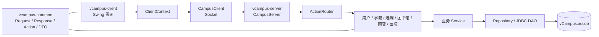

| Maven 模块 | 系统职责 |
|---|---|
| `vcampus-common` | 定义客户端和服务器共同使用的 Action、Request、Response、DTO、SessionInfo 和枚举。 |
| `vcampus-client` | 提供 Swing 页面、校验交互输入、发送请求、保存客户端会话并展示响应。 |
| `vcampus-server` | 接收并路由请求，执行身份与权限校验、业务规则、并发控制和数据库访问。 |

## 4. 子系统设计汇总计划

### 4.1 汇总原则

本说明书由总控维护统一结构，各子系统负责人对本模块设计的正确性负责。负责人提交设计材料后，总控只做术语、章节编号、图表格式和公共接口一致性整理，不擅自改变模块业务规则。

### 4.2 负责人和汇总状态

| 子系统 | 负责人 | 本说明书状态 |
|---|---|---|
| 用户与公共架构 | 吴尚扬 | 登录、会话、账号管理、批量导入和 Access 持久化已纳入 |
| 学籍 | 施天琦 | 待负责人材料汇总 |
| 选课 | 杨凯涵 | 待负责人材料汇总 |
| 图书馆 | 吴昊哲 | 已按 4.3 结构写完；检索、预约、续借、模拟借还、管理维护、Access 事务与测试均已纳入 |
| 商店 | 葛丰玮 | 待负责人材料汇总 |
| 医院 | 廖俊杰 | 待负责人材料汇总 |

### 4.3 每个子系统需要提交的设计内容

1. 模块目标、角色或业务资格和主要用例；
2. 客户端页面、页面状态及交互流程；
3. Action、请求 DTO、响应 DTO、错误码和权限要求；
4. 服务器 Module、Service、Repository/DAO 的职责与调用关系；
5. 数据表、字段、主外键、唯一约束和并发规则；
6. 关键流程图、时序图和类图；
7. 正常、异常、越权和并发测试及验收条件；
8. 仍未完成的内容和已知限制。

## 5. 用户登录模块设计说明

### 5.1 模块背景

用户登录模块是所有业务模块的统一入口。它确认“当前账号是谁、具有哪些账号级权限和模块管理范围”。学校统一维护的教师基础资格保存在 `tblTeacherProfile`，由超级管理员设置；选课和学籍服务器通过 `ServerContext.teachers()` 按 `userId` 查询。医生等专业资料仍由所属业务模块维护。最终种子库包含 8 名教师和 10 名医生，当前姓名统一从 `tblUser.displayName` 读取。

### 5.2 用例设计

#### 5.2.1 登录成功

前置条件：服务器已启动，账号存在、处于启用状态，密码正确。

基本流程：

1. 用户在登录界面输入账号和密码并点击“登录”。
2. 客户端完成非空校验并生成密码 proof。
3. 客户端发送 `USER.LOGIN` 请求，此时 token 为 `null`。
4. 服务器验证请求 DTO、账号状态和密码 proof。
5. 服务器生成 token，保存会话并返回 `SessionInfo`。
6. 客户端保存 `SessionInfo`，主界面根据会话显示可访问入口。

后置条件：服务器和客户端均持有本次会话；后续请求自动携带 token。

#### 5.2.2 登录失败

| 场景 | 处理结果 |
|---|---|
| 一卡通号为空 | 客户端提示“请输入一卡通号”，不发送网络请求。 |
| 密码为空 | 客户端提示“请输入密码”，不发送网络请求。 |
| 一卡通号格式无效 | 客户端提示“一卡通号必须是 8 位数字（年份 + 4 位流水号）”，不发送网络请求。 |
| 请求数据不是 `LoginRequest` | 返回 `COMMON_INVALID_REQUEST`。 |
| 账号不存在、已停用或密码错误 | 返回 `AUTH_INVALID_CREDENTIALS`，不创建会话。 |
| 服务器无法连接或响应无效 | 客户端提示检查服务器状态。 |

#### 5.2.3 退出登录

1. 客户端发送 `USER.LOGOUT`，请求携带当前 token。
2. 服务器从会话表中删除 token。
3. 删除成功时返回成功响应；token 无效时返回 `AUTH_REQUIRED`。
4. 客户端在 `finally` 中清除本地 `ClientSession`，回到登录界面。

### 5.3 界面设计

登录行为由 `LoginPanel` 实现，布局与样式集中在 `LoginPanelDesign`，避免视觉代码和网络登录逻辑混在一起。界面采用与主界面一致的青绿色主题，左侧仅保留系统英文标识，右侧提供登录表单和开发期测试账号。

超级管理员的账号名单与教师名单统一使用 `UserUiTheme`：主操作、普通操作和危险操作采用不同视觉层级，表格以加高行距、交替底色和明显选中态提高可读性，启用、禁用及操作结果使用状态色区分。账号名单支持按一卡通号或姓名实时搜索，并可组合筛选启停状态与子系统管理范围；这些筛选只处理客户端已经取得的账号列表，不新增服务器查询接口。编辑、启停、重置密码、修改教师和取消教师资格等按钮必须先选中一条记录才可使用；写操作成功后页面自动重新加载，因此不额外设置手动刷新按钮。

主要控件如下：

| 控件 | 组件类型 | 名称 | 作用 |
|---|---|---|---|
| 一卡通号输入框 | `JTextField` | `login.username` | 输入 8 位一卡通号；组件名暂为兼容字段名。 |
| 密码输入框 | `JPasswordField` | `login.password` | 输入密码，避免以普通字符串读取。 |
| 登录按钮 | `JButton` | `login.submit` | 发起登录，也可在密码框按回车触发。 |
| 状态文本 | `JLabel` | `login.status` | 显示校验、登录中、成功或失败信息。 |
| 测试账号区 | `JPanel` | `login.testAccounts` | 开发阶段展示公开的虚构测试账号。 |
| 显示密码 | `JCheckBox` | `login.showPassword` | 临时显示或隐藏密码输入内容。 |

登录期间输入框和按钮会被禁用，网络请求通过 `SwingWorker` 在后台线程执行，完成后回到界面线程更新状态，避免窗口卡死。密码框在校验失败或请求结束后清空。账号和密码输入框获得焦点时优先使用英文输入，减少测试账号误输入中文的情况。

登录成功后由 `MainFrame` 展示统一工作区：

- 顶部显示系统名称、当前账号类型和“退出登录”；
- 中间仅显示当前会话有权访问的模块卡片；
- 点击模块后进入模块页面，并可返回校园服务首页；
- 底部显示服务器连接状态，“测试服务器连接”只执行 `PING`，不会改变会话或模块权限；
- 模块入口的隐藏只用于改善体验，服务器仍需对每个受保护 Action 再次鉴权。

### 5.4 登录流程图

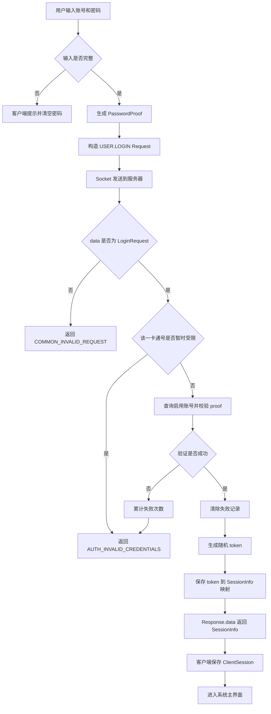

### 5.5 登录时序图

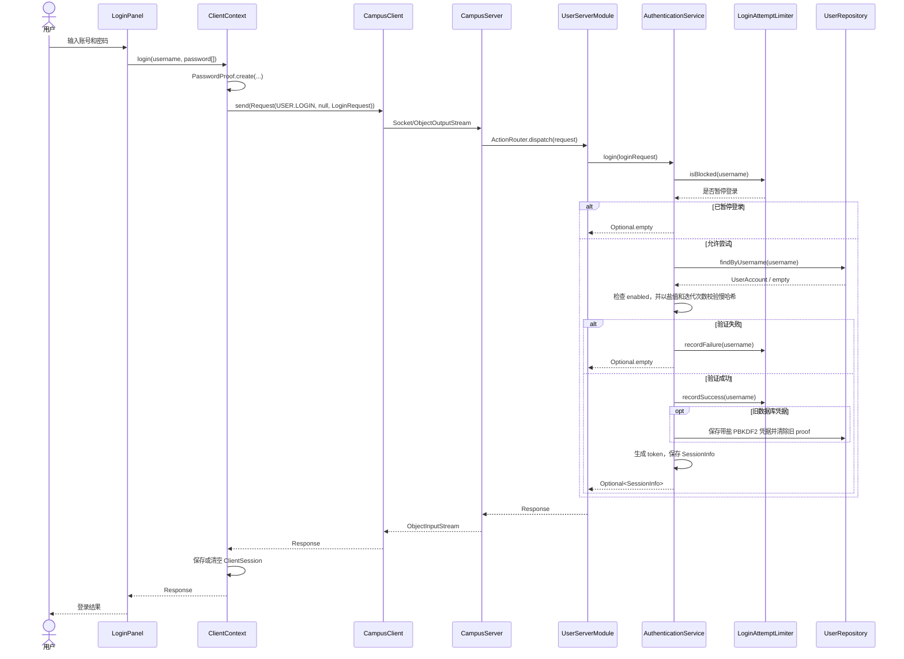

### 5.6 类分析

下图只保留登录流程的核心类，并列出理解设计所需的主要属性和方法。`+` 表示 `public`，`-` 表示 `private`，`~` 表示包内可见。

#### 5.6.1 核心登录类图

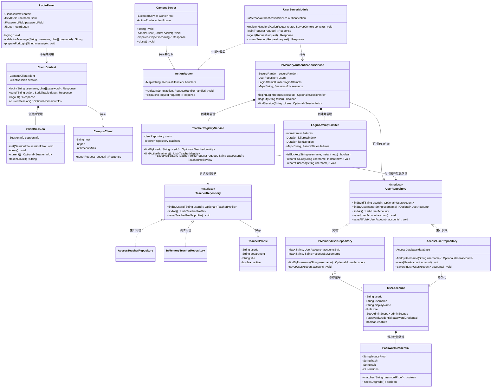

#### 5.6.2 网络 DTO 类图

网络 DTO 单独绘制，避免和核心业务类混在一张图中。它们只负责携带数据，不负责数据库查询或业务判断。

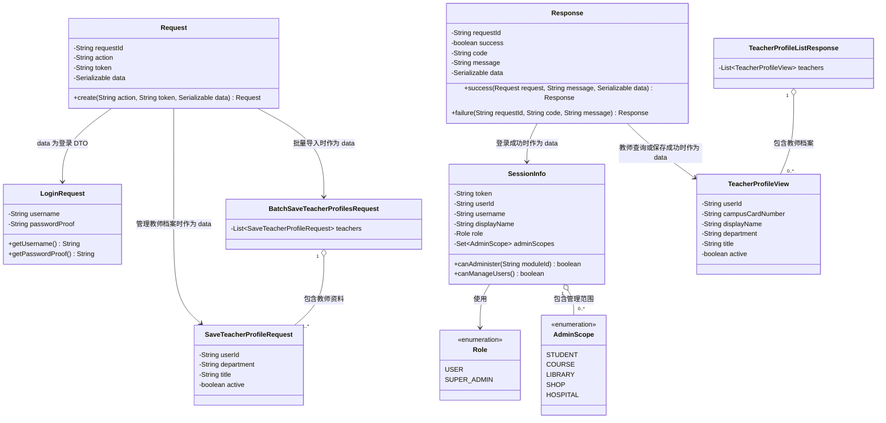

本节使用的关系符号如下：

| 符号 | UML 关系 | 本文含义 |
|---|---|---|
| `-->` | 单向关联 | 一个类长期持有或可以导航到另一个类。 |
| `..>` | 依赖 | 一个类在参数、返回值或方法内部临时使用另一个类。 |
| `*--` | 组合 | 左侧对象创建并管理右侧对象的生命周期。 |
| `o--` | 聚合 | 左侧对象保存若干右侧对象，但右侧类型也可独立使用。 |
| `<|..` | 接口实现 | 虚线和空心三角指向接口，实现类位于另一端。 |
| `1`、`0..*` | 多重性 | 一个对象对应零个或多个对象。 |

#### 5.6.3 客户端类

| 类 | 主要职责 | 登录相关方法 |
|---|---|---|
| `LoginPanel` | 登录表单、输入校验、异步调用和结果提示 | `login()`、`validationMessage()`、`prepareForLogin()` |
| `ClientContext` | 封装登录、带 token 请求、退出和失效通知 | `login()`、`send()`、`logout()`、`currentSession()`、`setAuthenticationLostHandler()` |
| `ClientSession` | 保存当前客户端会话 | `set()`、`clear()`、`current()`、`tokenOrNull()` |
| `CampusClient` | 建立 Socket 并完成一次请求/响应 | `send(Request)` |

#### 5.6.4 服务器端类

| 类/接口 | 主要职责 | 登录相关方法 |
|---|---|---|
| `CampusServer` | 监听连接、读取 Request、分派并写回 Response | `start()`、`handleClient()`、`dispatch()`、`close()` |
| `ActionRouter` | 将 `USER.LOGIN` 映射到唯一处理器 | `register()`、`dispatch()` |
| `UserServerModule` | 校验登录 DTO，组织成功或失败响应 | `registerHandlers()`、`login()`、`logout()`、`currentSession()` |
| `InMemoryAuthenticationService` | 验证账号、创建/删除/查询会话并执行过期判断 | `login()`、`logout()`、`findSession()` |
| `UserRepository` | 定义账号存取边界 | `findById()`、`findByUsername()`、`findAll()`、`save()` |
| `AccessUserRepository` | 正式启动时使用的 Access 账号实现 | 实现 `UserRepository` |
| `InMemoryUserRepository` | 自动化测试使用的隔离账号实现 | 实现 `UserRepository` |
| `UserAccount` | 服务器内部账号记录，不向客户端暴露密码 proof | 只读字段方法及不可变更新方法 |

## 6. 学籍子系统设计说明（待负责人材料汇总）

负责人：施天琦。后续按 4.3 节结构补充学籍查询、管理功能、业务规则、接口、数据库、图表和测试。

## 7. 选课子系统设计说明（待负责人材料汇总）

## 7. 选课子系统设计说明（已实现，已知限制见 7.10）

### 7.1 模块背景

负责人：杨凯涵。选课子系统负责处理选课批次、课程目录、教学班、学生选课与退课、课表、成绩、教师教学管理以及教务管理。

系统将“课程”和“教学班”分开建模：课程保存课程代码、课程名称、学分和课程类型等基本信息；教学班表示课程在本学期的具体开设情况，保存班号、任课教师、上课时间、地点、容量和开放状态。同一门课程可以开设多个教学班，但同一学生不能同时选择同一课程的多个教学班。

课程分为方案内课程、方案外替代课程、体育课程和通选课程。学生选课时，服务器统一检查批次状态、历史修读资格、重复选课、替代关系、容量、体育课性别名额和上课时间冲突。

正式启动路径使用 Microsoft Access `vCampus.accdb` 保存课程目录、教学班、批次、选课记录、成绩和任课关系；默认构造器及部分测试路径仍可使用内存 Repository。

当前数据字典见[选课系统数据字典](../../database/schema/course.md)。

### 7.2 用例设计

选课模块包含三类使用者：

| 使用者   | 判定方式                                                 | 主要能力                             |
| ----- | ---------------------------------------------------- | -------------------------------- |
| 学生    | 已登录且客户端未识别为课程管理员或教师的普通账号                             | 查看批次、查询课程、选课、退课、查看课表和本人课程成绩      |
| 普通教师  | 公共教师目录中存在有效教师档案                                      | 查看本人负责的教学班、学生名单，录入成绩并设置成绩比例      |
| 选课管理员 | `Role.USER + AdminScope.COURSE`，或 `Role.SUPER_ADMIN` | 管理学生选课、课程、教学班、任课教师、批次、成绩、统计和操作日志 |

客户端先判断账号是否具有选课管理权限，再查询公共教师档案，最后进入学生端。服务器不会信任客户端自报的身份，而是从请求 token 对应的 `SessionInfo` 获取当前账号，并对每个 Action 重新鉴权。

#### 7.2.1 学生用例

1. **查看选课批次**：查看当前学期启用的预选课、重修选课和退改补批次，以及批次开放状态、开始时间、结束时间和选退课权限。
2. **进入选课批次**：从选课中心进入指定批次。预选课和退改补批次显示方案内课程、方案外课程、体育课和通选课；重修批次不显示体育课和通选课。
3. **查询方案内课程**：查看培养方案范围内的课程、教学班、任课教师、上课时间、容量和剩余名额。
4. **查询方案外课程**：查看可以替代培养方案课程的方案外课程。已选择某门方案课程或其替代课程后，不得再选择满足同一培养要求的其他课程。
5. **查询体育课程**：按体育项目筛选课程，并根据学生性别、教学班性别限制、总容量及男女名额判断是否可选。
6. **查询通选课程**：按通选课类别筛选课程。学生可以选择多门不同通选课，但不能选择同一课程的多个教学班。
7. **全校课程查询**：按课程代码、课程名称、教师姓名、开课院系和余量状态组合查询，并分页显示教学班结果。
8. **选择课程**：提交批次 ID 和教学班 ID，服务器完成全部资格与冲突校验后保存选课记录。
9. **查看已选课程**：查看课程名称、班号、任课教师、时间、地点、学分和课程类型。
10. **查看课表**：将全部有效选课记录按星期和节次展示为课表。
11. **退课**：在批次开放且允许退课时退选课程。退课不删除原记录，而是将状态改为 `DROPPED` 并记录退课时间。
12. **查看成绩**：查看本人各课程的平时成绩、期末成绩、计算比例、总成绩、录入时间和是否及格。

学生相关请求不携带可用于冒充他人的学生身份。服务器使用 `SessionInfo.username` 作为当前学生学号。

#### 7.2.2 普通教师用例

1. **查看我的教学班**：按批次查询当前教师负责的课程及教学班。
2. **查看学生名单**：教师只能查看自己负责教学班中的有效选课学生。
3. **查看教学班成绩**：查看负责教学班中各学生的平时成绩、期末成绩和总成绩。
4. **录入或修改成绩**：教师只能修改自己负责教学班中的学生成绩，平时成绩和期末成绩均必须在 0—100 之间。
5. **查看成绩比例**：查询教学班的平时成绩和期末成绩比例；未设置时默认使用 40% 和 60%。
6. **修改成绩比例**：两个比例都必须在 0—100 之间，且总和必须等于 100。修改后总成绩按新比例动态计算。

总成绩计算公式为：

$$
总成绩=平时成绩\times\frac{平时成绩比例}{100}
+期末成绩\times\frac{期末成绩比例}{100}
$$

计算结果保留两位小数，总成绩不低于 60 分时判定为及格。

#### 7.2.3 选课管理员用例

1. **学生选课管理**：输入学生学号，查看该学生当前已选课程，并执行强制选课或强制退课。
2. **强制选课**：不检查批次开放时间、课程容量、时间冲突、体育课性别限制和历史修读资格，但课程和教学班必须存在，并且仍禁止同一课程重复选择。强制选课记录的 `selectedBatchId` 为 `0`。
3. **强制退课**：不受学生退课时间和批次状态限制，但选课记录必须属于指定学生且仍处于已选状态。
4. **教学班管理**：查看全部教学班，修改教学班容量和开放状态；容量不得小于当前已选人数。
5. **新增教学班**：为已有课程创建教学班，同时录入班号、地点、校区、授课语言、容量和首条上课时间。
6. **任课教师管理**：从公共有效教师目录中选择教师，为教学班建立或移除任课关系；同一教师不能重复分配到同一教学班。
7. **课程管理**：修改已有课程的课程代码、名称、学分和课程类型；课程代码不得与其他课程重复。
8. **批次管理**：修改批次名称、学期、类型、开始时间、结束时间、状态以及是否允许选课和退课。
9. **成绩管理**：选课管理员可以查询指定学生成绩；只有 `SUPER_ADMIN` 可以从管理员页面直接修改成绩。
10. **数据统计**：按批次统计课程数、教学班数、已选人数、总容量、剩余容量、已满教学班数、关闭教学班数和选课率。
11. **操作日志**：查看强制选课、强制退课、新增教学班、修改教学班、修改课程、修改批次、修改成绩和修改成绩比例等操作记录。

### 7.3 界面设计

#### 7.3.1 页面组成

| 使用端  | 页面或类                         | 主要职责                             |
| ---- | ---------------------------- | -------------------------------- |
| 统一入口 | `CourseClientModule`         | 根据会话权限和公共教师档案选择管理员端、教师端或学生端      |
| 学生端  | `CourseSelectionView`        | 使用 `CardLayout` 在选课中心和具体批次页面之间切换 |
| 学生端  | `CourseCenterPanel`          | 加载选课批次，显示批次类型、时间、状态和进入按钮         |
| 学生端  | `CourseBatchPanel`           | 组织具体批次中的所有选课功能页签                 |
| 学生端  | `PlanCoursePanel`            | 查询和选择方案内课程                       |
| 学生端  | `SubstituteCoursePanel`      | 查询和选择方案外替代课程                     |
| 学生端  | `PeCoursePanel`              | 按体育项目查询和选择体育课程                   |
| 学生端  | `GeneralCoursePanel`         | 按类别查询和选择通选课程                     |
| 学生端  | `TimetablePanel`             | 将当前已选课程显示为周课表                    |
| 学生端  | `SelectedCoursePanel`        | 查看已选课程并执行退课                      |
| 学生端  | `CourseSearchPanel`          | 全校课程组合查询与分页显示                    |
| 学生端  | `CourseStudentGradePanel`    | 查看当前学生本人课程成绩                     |
| 教师端  | `CourseTeacherView`          | 提供“我的教学班”“学生名单”“成绩管理”三个页签        |
| 教师端  | `CourseTeacherOfferingPanel` | 查询当前教师负责的教学班                     |
| 教师端  | `CourseTeacherStudentPanel`  | 查询指定教学班学生名单                      |
| 教师端  | `CourseTeacherGradePanel`    | 查询、录入成绩并维护成绩比例                   |
| 管理端  | `CourseAdminView`            | 提供选课管理模块的八个管理页签                  |
| 管理端  | `CourseAdminStudentPanel`    | 查询学生已选课程并执行强制选退课                 |
| 管理端  | `CourseAdminAuditPanel`      | 查询教务操作日志                         |
| 管理端  | `CourseAdminOfferingPanel`   | 新增教学班，修改容量和开放状态                  |
| 管理端  | `CourseAdminTeacherPanel`    | 分配和移除教学班任课教师                     |
| 管理端  | `CourseAdminCoursePanel`     | 修改课程基本信息                         |
| 管理端  | `CourseAdminBatchPanel`      | 修改选课批次                           |
| 管理端  | `CourseAdminGradePanel`      | 查询学生成绩；超级管理员可以修改成绩               |
| 管理端  | `CourseAdminStatisticsPanel` | 查看指定批次的选课统计                      |

#### 7.3.2 页面状态与交互约定

* 学生端每次进入批次时，根据当前批次重新创建 `CourseBatchPanel`。
* 重修批次隐藏体育课和通选课页签，预选课和退改补批次显示全部课程类别。
* 选课或退课成功后，已选课程列表和课表重新加载。
* 切换页签时，当前页重新读取服务器数据，避免长时间显示旧状态。
* 表格中的可选状态和按钮禁用状态只用于改善交互，服务器仍会重新执行全部业务校验。
* 教师身份通过公共教师接口异步查询，网络请求不阻塞 Swing 事件分派线程。
* 管理员身份判断优先于教师身份，避免同时具有教师资格的管理员误进入教师端。
* 只有超级管理员的成绩编辑控件处于启用状态，普通选课管理员只能查看成绩。
* 页面样式统一由 `CourseTheme` 提供背景色、表格、标题、按钮和状态提示样式。

### 7.4 学生选课判定流程

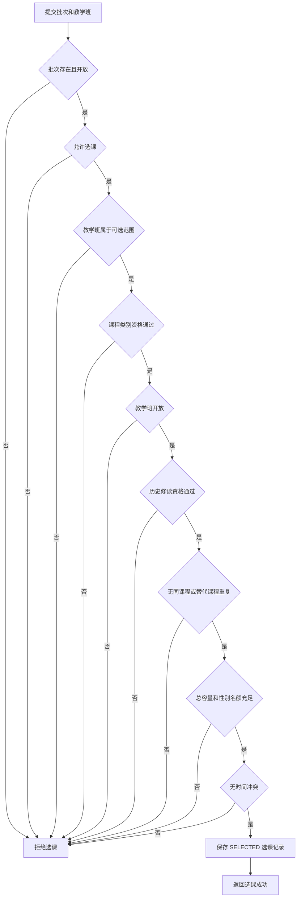

时间冲突由 `CourseScheduleConflictChecker` 判断。只有以下条件同时成立时才构成冲突：

1. 上课星期相同；
2. 开始节次和结束节次存在交集；
3. 教学周范围存在交集；
4. 在交集周内，两条课程安排均实际开课。

教学周支持 `EVERY`、`ODD` 和 `EVEN`，因此同一星期、同一节次的单周课程和双周课程不判定为冲突。

### 7.5 学生选课时序图

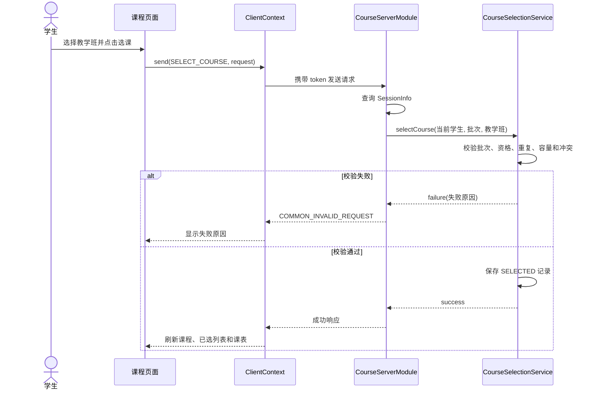

### 7.6 类分析

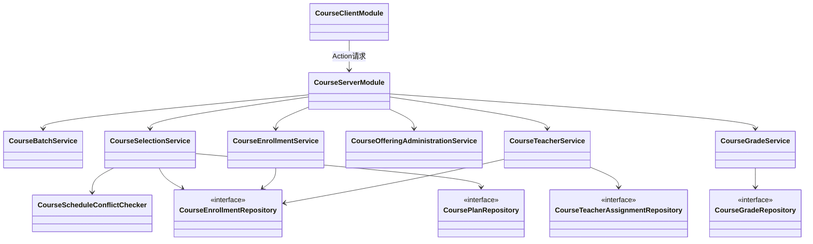

主要职责如下：

| 类或接口                                  | 主要职责                                                  |
| ------------------------------------- | ----------------------------------------------------- |
| `CourseServerModule`                  | 注册 Action，校验 token、权限和 DTO 类型，调用 Service 并包装 Response |
| `CourseBatchService`                  | 查询和修改选课批次，计算或应用批次状态                                   |
| `CoursePlanService`                   | 查询方案内课程，计算已选状态、余量和时间冲突                                |
| `CourseSubstitutionService`           | 查询方案外替代课程，处理历史修读和替代关系                                 |
| `PeCourseService`                     | 查询体育课，处理学生性别、性别限制及男女容量                                |
| `GeneralCourseService`                | 查询通选课并按通选类别筛选                                         |
| `CourseSearchService`                 | 对全校教学班执行组合查询和分页                                       |
| `CourseSelectionService`              | 执行学生选课和管理员强制选课规则                                      |
| `CourseEnrollmentService`             | 查询有效选课记录，执行学生退课和管理员强制退课                               |
| `CourseOfferingAdministrationService` | 查询、创建和修改课程及教学班设置                                      |
| `CourseTeacherService`                | 处理任课关系、教师教学班和学生范围鉴权                                   |
| `CourseGradeService`                  | 查询和保存学生成绩，计算总成绩                                       |
| `CourseGradePolicyService`            | 查询和修改平时成绩与期末成绩比例                                      |
| `CourseAdminStatisticsService`        | 汇总批次课程、容量和选课率                                         |
| `CourseAdminAuditService`             | 保存并查询教务操作记录                                           |
| `CourseScheduleConflictChecker`       | 根据星期、节次、周次和单双周检测冲突                                    |
| 各 Repository 接口                       | 隔离业务逻辑与 Access、内存存储实现                                 |

### 7.7 Action、DTO 与错误码

#### 7.7.1 学生 Action

| Action                           | Request.data                                         | 成功 Response.data           | 权限           |
| -------------------------------- | ---------------------------------------------------- | -------------------------- | ------------ |
| `COURSE.LIST_BATCHES`            | `null`                                               | `List<SelectionBatchInfo>` | 已登录          |
| `COURSE.LIST_PLAN_COURSES`       | `BatchRequest(batchId)`                              | `List<CourseInfo>`         | 已登录          |
| `COURSE.LIST_SUBSTITUTE_COURSES` | `BatchRequest(batchId)`                              | `List<CourseInfo>`         | 已登录          |
| `COURSE.LIST_PE_COURSES`         | `PeCourseListRequest(batchId, sportProject)`         | `List<CourseInfo>`         | 已登录          |
| `COURSE.LIST_GENERAL_COURSES`    | `GeneralCourseListRequest(batchId, generalCategory)` | `List<CourseInfo>`         | 已登录          |
| `COURSE.SEARCH_OFFERINGS`        | `CourseSearchRequest`                                | `CourseSearchResult`       | 已登录          |
| `COURSE.SELECT_COURSE`           | `SelectCourseRequest(batchId, offeringId)`           | `null`                     | 已登录          |
| `COURSE.LIST_ENROLLMENTS`        | `BatchRequest(batchId)`                              | `List<EnrollmentInfo>`     | 已登录且只能查询本人   |
| `COURSE.DROP_COURSE`             | `DropCourseRequest(batchId, enrollmentId)`           | `null`                     | 已登录且选课记录属于本人 |
| `COURSE.STUDENT_LIST_GRADES`     | `null`                                               | `List<CourseGradeInfo>`    | 已登录且只能查询本人   |

`CourseSearchRequest` 支持课程代码、课程名称、教师姓名、开课院系、余量状态、页码和每页数量。查询结果以教学班为一行，而不是以课程为一行。

#### 7.7.2 教师 Action

| Action                               | Request.data                                      | 成功 Response.data           | 权限               |
| ------------------------------------ | ------------------------------------------------- | -------------------------- | ---------------- |
| `COURSE.TEACHER_LIST_OFFERINGS`      | `BatchRequest(batchId)`                           | `List<CourseInfo>`         | 有效教师             |
| `COURSE.TEACHER_LIST_STUDENTS`       | `TeacherListStudentsRequest(batchId, offeringId)` | `List<TeacherStudentInfo>` | 有效教师且负责该教学班      |
| `COURSE.TEACHER_LIST_GRADES`         | `TeacherListStudentsRequest(batchId, offeringId)` | `List<CourseGradeInfo>`    | 有效教师且负责该教学班      |
| `COURSE.TEACHER_UPDATE_GRADE`        | `AdminUpdateGradeRequest`                         | `CourseGradeInfo`          | 有效教师且选课记录属于本人教学班 |
| `COURSE.TEACHER_GET_GRADE_POLICY`    | `TeacherListStudentsRequest`                      | `CourseGradePolicyInfo`    | 有效教师且负责该教学班      |
| `COURSE.TEACHER_UPDATE_GRADE_POLICY` | `TeacherUpdateGradePolicyRequest`                 | `CourseGradePolicyInfo`    | 有效教师且负责该教学班      |

#### 7.7.3 管理 Action

下列 Action 除特别说明外，均要求 `SessionInfo.canAdminister(ModuleNames.COURSE)`：

| Action                                  | Request.data                                                   | 成功 Response.data             |
| --------------------------------------- | -------------------------------------------------------------- | ---------------------------- |
| `COURSE.ADMIN_LIST_STUDENT_ENROLLMENTS` | `AdminListStudentEnrollmentsRequest(studentId)`                | `List<EnrollmentInfo>`       |
| `COURSE.ADMIN_FORCE_SELECT_COURSE`      | `AdminForceSelectCourseRequest(studentId, offeringId, reason)` | `null`                       |
| `COURSE.ADMIN_FORCE_DROP_COURSE`        | `AdminForceDropCourseRequest(studentId, enrollmentId, reason)` | `null`                       |
| `COURSE.ADMIN_LIST_OFFERINGS`           | `null` 或兼容旧客户端的 `BatchRequest`                                 | `List<CourseInfo>`           |
| `COURSE.ADMIN_CREATE_OFFERING`          | `AdminCreateOfferingRequest`                                   | 新教学班 ID                      |
| `COURSE.ADMIN_UPDATE_OFFERING`          | `AdminUpdateOfferingRequest`                                   | `null`                       |
| `COURSE.ADMIN_UPDATE_COURSE`            | `AdminUpdateCourseRequest`                                     | `CourseInfo`                 |
| `COURSE.ADMIN_UPDATE_BATCH`             | `AdminUpdateBatchRequest`                                      | `SelectionBatchInfo`         |
| `COURSE.ADMIN_LIST_ACTIVE_TEACHERS`     | `null`                                                         | `List<TeacherProfileView>`   |
| `COURSE.ADMIN_LIST_OFFERING_TEACHERS`   | `OfferingTeacherRequest(offeringId)`                           | `List<String>`，内容为教师 userId  |
| `COURSE.ADMIN_ASSIGN_TEACHER`           | `AdminTeacherAssignmentRequest`                                | `null`                       |
| `COURSE.ADMIN_REMOVE_TEACHER`           | `AdminTeacherAssignmentRequest`                                | `null`                       |
| `COURSE.ADMIN_LIST_GRADES`              | `AdminListGradesRequest(studentId)`                            | `List<CourseGradeInfo>`      |
| `COURSE.ADMIN_UPDATE_GRADE`             | `AdminUpdateGradeRequest`                                      | `CourseGradeInfo`            |
| `COURSE.ADMIN_GET_STATISTICS`           | `BatchRequest(batchId)`                                        | `CourseAdminStatisticsInfo`  |
| `COURSE.ADMIN_LIST_AUDIT_LOGS`          | `null`                                                         | `List<CourseAdminAuditInfo>` |

`ADMIN_UPDATE_GRADE` 额外要求全局角色为 `SUPER_ADMIN`。普通选课管理员只能查询成绩，不能通过该 Action 修改成绩。

#### 7.7.4 错误码

当前选课模块使用三类公共错误码：

| 错误码                      | 使用场景                      |
| ------------------------ | ------------------------- |
| `AUTH_REQUIRED`          | token 缺失、无效或会话已过期         |
| `AUTH_FORBIDDEN`         | 当前账号没有选课管理权限、教师资格或指定教学班权限 |
| `COMMON_INVALID_REQUEST` | DTO 类型错误、参数错误或选课业务校验失败    |

当前尚未定义以 `COURSE_` 开头的细分业务错误码。容量已满、时间冲突、重复选课、批次关闭等情况通过 `COMMON_INVALID_REQUEST` 的响应消息区分。

### 7.8 数据表与并发规则

#### 7.8.1 主要数据表

| 表名                          | 主要用途                 | 重要约束                               |
| --------------------------- | -------------------- | ---------------------------------- |
| `tblCourse`                 | 课程代码、名称、学分、类型、院系和课程组 | `courseId`、`courseCode` 唯一         |
| `tblCourseOffering`         | 教学班、地点、校区、语言、容量和状态   | `offeringId` 唯一                    |
| `tblCourseSchedule`         | 星期、节次、教学周和单双周安排      | 通过 `offeringId` 关联教学班              |
| `tblOfferingTeacher`        | 教学班与公共教师账号的任课关系      | `(offeringId, teacherUserId)` 业务唯一 |
| `tblSelectionBatch`         | 原始选课批次               | `batchId` 唯一                       |
| `tblEnrollment`             | 学生选课及退课记录            | `(userId, offeringId)` 唯一          |
| `tblCourseHistory`          | 学生历史修读课程             | `(userId, courseId)` 唯一            |
| `tblGrade`                  | 平时成绩、期末成绩和录入时间       | `enrollmentId` 唯一                  |
| `tblGradePolicy`            | 教学班成绩计算比例            | `offeringId` 唯一                    |
| `tblCourseSubstitution`     | 方案外课程与被替代课程关系        | 替代课程 ID 唯一                         |
| `tblPeCourse`               | 体育课程及体育项目            | `courseId` 唯一                      |
| `tblPeOfferingRule`         | 体育教学班性别和男女容量规则       | `offeringId` 唯一                    |
| `tblGeneralCourse`          | 通选课程类别               | `courseId` 唯一                      |
| `tblCourseSettings`         | 管理员修改后的课程基本信息        | `courseId` 唯一                      |
| `tblCourseOfferingSettings` | 管理员修改后的容量和开放状态       | `offeringId` 唯一                    |
| `tblCourseBatchSettings`    | 管理员修改后的批次设置          | `batchId` 唯一                       |
| `tblCourseAdminAudit`       | 教务操作日志               | 按 `operatedAt` 建立索引                |

`tblEnrollment` 使用 `SELECTED` 和 `DROPPED` 两种状态。退课后再次选择同一教学班时，Repository 重新启用原有记录，而不是插入违反唯一约束的新记录。

`tblGrade` 每条有效选课记录最多对应一条成绩。平时成绩和期末成绩写入数据库，总成绩根据 `tblGradePolicy` 中的比例动态计算，不重复保存。

任课关系使用公共教师档案的稳定 `teacherUserId`。`teacherName` 只作为兼容旧数据的显示快照，当前姓名优先从公共教师目录读取。

#### 7.8.2 并发规则

1. `CourseSelectionService.selectCourse()` 使用 `synchronized` 串行化单个服务器实例中的学生选课，防止同一实例内的容量检查和保存发生交错。
2. `CourseEnrollmentService.dropCourse()` 和强制退课操作使用 `synchronized`，避免同一记录被重复退课。
3. 成绩、成绩比例、批次、课程和教学班修改操作分别在对应 Service 或 Repository 中串行化。
4. `tblEnrollment(userId, offeringId)` 和 `tblGrade.enrollmentId` 的唯一索引作为持久化层的最后约束。
5. 新增教学班时，教学班和首条上课时间使用同一个数据库事务写入，任一步失败则整体回滚。
6. 当前同步锁只对单个 Java 服务器实例有效，不支持多个服务器进程同时操作同一 Access 数据库。

### 7.9 测试与验收

当前专门针对选课模块的自动化测试为 `AccessCourseOfferingCreationRepositoryTest`，覆盖：

* 为已有课程新增教学班及首条上课时间；
* 新教学班可以通过课程 Repository 重新读取；
* 新教学班 ID 正确生成；
* 同一课程下重复班号被拒绝。

选课、退课、冲突、容量、体育课性别限制、教师权限、成绩和管理员操作目前主要依赖业务代码校验与人工联调，仍需补充独立自动化测试。

验收条件：

* [ ] 学生可以查看当前启用的预选、重修和退改补批次。
* [ ] 重修批次不显示体育课和通选课。
* [ ] 普通批次拒绝再次选择已经正式修读过的普通课程。
* [ ] 重修批次只允许选择以前修读过的普通课程；不要求历史成绩低于 60 分。
* [ ] 同一学生不能同时选择同一课程的两个教学班。
* [ ] 方案课程或其替代课程已满足同一培养要求时，拒绝重复选择。
* [ ] 教学班已关闭或人数已满时，普通学生无法选课。
* [ ] 体育课按学生性别、教学班限制和男女容量判断资格。
* [ ] 时间冲突检测同时考虑星期、节次、周次及单双周。
* [ ] 学生只能在批次开放且允许退课时退课。
* [ ] 管理员可以不受批次时间限制执行强制选课和强制退课。
* [ ] 强制选课仍禁止同一课程重复选择。
* [ ] 普通教师只能查看和管理自己负责的教学班。
* [ ] 平时成绩和期末成绩均限制在 0—100 之间。
* [ ] 成绩比例总和必须等于 100，未设置时使用 40% 和 60%。
* [ ] 学生只能通过 token 查看本人成绩。
* [ ] 只有超级管理员可以通过管理员成绩页面修改成绩。
* [ ] 修改课程、教学班、批次、成绩和强制选退课后生成操作日志。
* [ ] 服务器重启后课程、选课、成绩和任课关系仍能从 Access 恢复。
* [ ] `mvn clean verify` 全部通过。

### 7.10 仍未完成的内容和已知限制

* 当前不能新增或删除课程，只能修改已有课程；新增功能仅覆盖“为已有课程新增教学班”。
* 当前不能删除教学班，只能通过开放状态关闭教学班。
* 课程和教学班目前是全局数据，Repository 中保留的 `batchId` 参数未真正用于划分课程范围；不同批次暂时共享同一课程目录。
* 方案内课程暂未按具体培养方案、专业和年级区分，Access 实现直接把 `courseGroup = REGULAR` 的课程作为方案内课程。
* 管理员修改课程、教学班和批次时采用额外 Settings 表覆盖原始数据，尚未统一回写基础表。
* 原始 `tblCourseOffering.selectedCount` 与根据 `tblEnrollment` 动态统计的人数同时存在，存在两套人数来源；演示数据重建和运行时统计需要保持一致，后续应统一为根据有效选课记录实时计算。
* 当前没有课程专用业务错误码，所有业务失败均使用 `COMMON_INVALID_REQUEST`，客户端只能根据消息区分具体原因。
* 教师分配和移除任课关系目前没有写入 `tblCourseAdminAudit`。
* 选课和退课依赖单实例 `synchronized`，没有数据库行锁或乐观锁，不支持多个服务器实例并发抢占最后名额。
* 学生身份目前使用登录账号 `username` 作为学号，尚未统一改为公共用户 `userId` 与学籍主键的稳定关联。
* `database/schema/course.md` 中的部分设计字段和当前 Access DAO 实际表结构尚未完全一致，需要在最终提交前统一。
* 自动化测试覆盖不足，尚缺学生选课、退课、跨类别时间冲突、体育课男女容量、管理员越权、教师越权、成绩计算、并发选课和服务器重启持久化测试。
* 当前不提供候补队列、抽签选课、志愿优先级、选课结果通知、成绩申诉和课程评价功能。

## 8. 图书馆子系统设计说明（已实现，已知限制见 8.10）

### 8.1 模块背景

负责人：吴昊哲。图书馆是课程必做模块之一，目标是实现"书目—实体单册—借阅记录—预约"四层模型下的
馆藏检索、线上预约与模拟自助条码借还。系统的关键设计判断是**把书目与可流转的实体单册分离**：
馆藏数与可借数不落库，而由未注销单册的状态按馆藏地实时汇总，避免两套事实来源。

模块同时保留一个刻意的简化：读者在自己的检索结果里不能直接借走实体书，必须走到"模拟自助终端"
扫描条码，模拟真实图书馆"线上预约、到馆取书"的流程。终端不接真实扫码硬件，条码由手工输入。

当前实现及评审入口：[借阅归还交付说明](../modules/library-borrow-return.md)、
[图书管理员维护设计与测试](../modules/library-admin-maintenance.md)、
[数据字典](../../database/schema/library.md)。

### 8.2 用例设计

参与角色只有两类，二者是正交的：

| 角色 | 判定方式 | 能力 |
|---|---|---|
| 读者 | 任意已登录账号 | 检索、预约、续借、条码借还、查看本人记录 |
| 图书馆管理员 | `Role.USER + AdminScope.LIBRARY`，或 `Role.SUPER_ADMIN` | 管理员全部能力，同时保留读者能力 |

图书管理员不是新的全局角色。服务器从 token 取得会话，通过
`SessionInfo.canAdminister(ModuleNames.LIBRARY)` 逐个 Action 鉴权，客户端在 DTO 中自报身份无效。

#### 8.2.1 读者用例

1. **检索馆藏**：按关键词（≤50 字符）与可选分类查询，结果为按馆藏地汇总的馆藏数与可借数；停用书目不可见。
2. **线上预约**：选定书目与取书馆藏地提交预约；有可借单册时立即保留 24 小时，否则进入队列。
3. **查看与取消预约**：查看状态、排队位次、分配条码与取书截止时间；排队中或待取可取消。
4. **条码借书**：在模拟终端扫描条码，先由服务器预检，界面只启用合法操作；本人预约的保留册可在此时取走。
5. **条码还书**：扫描本人当前借阅的单册完成归还，单册转入"待上架"。
6. **查看借阅记录**：当前借阅与历史借阅，逾期由服务器动态判定并标注。
7. **续借**：本人当前、未逾期且未续借过的记录可续借 1 次，从原到期日顺延 30 天。

#### 8.2.2 管理员用例

1. **书目维护**：查询全部书目（含停用）、新增与编辑元数据、切换"开放借阅 / 停止借阅"。
2. **分类维护**：新增可复用分类，名称忽略大小写去重；书目只保存稳定分类 ID。
3. **单册维护**：登记唯一馆藏条码、维护馆藏地与索书号、确认归架、软注销、恢复误注销单册。
4. **借阅查询**：按"当前借阅 / 借阅历史 / 逾期未还"三个范围查询全馆记录。

### 8.3 界面设计

| 页面 | 类 | 职责 |
|---|---|---|
| 模式选择 | `LibraryModePanel` | 三张入口卡片：线上图书馆、图书管理员工作台（仅管理员可见）、模拟自助终端 |
| 馆藏查询 | `LibraryPanel` | 关键词与分类检索、结果表、按馆藏地展示的馆藏详情、预约提交 |
| 我的图书馆 | `MyLibraryPanel` | 当前借阅 / 历史借阅 / 我的预约三个页签，含续借与取消预约 |
| 模拟自助终端 | `SelfServicePanel` | 条码输入、服务器预检、按预检结果启用借书或归还 |
| 图书管理员工作台 | `LibraryAdminPanel` | 书目维护 / 实体单册 / 借阅查询三个页签 |

页面状态约定：

- 图书管理员入口与读者页签**不混排**；管理员进入工作台与进入线上图书馆是两条独立路径。
- 离开模块返回其他子系统后再次进入，始终从模式选择页开始（`ModuleViewLifecycle.onModuleExit`）。
- 所有表格只读、单选，禁止拖动列与列宽；网络调用一律在 `SwingWorker` 中执行，不阻塞 EDT。
- 客户端对状态的预判（如禁用"续借"按钮）只改善体验，服务器仍独立校验。
- 写入结果不确定时冻结全部按钮，提示"请先查询核对，勿重复提交"。

### 8.4 条码借书判定流程

判定顺序固定，任一环节不通过即返回对应错误码；预检与正式提交复用同一判定链。

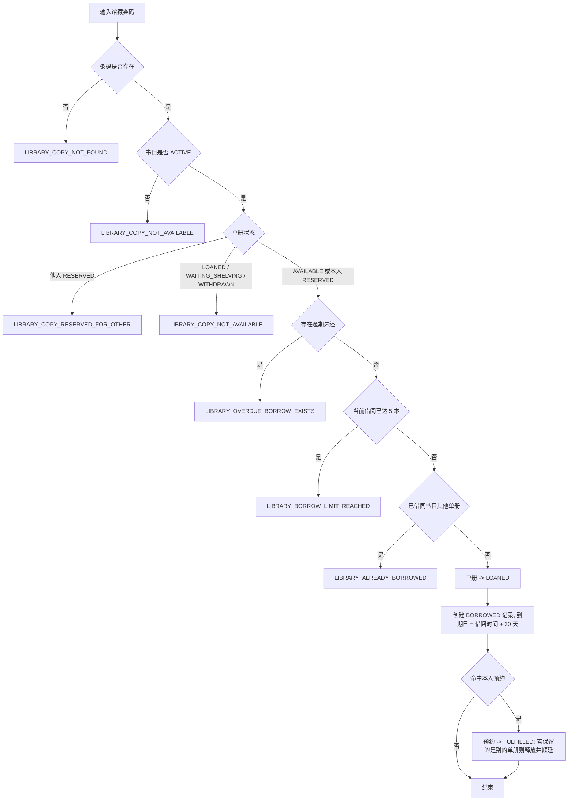

### 8.5 线上预约时序图

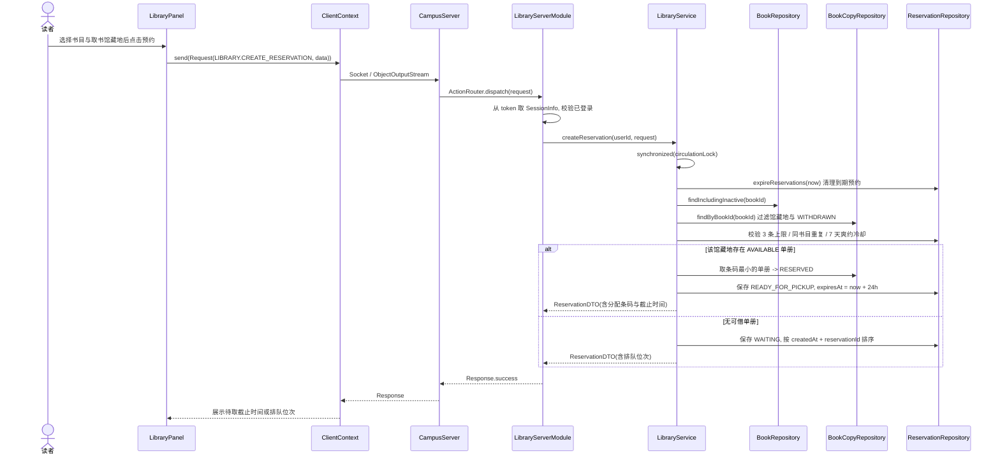

### 8.6 类分析

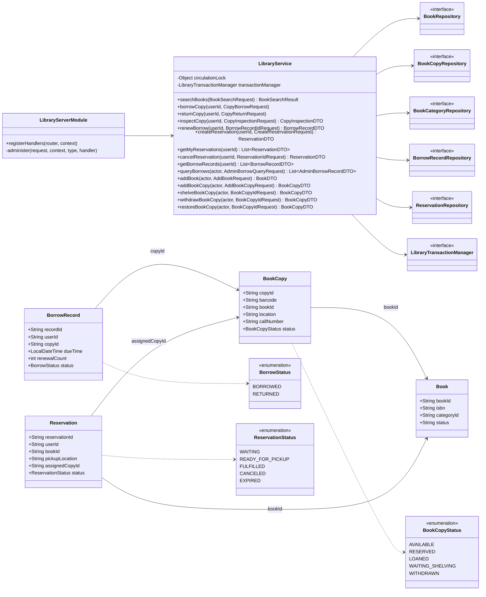

职责划分：`LibraryServerModule` 只做参数类型校验、鉴权与响应包装；`LibraryService` 承载全部业务规则，
是唯一的临界区持有者；五个 Repository 接口各有 InMemory 与 Access 两套实现；领域类
（`Book` 之外）为不可变记录，状态流转通过 `withStatus` / `renewedUntil` / `canceledAt` 等方法派生新实例。

更完整的类图（含客户端、公共契约、服务器三张分区图）、类职责表、类关系表与条码借书时序图见
[图书馆模块 UML 设计](../modules/library-uml.md)。

### 8.7 Action、DTO 与错误码

读者与通用 Action（10 个）：

| Action | Request.data | 成功 Response.data | 权限 |
|---|---|---|---|
| `LIBRARY.SEARCH_BOOKS` | `BookSearchRequest(keyword, categoryId)` | `BookSearchResult` | 已登录 |
| `LIBRARY.LIST_CATEGORIES` | `null` | `List<BookCategoryDTO>` | 已登录 |
| `LIBRARY.CREATE_RESERVATION` | `CreateReservationRequest(bookId, pickupLocation)` | `ReservationDTO` | 已登录 |
| `LIBRARY.GET_MY_RESERVATIONS` | `null` | `List<ReservationDTO>` | 已登录 |
| `LIBRARY.CANCEL_RESERVATION` | `ReservationIdRequest(reservationId)` | `ReservationDTO` | 已登录且为预约本人 |
| `LIBRARY.GET_BORROW_RECORDS` | `null` | `List<BorrowRecordDTO>` | 已登录 |
| `LIBRARY.RENEW_BORROW` | `BorrowRecordIdRequest(recordId)` | `BorrowRecordDTO` | 已登录且为借阅本人 |
| `LIBRARY.INSPECT_COPY` | `CopyInspectionRequest(barcode)` | `CopyInspectionDTO` | 已登录 |
| `LIBRARY.BORROW_COPY` | `CopyBorrowRequest(barcode)` | `null` | 已登录 |
| `LIBRARY.RETURN_COPY` | `CopyReturnRequest(barcode)` | `null` | 已登录 |

管理 Action（全部要求 `canAdminister(LIBRARY)`，由 `administer(...)` 统一包装）：

| Action | Request.data | 成功 Response.data |
|---|---|---|
| `LIBRARY.ADMIN_SEARCH_BOOKS` | `BookSearchRequest` | `BookSearchResult` |
| `LIBRARY.ADD_BOOK_CATEGORY` | `AddBookCategoryRequest(categoryName)` | `BookCategoryDTO` |
| `LIBRARY.ADD_BOOK` / `LIBRARY.UPDATE_BOOK` | `AddBookRequest` / `UpdateBookRequest` | `BookDTO` |
| `LIBRARY.SET_BOOK_STATUS` | `SetBookStatusRequest(bookId, status)` | `BookDTO` |
| `LIBRARY.ADD_BOOK_COPY` | `AddBookCopyRequest(bookId, barcode, location, callNumber)` | `BookCopyDTO` |
| `LIBRARY.LIST_BOOK_COPIES` | `ListBookCopiesRequest(bookId)` | `List<BookCopyDTO>` |
| `LIBRARY.UPDATE_BOOK_COPY` | `UpdateBookCopyRequest(copyId, location, callNumber)` | `BookCopyDTO` |
| `LIBRARY.SHELVE_BOOK_COPY` / `WITHDRAW_BOOK_COPY` / `RESTORE_BOOK_COPY` | `BookCopyIdRequest(copyId)` | `BookCopyDTO` |
| `LIBRARY.ADMIN_QUERY_BORROWS` | `AdminBorrowQueryRequest(scope)` | `List<AdminBorrowRecordDTO>` |

借还类请求 DTO **不含 `userId`**：当前用户一律由 `Request.token -> SessionInfo.userId` 确认，
防止越权代操作。

业务错误码（`ErrorCodes` 中以 `LIBRARY_` 开头、由 `LibraryBusinessException` 抛出）：

| 分类 | 错误码 |
|---|---|
| 书目与单册 | `LIBRARY_BOOK_NOT_FOUND`、`LIBRARY_COPY_NOT_FOUND`、`LIBRARY_CATEGORY_NOT_FOUND`、`LIBRARY_DUPLICATE_ISBN`、`LIBRARY_DUPLICATE_BARCODE`、`LIBRARY_DUPLICATE_CATEGORY`、`LIBRARY_INVALID_BOOK_STATUS`、`LIBRARY_INVALID_COPY_STATUS`、`LIBRARY_COPY_NOT_AVAILABLE`、`LIBRARY_COPY_RESERVED_FOR_OTHER` |
| 借还与续借 | `LIBRARY_BORROW_RECORD_NOT_FOUND`、`LIBRARY_BORROW_LIMIT_REACHED`、`LIBRARY_ALREADY_BORROWED`、`LIBRARY_OVERDUE_BORROW_EXISTS`、`LIBRARY_RENEWAL_NOT_ALLOWED`、`LIBRARY_RENEWAL_LIMIT_REACHED`、`LIBRARY_RENEWAL_BLOCKED_BY_RESERVATION` |
| 预约 | `LIBRARY_RESERVATION_NOT_FOUND`、`LIBRARY_RESERVATION_LIMIT_REACHED`、`LIBRARY_DUPLICATE_RESERVATION`、`LIBRARY_RESERVATION_COOLDOWN`、`LIBRARY_RESERVATION_NOT_CANCELLABLE`、`LIBRARY_INVALID_PICKUP_LOCATION` |
| 认证 | `AUTH_REQUIRED`（无 token 或会话失效）、`AUTH_FORBIDDEN`（非图书馆管理员调用管理 Action） |

参数非法（超长文本、非法 ISBN、非法出版年、未知查询范围）返回 `COMMON_INVALID_ARGUMENT`；
请求体类型不符返回 `COMMON_INVALID_REQUEST`。客户端 `LibraryMessages` 把错误码映射为中文提示。

### 8.8 数据表与并发规则

五张表：`tblBook`、`tblBookCopy`、`tblBookCategory`、`tblBorrowRecord`、`tblReservation`。
字段、主外键、唯一索引与不变量的完整定义见[图书馆数据字典](../../database/schema/library.md)，此处只列设计要点：

- `tblBook` 是书目元数据，**不保存 `totalCount` / `availableCount`**；两个值由未注销
  `tblBookCopy` 按馆藏地实时汇总，`INACTIVE` 书目保留馆藏数但业务可借数固定为 0。
- `tblBorrowRecord` 只保存 `copyId` 而不保存 `bookId`；`renewalCount` 记录成功续借次数（上限 1）。
- 逾期**不落库、不占第三种状态**，由 `BORROWED && now > dueTime` 动态计算。
- `tblReservation` 的排队顺序由 `createdAt` 加 `reservationId` 决定，保证相同创建时间下顺序稳定。
- 唯一索引：`tblBook.isbn`、`tblBookCopy.barcode`；跨模块 `userId` 不建外键。

并发规则分两层：

1. **同一服务器实例内**：`LibraryService.circulationLock` 串行化全部读写，管理操作与流通操作共用同一临界区，
   避免交错破坏状态。预约到期的清理没有后台定时器，而是在检索、预约、借还和管理状态操作前于事务内原子执行。
2. **持久化层**：`AccessLibraryStore` 在事务开始时把同一个 JDBC Connection 绑定到当前线程，
   五个 Access Repository 在一次业务中复用该连接，任一步失败整体回滚。InMemory 版本通过
   第二步失败时补偿第一步维持测试状态一致。

尚未覆盖的是**跨进程或跨服务器实例**的并发：系统没有 `SELECT ... FOR UPDATE` 与乐观锁版本号，
多实例部署时同一单册可能被重复分配。这一点在 8.10 中作为已知限制列出。

### 8.9 测试与验收

自动化测试共 **97 个用例**（服务端 10 个测试类、客户端 9 个测试类），详见
[交付说明](../modules/library-borrow-return.md)：

| 测试类 | 覆盖内容 |
|---|---|
| `LibraryServiceTest` | 关键词 trim、分类过滤、馆藏地汇总语义、停用书目对读者的可见性 |
| `LibraryValidationTest` | 字段长度上限（恰好等于上限通过 / 超一字符拒绝）、ISBN 的 10 位与 13 位写法与分隔符归一化、长度检查先于格式检查、出版年 1000–9999 边界 |
| `LibraryBoundaryTest` | 逾期与预约过期的时刻边界、第五本借阅与第三条预约的恰好边界、借已注销单册、续借已归还记录、有活跃借阅时归架与恢复被拒、未知标识的未找到分支 |
| `LibraryCirculationPhaseTwoTest` | 条码借还、30 天借期、五本上限、同书目重复、逾期停借、终端预检、他人归还拒绝、并发借同一册、事务回滚 |
| `LibraryReservationServiceTest` | 立即保留、FIFO 排队与稳定 tie-break、24 小时过期、7 天冷却、取消顺延、续借三条规则、并发抢最后一册 |
| `LibraryAdminServiceTest` | 分类新增与去重、ISBN 规范化、单册生命周期、状态专用操作、全馆借阅查询与越权拒绝 |
| `LibraryServerModuleTest` | 22 个 Action 契约反射冻结、鉴权、DTO 类型校验、会话身份优先于载荷 |
| `AccessLibraryRepositoryTest` | 真实 `.accdb` 建表与索引、唯一约束、借还/预约事务回滚、演示种子不变量 |
| `LibraryPersistenceIntegrationTest` | 真实 Socket 下跨多次服务器重启的状态保留、演示数据不重复播种 |
| `LibraryWorkflowUiTest` / `LibraryAdminUiTest` / `LibraryReservationUiTest` / `LibrarySearchIntegrationTest` / `LibraryAdminIntegrationTest` | 模式切换、预约与取消、续借、终端预检、管理员可见性与状态按钮禁用、跨 Socket 全链路 |
| `LibraryResponsiveLayoutTest` / `LibraryUiThemeTest` | 900×560 与 1280×760 两档布局不越界、按钮禁用态对比度 |

验收条件：

- [ ] 读者检索只能看到 `ACTIVE` 书目，管理员检索可见 `INACTIVE`。
- [ ] 馆藏数与可借数按馆藏地汇总，`RESERVED` 计入馆藏不计可借，`WITHDRAWN` 全部不计。
- [ ] 有可借单册时预约立即保留 24 小时；无可借单册时按稳定 FIFO 排队并返回位次。
- [ ] 借书成功后单册为 `LOANED`，且存在对应 `BORROWED` 记录，到期日为借阅时间加 30 天。
- [ ] 逾期、达到五本上限、已借同书目时拒绝借阅，分别返回对应错误码。
- [ ] 超长字段、非法 ISBN 与越界出版年返回 `COMMON_INVALID_ARGUMENT`；恰好等于上限的值被接受。
- [ ] 到期时刻本身不算逾期；预约截止时刻本身算过期。
- [ ] 归还后单册为 `WAITING_SHELVING`，可借数不立即恢复；管理员确认归架后恢复。
- [ ] 续借从原到期日顺延 30 天，逾期、已续借过一次或同书目有有效预约时拒绝。
- [ ] 非图书馆管理员调用任一管理 Action 返回 `AUTH_FORBIDDEN`；无 token 返回 `AUTH_REQUIRED`。
- [ ] 同一单册的并发借阅只有一次成功（`LibraryCirculationPhaseTwoTest`）。
- [ ] 服务器重启后借阅、预约与单册状态保持不变，已有数据库不重新播种演示数据。
- [ ] `mvn clean verify` 全部通过。

### 8.10 仍未完成的内容和已知限制

**文档声明排除、本轮不实现**（出处见各模块文档的"范围"说明）：

- 逾期罚款、欠款与遗失赔偿：无金额字段、无计费规则、无缴费 Action。
  上游已为图书馆预留校园卡缴费钩子 `LibraryServerModule.settleFee(...)`，但图书馆侧尚未接入。
- 消息通知：预约到书、到期提醒与逾期催还均无推送，用户只能主动刷新查看。
- 委托借阅、书评、书架收藏、荐购与热门排行。
- 采购批次、馆藏盘点与馆际互借。
- 真实条码枪或 RFID 硬件，终端为手工输入条码的模拟实现。
- 学生与教师使用同一套借阅规则，无差异化借期与额度（无复杂借阅等级）。
- 分类只支持新增，不支持重命名与删除，以免已有书目引用失效。
- 管理员不能代替读者办理借还：借还一律取会话身份，这是有意的防越权设计。

**尚未实现但未在文档中声明排除**（后续 PR 处理）：

- 分页与排序：检索、借阅查询与单册列表均一次性全量返回，无 `pageSize` 一类参数。
- 管理员看不到预约队列：工作台只有书目、单册、借阅三个页签，无法查看或干预预约。
- 管理员不能按读者筛选借阅记录：`AdminBorrowQueryRequest` 只有 `scope` 字段。
- 无统计报表与导出，只有"共 N 条"的文字计数。
- 检索字段偏窄：关键词只匹配书名、作者、ISBN 与分类名，不含索书号、出版社、出版年与语种。
- 无独立馆藏地字典，取书地点由现存单册的 `location` 反推。
- 逾期只有动态判定与拦截，没有催还动作与状态位。

**工程限制**：

- **不支持跨进程/跨实例并发**：仅依赖单实例的 `circulationLock` 与数据库唯一索引，无悲观锁或乐观锁。
- **`LibraryService` 未按课程"每个文件不超过 200 行"拆分**：当前 1050 行，承载检索、流通、预约、
  馆藏维护等职责。经评估，全面达标需拆为约 10 个类，与仓库其余模块现状（`HospitalService` 2209 行、
  course 模块存在 693 与 889 行的服务类）差异过大，本轮暂不拆分。
- **无障碍支持空白**：界面无 `setMnemonic` / `setLabelFor` 与可访问名称，除回车外无快捷键。
- **业务常量在两处维护**：借期、上限、保留时长等服务端常量在客户端提示文案中硬编码了一份，存在漂移风险。
- **未使用常量**：`LIBRARY_NO_AVAILABLE_COPY`、`LIBRARY_ALREADY_RETURNED`、`LIBRARY_INVALID_STOCK`
  在服务端从不抛出，是 V1 遗留，客户端仍保留其文案映射。

## 9. 商店子系统设计说明（已实现首条完整业务链路，其余待负责人材料汇总）

负责人：葛丰玮。当前已有商品查询与发布、服务器购物车、校园卡充值与支付、个人订单取消退款以及商家成交查询。服务器始终使用会话 `userId` 归属余额和订单；登录一卡通号同时作为界面展示的卡号，不再生成第二套编号。商品分类、商品与库存、购物车、订单及订单明细均已迁移至 Access；校园卡余额和流水由默认 TCP 8889 的独立入口提供，并与各模块共用同一 `vCampus.accdb`。商店支付仍将余额扣减、库存扣减和订单创建放在同一数据库事务中，避免部分成功。

## 10. 医院子系统设计说明（已补充医生申请链路，其余待负责人材料汇总）

负责人：廖俊杰。当前已有患者、医生和管理员模式，以及医生新增申请审批链路。全局 `Role` 不包含医生。申请明确分为关联已有账号和新建外来医生：已有账号在提交时精确校验一卡通号，外来医生不填写一卡通号，批准后由用户模块按“当前年份 + 当年最大流水号加一”生成唯一 `Role.USER` 账号，再以 `userId` 激活医院医生档案。医院管理员不能直接创建账号或激活医生身份。号源预约等其余内容后续按 4.3 节补充。

医生申请相关网络接口：

| Action | 调用者 | 请求 data | 成功响应 data |
|---|---|---|---|
| `HOSPITAL.SUBMIT_DOCTOR_APPLICATION` | 医院管理员 | `SubmitDoctorApplicationRequest` | `DoctorApplicationView` |
| `HOSPITAL.LIST_DOCTOR_APPLICATIONS` | 医院管理员或超级管理员 | `null` | `DoctorApplicationListResponse` |
| `HOSPITAL.REVIEW_DOCTOR_APPLICATION` | 超级管理员 | `ReviewDoctorApplicationRequest` | `DoctorApplicationView` |

申请状态为 `PENDING`、`APPROVED` 或 `REJECTED`。已审核申请不能重复处理；同一 `userId` 不能重复绑定有效医生档案。关联已有账号必须在提交时找到并锁定准确账号；外来医生批准后生成唯一一卡通号，初始密码为 `123456`。禁止把同名人员自动认定为同一个人。申请和专业档案在正式启动时写入 Access，测试使用内存 Repository。

## 11. 公共模块设计说明

公共模块位于 `vcampus-common`。下列对象会同时被客户端和服务器使用，并实现 `Serializable`；服务器内部的 `UserAccount`、Repository 和 Service 不参与网络传输。

### 11.1 Action

| Action | 请求 token | 请求 data | 成功响应 data | 说明 |
|---|---|---|---|---|
| `USER.LOGIN` | `null` | `LoginRequest` | `SessionInfo` | 验证账号并创建新会话。 |
| `USER.CURRENT_SESSION` | 必填 | `null` | `SessionInfo` | 检查 token 是否仍有效。 |
| `USER.LOGOUT` | 必填 | `null` | `null` | 删除服务器会话。 |
| `USER.CHANGE_PASSWORD` | 必填 | `ChangePasswordRequest` | `null` | 修改当前账号密码，成功后清除该账号全部会话。 |
| `USER.ADMIN_LIST_ACCOUNTS` | 必填 | `null` | `UserAccountListResponse` | 超级管理员查询账号。 |
| `USER.ADMIN_PREVIEW_NEXT_ACCOUNT` | 必填 | `null` | `String` | 预览下一张自动生成的一卡通号。 |
| `USER.ADMIN_CREATE_GENERATED_ACCOUNT` | 必填 | `CreateGeneratedUserAccountRequest` | `UserAccountView` | 由服务器生成一卡通号并创建普通账号。 |
| `USER.ADMIN_CREATE_ACCOUNT` | 必填 | `CreateUserAccountRequest` | `UserAccountView` | 创建一个普通账号。 |
| `USER.ADMIN_BATCH_CREATE_ACCOUNTS` | 必填 | `BatchCreateUserAccountsRequest` | `UserAccountListResponse` | 原子批量创建普通账号。 |
| `USER.ADMIN_UPDATE_ACCOUNT` | 必填 | `UpdateUserAccountRequest` | `UserAccountView` | 修改显示名和管理范围。 |
| `USER.ADMIN_UPDATE_STATUS` | 必填 | `UpdateUserStatusRequest` | `UserAccountView` | 启用或停用账号。 |
| `USER.ADMIN_RESET_PASSWORD` | 必填 | `ResetUserPasswordRequest` | `UserAccountView` | 重置密码并清除该账号会话。 |
| `USER.ADMIN_LIST_AUDIT_LOGS` | 必填 | `null` | `UserAuditLogResponse` | 超级管理员读取全部账号管理操作记录。 |
| `USER.CURRENT_TEACHER_PROFILE` | 必填 | `null` | `TeacherProfileView` | 查询当前登录账号的有效教师档案；无教师资格时返回禁止访问。 |
| `USER.ADMIN_LIST_TEACHERS` | 必填 | `null` | `TeacherProfileListResponse` | 超级管理员查看全部教师档案。 |
| `USER.ADMIN_SAVE_TEACHER_PROFILE` | 必填 | `SaveTeacherProfileRequest` | `TeacherProfileView` | 超级管理员为已有账号创建或更新教师档案。 |
| `USER.ADMIN_BATCH_SAVE_TEACHERS` | 必填 | `BatchSaveTeacherProfilesRequest` | `TeacherProfileListResponse` | 超级管理员批量新增或更新已有账号的教师档案。 |

> 上表以用户模块为例说明 Action 的命名与请求/响应约定，**不是跨模块的全量清单**。
> Action 名统一为 `<模块>.<动作>`，由 `ActionNames.of(ModuleNames.XXX, "VERB")` 生成。
> 各业务模块的完整 Action 表在其子系统章节中给出，例如图书馆的 22 个 Action（10 个读者与通用、
> 12 个管理）见 8.7 节。

### 11.2 Request

| 字段 | 类型 | 约束 | 说明 |
|---|---|---|---|
| `requestId` | `String` | 非空，由客户端生成 UUID | 关联请求、响应和日志。 |
| `action` | `String` | 非空 | 业务操作名称。 |
| `token` | `String` | 登录前可为 `null` | 会话凭证。 |
| `data` | `Serializable` | 可为 `null` | 对应 Action 的请求 DTO。 |

### 11.3 LoginRequest

| 字段 | 类型 | 约束 | 说明 |
|---|---|---|---|
| `username` | `String` | 去首尾空格后必须匹配 `2\d{7}` | 技术字段名；实际内容是“4 位年份 + 4 位流水号”的一卡通号。 |
| `passwordProof` | `String` | 64 位小写十六进制 SHA-256 值 | 开发期密码证明，不是原始密码。 |

`PasswordProof.create()` 当前计算内容为领域标记、规范化用户名和密码的 SHA-256 摘要。它降低了原始密码进入请求对象的风险，但在没有 TLS 时仍可能被截获并重放，因此不能视为最终安全协议。

`ChangePasswordRequest` 包含 `currentPasswordProof` 和 `newPasswordProof`。它不包含 `userId`：服务器必须通过请求 token 查询 `SessionInfo.userId`，从而保证普通用户只能修改自己的密码。两项证明均为 64 位小写十六进制 SHA-256 值；修改成功后客户端清除本地会话并返回登录页。

单个新增账号时，客户端先调用 `USER.ADMIN_PREVIEW_NEXT_ACCOUNT`，把建议一卡通号显示在只读框中；确认创建时发送只包含姓名和管理范围的 `CreateGeneratedUserAccountRequest`。服务器再次读取当前年份已有一卡通号的最大四位流水号并加一，因而不按账号总数推算，也不依赖客户端预览值。批量导入仍使用文件中明确给出的一卡通号。

### 11.4 Response

| 字段 | 类型 | 约束 | 说明 |
|---|---|---|---|
| `requestId` | `String` | 与请求一致 | 客户端据此检查响应是否匹配。 |
| `success` | `boolean` | 必填 | 请求是否成功。 |
| `code` | `String` | 必填 | `SUCCESS` 或标准错误码。 |
| `message` | `String` | 必填 | 可安全展示给用户的提示。 |
| `data` | `Serializable` | 可为 `null` | 登录成功时为 `SessionInfo`。 |

### 11.5 SessionInfo

| 字段 | 类型 | 说明 |
|---|---|---|
| `token` | `String` | 32 个安全随机字节经 Base64 URL 无填充编码形成的会话凭证。 |
| `userId` | `String` | 全系统稳定用户标识，业务模块用它查询自己的业务资料。 |
| `username` | `String` | 一卡通号；字段名为兼容现有接口保留。 |
| `displayName` | `String` | 界面显示名称，不作为权限依据。 |
| `role` | `Role` | `USER` 或 `SUPER_ADMIN`。 |
| `adminScopes` | `Set<AdminScope>` | 普通账号只能为 0–1 项；超级管理员由 `Role` 隐式拥有全部管理能力。 |

token 已经是 `SessionInfo` 的字段。登录响应不是分别返回两份“SessionInfo 和 token”，而是 `Response.data` 返回一个包含 token 的 `SessionInfo`。

### 11.6 主要响应码

| 响应码 | 含义 | 出现场景 |
|---|---|---|
| `SUCCESS` | 操作成功 | 登录、会话查询或退出成功。 |
| `COMMON_INVALID_REQUEST` | 请求数据不符合接口约定 | `USER.LOGIN` 的 data 类型错误。 |
| `AUTH_INVALID_CREDENTIALS` | 登录凭据无效 | 账号不存在、停用或密码错误。 |
| `AUTH_REQUIRED` | 需要有效登录 | 会话查询或退出时 token 为空/无效。 |
| `COMMON_UNKNOWN_ACTION` | Action 未注册 | 客户端发送未知操作。 |
| `COMMON_SERVER_ERROR` | 服务器无法完成请求 | 处理器抛出未预期运行时异常。 |
| `AUTH_FORBIDDEN` | 已登录但无该模块管理权 | 非管理员调用任意模块的管理 Action。 |

> 上表是公共与认证类响应码。各业务模块另有自己的响应码族，例如图书馆的 `LIBRARY_*`
> （书目与单册、借还与续借、预约三组）见 8.7 节。

## 12. 网络模块设计说明

### 12.1 客户端

`CampusClient.send()` 每次请求新建一个 Socket，连接服务器后按以下顺序处理：

1. 连接服务器地址和端口；
2. 设置连接及读取超时 5 秒；
3. 先创建并刷新 `ObjectOutputStream`，再创建 `ObjectInputStream`；
4. 序列化写出 `Request`；
5. 读取并检查返回对象必须为 `Response`；
6. 校验响应 `requestId` 必须等于请求 `requestId`；
7. 关闭对象流和 Socket。

### 12.2 服务器端

`CampusServer` 默认在所有可用网络接口上监听 8888 端口。跨电脑联调统一使用 Radmin VPN 组成虚拟局域网，客户端连接服务器电脑的 Radmin VPN IPv4 地址；Radmin VPN 只提供 IP 网络，应用层仍为 TCP Socket。能否连通还取决于双方 Radmin 在线状态和服务器 Windows 防火墙。服务器接收一个连接后，将处理任务提交到固定大小的工作线程池。每个连接当前只处理一个 Request 和一个 Response，然后关闭连接。

一个服务器可以同时服务多个客户端进程。每个客户端分别保存自己的 token；同一账号也可以建立多个相互独立的会话，其中一个客户端退出只删除自己的 token，不影响其他客户端会话。集成测试会并发启动多个 `ClientContext`，验证 token 唯一、会话查询正确和退出隔离。

客户端程序通过启动参数接收服务器地址和端口，例如 `java -jar vcampus-client-0.1.0-SNAPSHOT.jar 26.12.34.56 8888`，其中地址必须替换为服务器的 Radmin VPN IPv4。自动测试只能证明监听方式、并发处理和会话隔离正确；最终验收还必须让服务器和客户端在两台真实电脑上通过 Radmin VPN 完成登录及至少一项业务操作。本课程项目的 Socket 协议没有 TLS，只用于课程组可信成员组成的虚拟局域网，不应直接暴露到公网。

服务器收到对象后先检查是否为 `Request`，再交给 `ActionRouter`。路由器根据 `action` 找到 `UserServerModule` 注册的处理方法，并将返回值写回客户端。

### 12.3 网络数据边界

允许跨网络传输：`Request`、`Response`、`LoginRequest`、`SessionInfo`、枚举及其他显式 DTO。

禁止跨网络传输：`UserAccount`、密码 proof 存储记录、Repository、DAO、数据库连接、服务器异常堆栈。

## 13. 多线程模块设计说明

### 13.1 客户端线程

Swing 组件必须在事件分派线程中创建和更新。登录网络请求由 `SwingWorker.doInBackground()` 执行，结果由 `done()` 返回界面线程处理，从而避免网络等待阻塞界面。

`ClientSession.sessionInfo` 使用 `volatile`，保证界面和后台线程读取到最新会话引用。

### 13.2 服务器线程

`CampusServer` 使用一个接收线程监听连接，使用固定线程池并发处理客户端请求。并发共享对象采用线程安全结构：

- 会话：`ConcurrentHashMap<String, StoredSession>`，内部记录 `SessionInfo`、创建时间和最后访问时间；
- 测试用内存账号：`ConcurrentHashMap<String, UserAccount>`；
- 正式启动账号：Access DAO，每次操作使用独立 JDBC 连接，写入使用事务；
- 正式启动图书馆：普通查询按次打开连接；预约、借书和归还由事务上下文向多个 Repository 提供同一连接；
- Action 注册表：`ConcurrentHashMap<String, RequestHandler>`。

`SessionInfo` 和 `UserAccount` 采用不可变对象设计，减少并发修改风险。

竞争资源的校验与写入不能分散到两个无锁请求中。当前单服务器部署在业务 Service 层串行化同一资源，并使用 Access 事务和唯一索引兜底：用户自动编号在同一认证服务内串行生成；选课保存具有 `(userId, offeringId)` 唯一索引；图书借还使用同一事务连接；医院按 `scheduleId` 锁定号源并原子保存预约、账单和就诊 Episode。现有测试覆盖多客户端会话隔离、并发生成一卡通号、同一本图书竞争和医院号源竞争。选课最后名额、商店最后库存及跨模块同时写 Access 仍需专项集成测试。

## 14. 数据库设计说明

### 14.1 当前实现

当前登录模块已经连接 `vCampus.accdb`：

- `AccessUserRepository` 首次连接时创建用户表；
- `AccessUserAuditRepository` 首次连接时创建只追加的账号管理审计表；
- `FinalDemoRoster` 定义 39 个最终演示账号；停服后的 `--rebuild-demo-database` 先备份旧库，再在临时文件中初始化并校验，成功后原子替换；
- 账号资料和 `AdminScope` 修改会跨服务器重启保留；
- `InMemoryAuthenticationService` 在内存中保存会话；
- `AccessHospitalRepository` 保存医生新增申请和已审核医生档案；
- `AccessLibraryStore` 创建图书馆五张表并协调跨 Repository 事务；
- `AccessBookRepository`、`AccessBookCopyRepository`、`AccessBorrowRecordRepository`、
  `AccessBookCategoryRepository` 和 `AccessReservationRepository` 保存图书馆业务数据；
- 服务器重启后全部 token 会失效，用户需要重新登录。

自动化测试仍使用 `InMemoryUserRepository`，防止测试修改正式数据库。

### 14.2 当前结构

服务器中的 JDBC DAO 实现 `UserRepository`，客户端不得直接连接数据库。登录流程的 Action、DTO 和界面没有因持久化而改变。

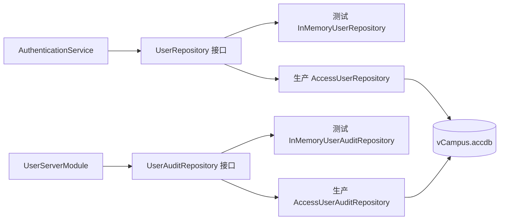

### 14.3 登录相关表

#### 14.3.1 `tblUser`

| 字段 | Access 类型 | 必填 | 约束/默认值 | 登录用途 |
|---|---|---|---|---|
| `userId` | Short Text(36) | 是 | 主键 | 写入 `SessionInfo.userId`。 |
| `username` | Short Text(50) | 是 | 唯一索引、8 位数字 | 技术字段名，保存一卡通号并用于登录。 |
| `passwordHash` | Short Text(255) | 是 | 带盐慢哈希 | 校验正式密码。 |
| `passwordSalt` | Short Text(255) | 是 | 每个账号独立 | 防止相同密码产生相同哈希。 |
| `passwordIterations` | Long Integer | 是 | `120000` | PBKDF2 迭代次数，允许以后逐账号升级。 |
| `passwordProof` | Short Text(64) | 兼容列 | 64 个 `0` | 旧库迁移使用；已升级账号不保存可登录的 proof。 |
| `displayName` | Short Text(100) | 是 | 非空 | 写入会话供界面显示。 |
| `roleCode` | Short Text(20) | 是 | `USER` / `SUPER_ADMIN` | 写入会话角色。 |
| `status` | Short Text(20) | 是 | 默认 `ACTIVE` | 非启用账号拒绝登录。 |
| `passwordChangedAt` | Date/Time | 是 | 当前时间 | 支持密码策略和会话失效。 |
| `createdAt` | Date/Time | 是 | 当前时间 | 账号审计。 |
| `updatedAt` | Date/Time | 是 | 当前时间 | 账号审计。 |

#### 14.3.2 `tblUserAdminScope`

登录成功时可通过 `userId` 查询该账号的管理范围，并写入 `SessionInfo.adminScopes`。

| 字段 | Access 类型 | 必填 | 约束 | 说明 |
|---|---|---|---|---|
| `userAdminScopeId` | AutoNumber | 是 | 主键 | 范围记录编号。 |
| `userId` | Short Text(36) | 是 | 外键 | 对应一卡通账号的稳定内部标识。 |
| `moduleCode` | Short Text(20) | 是 | 与 `userId` 联合唯一 | `STUDENT`、`COURSE`、`LIBRARY`、`SHOP` 或 `HOSPITAL`。 |
| `grantedByUserId` | Short Text(36) | 是 | 外键 | 授权人。 |
| `grantedAt` | Date/Time | 是 | 当前时间 | 授权时间。 |

#### 14.3.3 `tblUserAuditLog`

该表由用户服务器追加写入，保存账号管理操作的成功或失败结果。客户端只能通过 `USER.ADMIN_LIST_AUDIT_LOGS` 读取全部记录；系统不提供网络修改和删除接口。

| 字段 | Access 类型 | 必填 | 说明 |
|---|---|---|---|
| `auditId` | Short Text(36) | 是 | UUID 主键。 |
| `occurredAt` | Date/Time | 是 | 操作发生时间。 |
| `actorUserId` | Short Text(36) | 是 | 操作者稳定用户 ID。 |
| `actorUsername` | Short Text(50) | 是 | 操作者当时的一卡通号。 |
| `actorDisplayName` | Short Text(100) | 是 | 操作者当时的显示名称。 |
| `actionCode` | Short Text(80) | 是 | 被执行的账号管理 Action。 |
| `targetText` | Short Text(120) | 是 | 目标账号或批量操作摘要。 |
| `successful` | Yes/No | 是 | 是否成功。 |
| `detailText` | Short Text(255) | 是 | 响应码和简短说明，不含凭据。 |

#### 14.3.4 `tblTeacherProfile`

该表由用户模块维护全校共用的教师基础资格。它不重复保存姓名和一卡通号；其他服务器模块以 `teacherUserId` 通过 `TeacherDirectory` 取得合并后的只读信息。教师与教学班的任课关系仍由选课模块保存。

| 字段 | Access 类型 | 必填 | 说明 |
|---|---|---|---|
| `teacherUserId` | Short Text(36) | 是 | 主键，关联 `tblUser.userId`。 |
| `department` | Short Text(100) | 是 | 所属院系。 |
| `teacherTitle` | Short Text(50) | 是 | 教师职称。 |
| `active` | Yes/No | 是 | 教师资格是否有效，不影响普通账号登录。 |
| `createdByUserId` | Short Text(36) | 是 | 首次建立档案的超级管理员。 |
| `createdAt` | Date/Time | 是 | 首次建立时间。 |
| `updatedAt` | Date/Time | 是 | 最近修改时间。 |

### 14.4 会话存储

会话不写入 Access，而由用户服务器进程中的 `ConcurrentHashMap` 保存。每条记录包含创建时间和最后访问时间，空闲超时为 30 分钟，绝对有效期为 8 小时；每次成功查询会话会更新最后访问时间，但不会延长绝对有效期。其他服务器模块通过 `ServerContext.sessions()` 提供的只读 `SessionLookup` 查询 token；需要确认任意已有账号时，通过 `ServerContext.users()` 提供的 `UserDirectory` 按 `userId` 或一卡通号查询，只能得到 `userId`、一卡通号、姓名和启用状态；需要确认教师资格时，通过 `ServerContext.teachers()` 提供的 `TeacherDirectory` 查询。客户端不能调用 `ServerContext`，也不能直接读取服务器会话表或用户 DAO。

如需跨进程共享或服务器重启后保持登录，应单独设计持久化方案，不能直接把完整 token 写入普通日志、数据库明文字段或审计表。

## 15. 安全与异常设计

### 15.1 当前安全措施

- 登录失败统一返回“账号或密码错误”，不暴露账号是否存在或是否停用；
- token 使用 `SecureRandom` 生成 32 字节随机值；
- 密码以 `char[]` 接收，并在使用后清零；
- 密码和密码 proof 不写入 `SessionInfo` 或服务器响应；
- 后续请求的权限以服务器会话为准，不相信客户端自报身份；
- ActionRouter 捕获未预期运行时异常，只返回通用服务器错误。

### 15.2 已知限制与改进方向

| 当前限制 | 后续改进 |
|---|---|
| Socket 未使用 TLS | 在真实网络部署前增加 TLS，防止凭据 proof 和 token 被窃听。 |
| 开发期网络 proof 为确定性 SHA-256 | 数据库已经使用带独立盐值的 PBKDF2；网络认证方案仍需结合 TLS 重新设计。 |
| 内存中过期 token 可能累积 | 查询时删除当前过期 token，创建会话时批量清理；若并发规模扩大再增加定时清理任务。 |
| 登录失败没有限速与锁定 | 增加失败计数、短时限流和可审计的锁定/解锁流程。 |
| 会话只存在内存 | 明确服务器重启后要求重新登录；需要持久化时另行评审。 |

## 16. 测试与验收

### 16.1 已有自动化测试

| 测试类 | 覆盖内容 |
|---|---|
| `AuthenticationIntegrationTest`、`InMemoryAuthenticationServiceTest` | 正确登录、会话查询、退出、错误密码、子系统管理员范围，以及空闲/绝对过期。 |
| `LoginPanelTest` | 登录界面控件、开发测试账号展示、账号和密码非空校验。 |
| `DoctorOnboardingIntegrationTest` | 医院管理员分类提交、越权拦截、已有账号精确绑定、外来医生账号自动生成、账号碰撞防护，以及 Access 重启后医生资格保留。 |
| `AccessLibraryRepositoryTest` | 图书馆表和索引初始化、Repository 映射、唯一约束、借还/预约事务回滚，以及新库演示种子不变量。 |
| `LibraryPersistenceIntegrationTest` | 真实 Socket 下演示借阅与预约跨重启保留、已有库不重复补种，以及借书、归还、管理员上架。 |
| `UserAdministrationIntegrationTest`、`AccessUserAuditRepositoryTest` | 超级管理员账号维护、越权拦截、成功/失败审计记录及 Access 重启后记录保留。 |

图书馆模块的服务端 10 个测试类与客户端 9 个测试类共 97 个用例，完整清单见 8.9 节。
其余模块的测试同样由 `.github/workflows/ci.yml` 在每次 PR 上执行。

### 16.2 登录模块验收条件

- [ ] 正确账号和密码能够登录，响应数据为 `SessionInfo`。
- [ ] 登录请求不携带 token，成功后 token 非空且不可预测。
- [ ] 错误密码、未知账号和停用账号均不能创建会话。
- [ ] 客户端保存会话后，`USER.CURRENT_SESSION` 可以返回同一个 `userId`。
- [ ] 退出后客户端会话为空，原 token 再次查询返回 `AUTH_REQUIRED`。
- [ ] 连续空闲 30 分钟或登录满 8 小时后 token 返回 `AUTH_REQUIRED`，客户端回到登录页。
- [ ] 登录过程不冻结 Swing 界面，密码输入在使用后被清空。
- [ ] Response 不包含密码、密码 proof 或服务器异常堆栈。
- [ ] `mvn clean verify` 全部通过。

### 16.3 图书馆模块验收条件

图书馆的完整验收清单见 8.9 节，覆盖：读者与管理员检索可见性差异、馆藏数与可借数的汇总语义、
预约的 24 小时保留与稳定 FIFO 排队、借还与归架的状态流转、续借的三条拒绝规则、
越权与匿名请求拒绝、并发抢同一单册只有一次成功，以及跨服务器重启后的状态保持。

## 17. 源代码位置索引

| 内容 | 文件位置 |
|---|---|
| 登录行为 | `vcampus-client/src/main/java/edu/seu/vcampus/client/module/user/LoginPanel.java` |
| 登录界面布局与样式 | `vcampus-client/src/main/java/edu/seu/vcampus/client/module/user/LoginPanelDesign.java` |
| 用户与教师管理样式 | `vcampus-client/src/main/java/edu/seu/vcampus/client/module/user/UserUiTheme.java` |
| 登录后主界面与模块导航 | `vcampus-client/src/main/java/edu/seu/vcampus/client/view/MainFrame.java` |
| 客户端登录与会话入口 | `vcampus-client/src/main/java/edu/seu/vcampus/client/application/ClientContext.java` |
| 客户端会话保存 | `vcampus-client/src/main/java/edu/seu/vcampus/client/application/ClientSession.java` |
| Socket 客户端 | `vcampus-client/src/main/java/edu/seu/vcampus/client/infrastructure/CampusClient.java` |
| 公共请求和响应 | `vcampus-common/src/main/java/edu/seu/vcampus/common/protocol/Request.java`、`Response.java` |
| 登录 DTO 与密码 proof | `vcampus-common/src/main/java/edu/seu/vcampus/common/user/LoginRequest.java`、`PasswordProof.java` |
| 会话 DTO | `vcampus-common/src/main/java/edu/seu/vcampus/common/user/SessionInfo.java` |
| 审计 DTO | `vcampus-common/src/main/java/edu/seu/vcampus/common/user/UserAuditLogEntry.java`、`UserAuditLogResponse.java` |
| 用户 Action | `vcampus-common/src/main/java/edu/seu/vcampus/common/user/UserActions.java` |
| Access 审计 DAO | `vcampus-server/src/main/java/edu/seu/vcampus/server/module/user/AccessUserAuditRepository.java` |
| Socket 服务器 | `vcampus-server/src/main/java/edu/seu/vcampus/server/infrastructure/CampusServer.java` |
| Action 路由 | `vcampus-server/src/main/java/edu/seu/vcampus/server/infrastructure/ActionRouter.java` |
| 用户服务器入口 | `vcampus-server/src/main/java/edu/seu/vcampus/server/module/user/UserServerModule.java` |
| 身份认证与会话存储 | `vcampus-server/src/main/java/edu/seu/vcampus/server/module/user/InMemoryAuthenticationService.java` |
| 账号 Repository | `vcampus-server/src/main/java/edu/seu/vcampus/server/module/user/UserRepository.java` |
| 生产账号实现 | `vcampus-server/src/main/java/edu/seu/vcampus/server/module/user/AccessUserRepository.java` |
| 图书馆业务规则 | `vcampus-server/src/main/java/edu/seu/vcampus/server/module/library/LibraryService.java` |
| 图书馆服务器入口与鉴权 | `vcampus-server/src/main/java/edu/seu/vcampus/server/module/library/LibraryServerModule.java` |
| 图书馆 Access 事务边界 | `vcampus-server/src/main/java/edu/seu/vcampus/server/module/library/AccessLibraryStore.java` |
| 图书馆 Access Repository | `vcampus-server/src/main/java/edu/seu/vcampus/server/module/library/AccessBookRepository.java`、`AccessBookCopyRepository.java`、`AccessBorrowRecordRepository.java`、`AccessBookCategoryRepository.java`、`AccessReservationRepository.java` |
| 图书馆 Action 常量 | `vcampus-common/src/main/java/edu/seu/vcampus/common/library/LibraryActions.java` |
| 图书馆公共 DTO | `vcampus-common/src/main/java/edu/seu/vcampus/common/library/`（书目、单册、借阅记录、预约、分类） |
| 图书馆客户端入口与容器 | `vcampus-client/src/main/java/edu/seu/vcampus/client/module/library/LibraryClientModule.java`、`LibraryModePanel.java` |
| 图书馆客户端页面 | `vcampus-client/src/main/java/edu/seu/vcampus/client/module/library/LibraryPanel.java`、`MyLibraryPanel.java`、`SelfServicePanel.java`、`LibraryAdminPanel.java` |
| 图书馆客户端样式与文案 | `vcampus-client/src/main/java/edu/seu/vcampus/client/module/library/LibraryUiTheme.java`、`LibraryMessages.java` |
| 图书馆数据库设计 | `database/schema/library.md` |
| 测试账号实现 | `vcampus-server/src/main/java/edu/seu/vcampus/server/module/user/InMemoryUserRepository.java` |
| 子系统会话查询接口 | `vcampus-server/src/main/java/edu/seu/vcampus/server/security/SessionLookup.java` |
| 用户数据库设计 | `database/schema/user.md` |

## 18. 文档汇总与维护说明

本文是逐步汇总的全系统提交材料。公共 Action、DTO、权限、数据库字段或关键业务流程发生变化时，应同步更新对应章节；界面文案和内部私有方法的小调整不必修改公共接口说明。

各子系统负责人提交材料后，按第 4.3 节要求补入其正式章节，并删除标题中的“待负责人材料汇总”。汇总时应以已合并代码、数据库字典和自动化测试为依据；若设计与实现不一致，应先由模块负责人确认，不能只修改文档掩盖差异。
