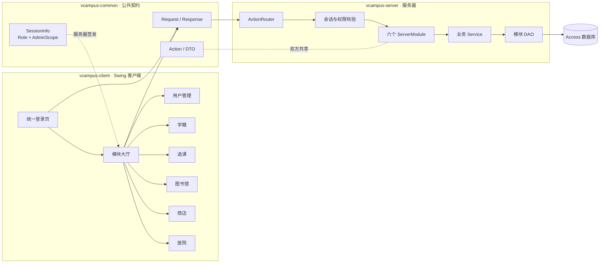
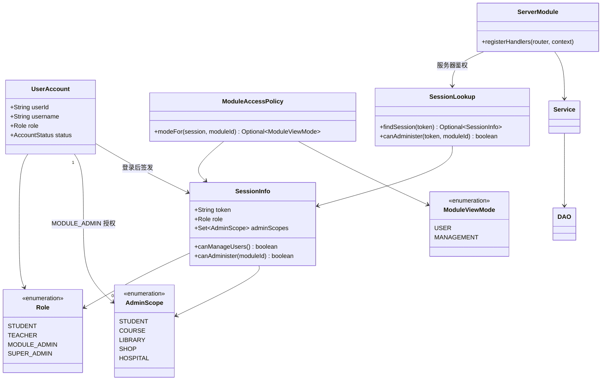
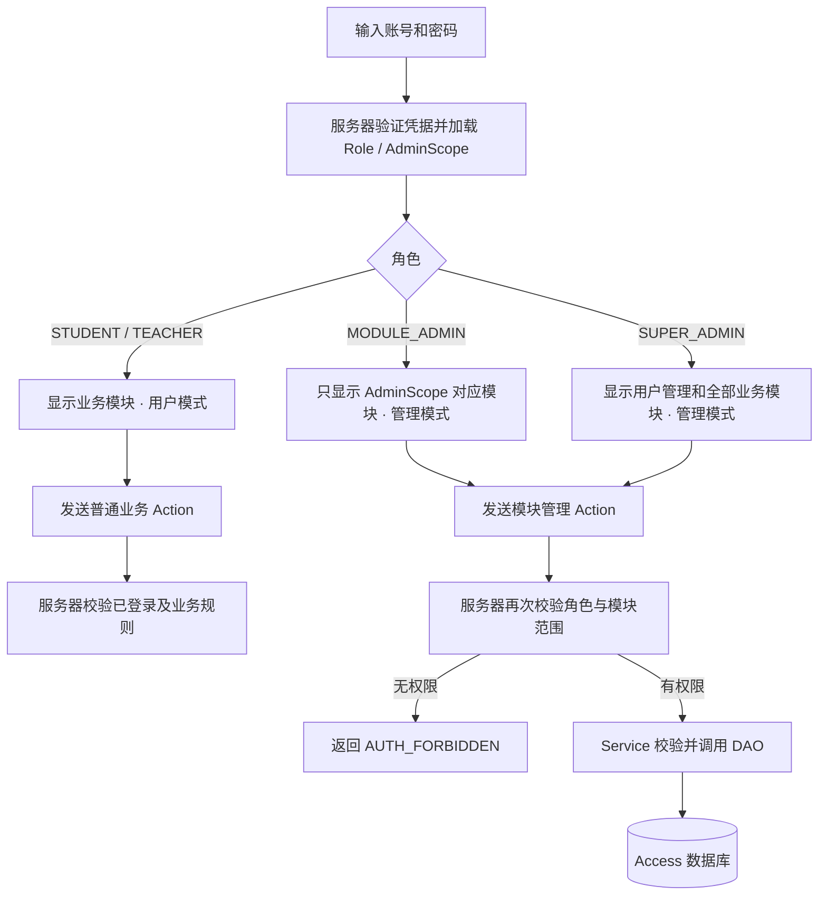
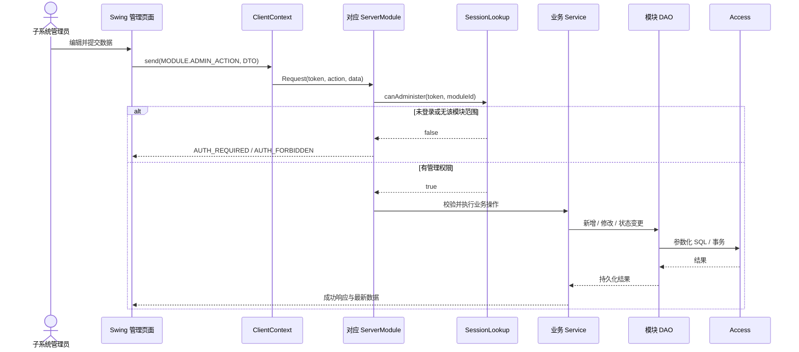

# 管理员权限与模块模式 UML / 流程图

本页固定身份、模块模式和数据库操作链路。业务模块的具体页面、Action、DTO 与表字段仍由对应 Epic 和数据字典维护。

## 1. 软件总体分层与六模块

## 2. 身份与权限类图

## 3. 登录后如何决定模块模式

## 4. 管理员修改业务数据时序图

## 5. 各模块实现约定

- 普通模式与管理模式可以复用查询页面，但管理按钮只在 `MANAGEMENT` 下出现。
- 每个管理 Action 都在对应 Epic 写明所需 `AdminScope`、DTO、校验、错误码和测试。
- 客户端校验用于及时提示；服务器必须重复校验输入、身份和业务约束。
- 数据库只允许服务器 DAO 访问；客户端和 common 层不得出现 JDBC、SQL 或 Access 路径。
- “删除”优先实现为状态变更；库存、容量、号源等并发数据必须由 Service/事务原子更新。
