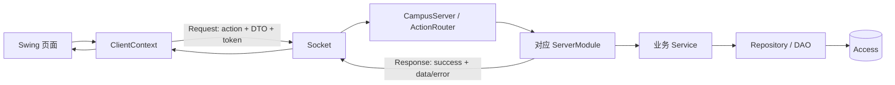
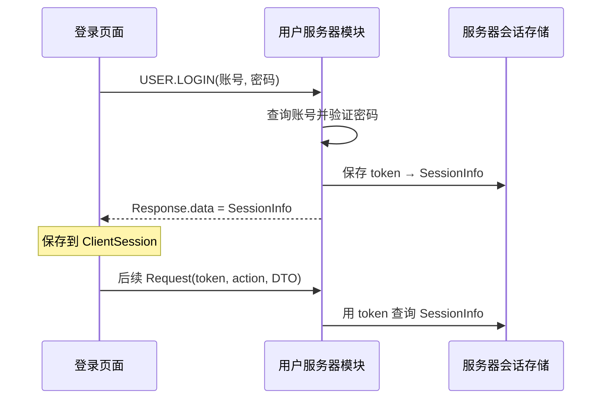

# 系统设计与接口说明

本文回答三个问题：系统如何运行、登录后如何识别用户、子系统负责人需要实现什么。

## 1. 先看结论

- 六个子系统运行在同一个客户端和同一个服务器中，不是六套独立程序。
- 只有客户端与服务器之间使用 Socket；服务器内部通过 Java 对象调用。
- 客户端不访问数据库，也不自行认定权限。
- 登录成功后，客户端保存服务器返回的会话；之后每个请求携带 token。
- 服务器根据 token 找到 `SessionInfo`，再由各子系统校验该用户能否执行当前操作。
- 总控提供公共框架和会话查询能力；子系统负责人实现自己的业务接口、规则和数据访问。

## 2. 总体结构



| Maven 模块 | 作用 |
|---|---|
| `vcampus-common` | 客户端与服务器共享的 Request、Response、Action、DTO 和枚举 |
| `vcampus-client` | Swing 页面、交互状态、发送请求、展示响应 |
| `vcampus-server` | 登录、授权、业务规则、并发控制和数据库读写 |

## 3. 从登录到后续请求

### 3.1 登录过程

1. 登录页面发送 `USER.LOGIN`，请求 DTO 中只有账号和密码凭据，此时 token 为空。
2. 用户模块在服务器查询账号并验证密码。
3. 验证成功后，服务器生成随机 token，构造 `SessionInfo`。
4. 服务器内存保存 `token → SessionInfo`。
5. `Response.data` 返回 `SessionInfo`；token 已经是它的一个字段，并不是第二份独立返回值。
6. 客户端把 `SessionInfo` 保存到 `ClientSession`。
7. 后续请求由 `ClientContext` 自动带上 token。

登录成功后，`MainFrame` 根据 `SessionInfo` 和 `ModuleAccessPolicy` 生成校园服务入口。普通账号只看到普通业务模块；拥有管理范围或超级管理员权限的账号会看到相应管理入口。页面是否显示入口只是界面导航，不能替代服务器鉴权。



### 3.2 SessionInfo 包含什么

| 字段 | 含义 |
|---|---|
| `token` | 本次登录会话的随机凭证 |
| `userId` | 全系统稳定用户 ID，子系统用它查询自己的业务数据 |
| `username` | 登录账号 |
| `displayName` | 页面显示名称 |
| `role` | `USER` 或 `SUPER_ADMIN` |
| `adminScopes` | 该账号可管理的子系统集合 |

当前会话只保存在用户服务器进程的内存中，不使用数据库。关闭客户端会丢失客户端会话；重启服务器会清空全部 token，用户需要重新登录。这是开发阶段实现，后续再增加过期时间和持久化策略。

相关代码：

- `vcampus-common/.../common/user/SessionInfo.java`
- `vcampus-client/.../client/application/ClientSession.java`
- `vcampus-server/.../server/module/user/InMemoryAuthenticationService.java`
- `vcampus-server/.../server/module/ServerContext.java`

## 4. ServerContext 是什么

`ServerContext` 是服务器启动时创建并传给各个 `ServerModule` 的公共服务容器，不是 Socket 网络接口，也不是让客户端调用的 API。

子系统可以通过它获得只读会话查询能力：

```java
Optional<SessionInfo> session = context.sessions()
        .findSession(request.getToken());
```

由此获得 `userId`、`role` 和 `adminScopes`。子系统不能修改会话存储，也不能相信客户端传来的“我是管理员”等字段。

| 公共能力 | 谁提供 | 谁使用 |
|---|---|---|
| `ServerContext` / `SessionLookup` | 总控公共框架 | 各服务器子系统 |
| token 创建、保存、失效 | 用户服务器模块 | 登录和退出流程 |
| 使用 token 查询会话 | 公共会话服务 | 每个需要登录的 Action |

## 5. 身份、管理权和模块模式

全局只做两层判断：

- `Role.USER`：普通账号。
- `Role.SUPER_ADMIN`：可管理全系统的超级管理员。
- `AdminScope`：账号可管理哪些子系统，例如 `HOSPITAL`、`COURSE`。

模块内部再用 `SessionInfo.userId` 查询本模块数据。例如医院模式：

| 模式 | 服务器判断 |
|---|---|
| 患者模式 | 已登录 |
| 医生模式 | `userId` 存在于医院医生表并且医生状态有效 |
| 管理员模式 | 具有 `AdminScope.HOSPITAL` 或为 `SUPER_ADMIN` |

医生新增不是医院管理员直接写入有效档案。申请分为两类：关联已有账号时，医院管理员明确填写已存在的登录账号，服务器在提交阶段校验并锁定其 `userId`；新建外来医生时只填写医生编号、姓名、科室和职称，不填写登录账号。超级管理员批准外来医生后，用户模块生成唯一 `Role.USER` 登录账号，医院模块随后以确定的 `userId` 激活医生档案。医院管理员可在“医生申请记录”中查看审核状态和最终账号，并将初始凭据交给医生；拒绝的申请不创建账号、不授予医生能力。

因此，总控负责让医院模块可靠地取得当前 `userId` 和管理范围，并提供只允许审批流程使用的内部账号开通接口；医院负责人负责申请、医生档案、医生资格查询以及医生业务权限。教师、读者、顾客、任课关系等也由相应模块按自己的数据和规则判断。

页面是否显示入口只是用户体验。服务器处理每个 Action 时仍必须重新验证，不能只靠按钮隐藏来保证安全。

主界面底部的“测试服务器连接”只发送公共 `PING` 请求，用于确认 Socket 服务器是否可达。它不更新 `SessionInfo`、不改变权限，也不应影响右上角的退出登录操作。

## 6. 两类“接口”分别是什么

### 6.1 框架扩展点

这是总控定义的 Java 接口，模块负责人实现它，让公共程序知道怎样加载该模块。

| 扩展点 | 模块负责人实现的内容 |
|---|---|
| `ClientModule` | 模块名称、入口以及 Swing 页面 |
| `ServerModule` | 模块名称、支持的 Action 和请求处理 |

总控提供接口定义、注册机制、`ClientContext`、`ServerContext`、Socket 和 `ActionRouter`；模块负责人不需要重新实现这些公共设施。

### 6.2 客户端—服务器业务契约

这是每个具体功能通过网络交换的约定，由该子系统负责人定义并实现完整逻辑。每个功能应写清：

- Action 名称；
- 请求 DTO 的字段；
- 成功响应 DTO 的字段；
- 需要的登录、管理权或业务资格；
- 可能返回的错误码。

例如：

| 项目 | 示例 |
|---|---|
| Action | `HOSPITAL.SEARCH_SLOTS` |
| 请求 DTO | 科室 ID、日期 |
| 响应 DTO | 可预约号源列表 |
| 权限 | 已登录 |
| 错误 | 参数错误、科室不存在、服务器错误 |

两类接口的关系是：模块先通过 Java 扩展点接入系统，再在模块内部实现若干业务契约。

## 7. DTO 是什么

DTO（Data Transfer Object）就是“为了传输数据而定义的简单对象”。它只保存字段，用于客户端和服务器之间传递请求或响应，不负责页面绘制、SQL 或业务判断。

例如：

```java
public record SearchSlotsRequest(String departmentId, LocalDate date)
        implements Serializable {
}
```

请求 DTO、响应 DTO 与 Action 放在 `vcampus-common` 的对应模块包中，客户端和服务器才能使用完全相同的字段定义。不要直接传 Swing 组件、DAO 实体、数据库连接或包含复杂行为的 Service 对象。

## 8. 子系统负责人如何实现一个功能

以新增 `MODULE.DO_SOMETHING` 为例：

1. 在 common 定义 Action、请求 DTO 和响应 DTO。
2. 在客户端页面收集输入，通过 `ClientContext` 发送请求。
3. 在本模块 `ServerModule` 注册并接收该 Action。
4. 通过 `ServerContext.sessions()` 查询会话。
5. 在服务器校验登录、管理权或模块业务资格。
6. 调用 Service 执行业务规则。
7. Service 通过本模块 Repository/DAO 访问数据。
8. 返回统一 `Response`，客户端展示结果或错误。
9. 增加正常、异常和越权测试，并更新本模块数据字典。

建议目录：

```text
vcampus-common/.../<module>/       Action、请求/响应 DTO
vcampus-client/.../<module>/       ClientModule、Swing 页面
vcampus-server/.../<module>/       ServerModule、Service、Repository/DAO
database/schema/<module>.md         表、字段、约束
```

## 9. 统一响应与错误

`Response` 至少表达：

- 请求是否成功；
- 成功时的 `data`；
- 失败时稳定的错误码；
- 给用户或开发者看的简短消息。

错误码应稳定、可测试。客户端根据错误码决定提示或重新登录，不解析服务器异常堆栈。服务器日志可以记录详细异常，但响应中不得泄露密码、SQL、数据库路径或敏感个人信息。

## 10. 模块和数据边界

- 每个模块维护自己的 Service、Repository/DAO 和数据字典。
- Swing 页面不能直接执行 SQL。
- 模块不能直接改其他模块的表；需要跨模块能力时传稳定 ID，或增加经过评审的只读查询接口。
- 容量、库存、号源等竞争资源必须由服务器原子校验并写入。
- 账号、权限和数据库变化必须同时补充测试。

各模块当前完成情况见 [项目当前状态](../PROJECT_STATUS.md)，表结构见 [数据库说明](../../database/README.md)。

## 11. 谁维护哪份说明

| 问题 | 查看位置 |
|---|---|
| 系统怎么运行、接口怎么写、身份怎么判断 | 本文 |
| 做哪些功能、由谁负责、阶段目标 | [项目范围与分工](../PROJECT_SCOPE.md) |
| 现在完成了什么、下一步是什么 | [项目当前状态](../PROJECT_STATUS.md) |
| 测试、验收和最终提交物 | [质量与交付清单](../QUALITY_AND_DELIVERY.md) |
| 为什么采用当前关键方案 | [当前架构决定](../ARCHITECTURE_DECISIONS.md) |
| 某模块的表和字段 | `database/schema/<module>.md` |
| 某模块的详细任务和验收项 | 对应 GitHub Epic |
| 整个系统的详细设计和最终汇总材料 | [虚拟校园系统软件设计说明书](SOFTWARE_DESIGN_SPECIFICATION.md) |
