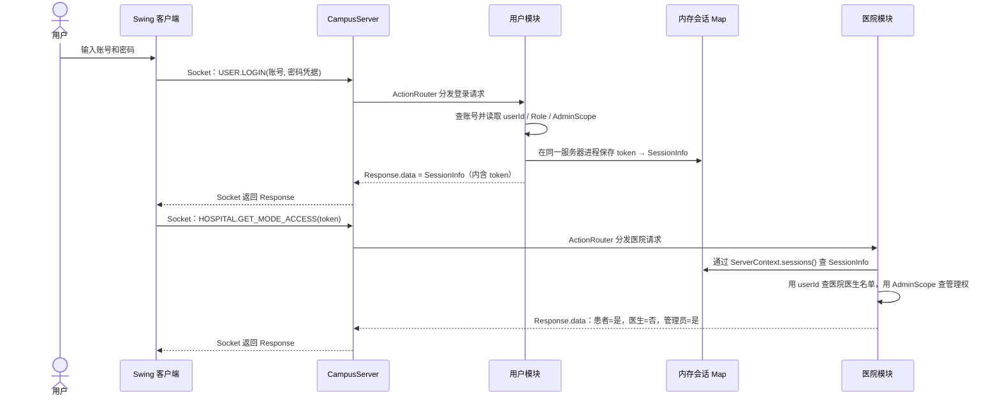
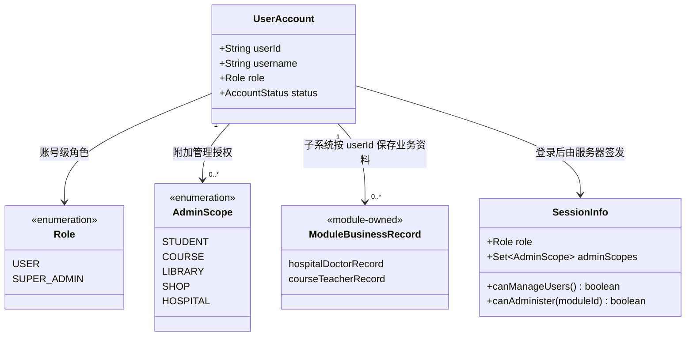
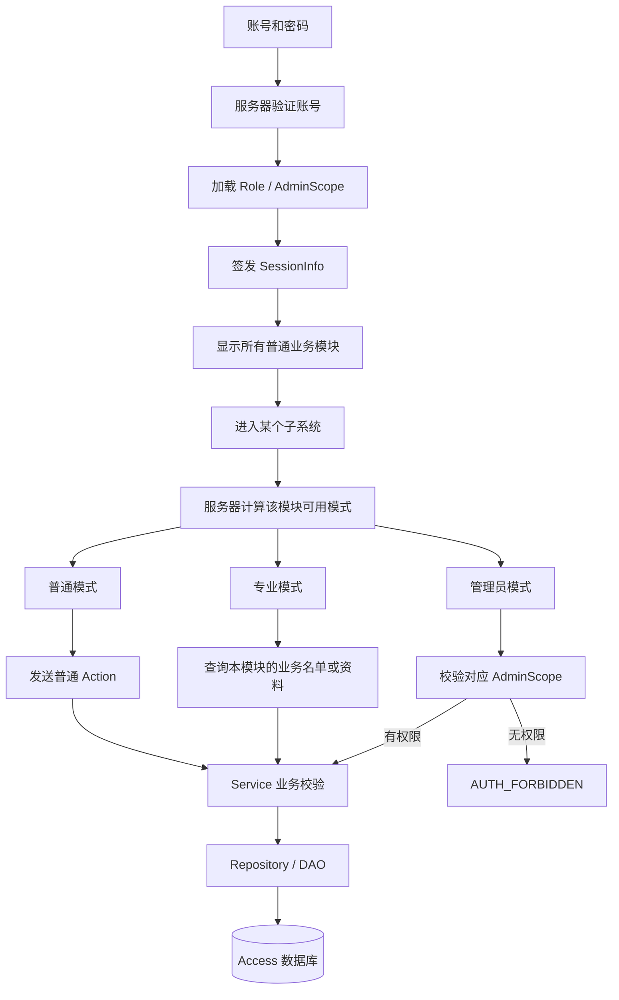
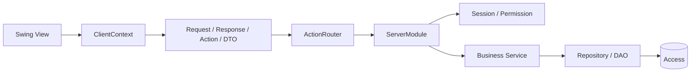

# 虚拟校园系统现行设计总览

> 如果只看一份设计文档，就看本文。前半部分用登录示例解释系统如何识别人，后半部分供开发时查接口和边界。

## 文档定位

本文是当前架构和子系统公共接口的唯一说明：开发者在这里查登录会话、公共 Java 接口、Action/DTO、服务器鉴权、分层边界和模块模式。模块自己的需求和验收项仍写在对应 GitHub Epic，表字段写在 `database/schema/<module>.md`。

## 1. 子系统公共接口

子系统不负责登录，也不保存第二套用户。开发一个学籍、选课、图书馆、商店或医院功能时，只需要接入下面这条公共链路：

本文说的“接口”有两层含义：

| 接口类型 | 是什么 | 例子 |
|---|---|---|
| Java 扩展接口 | 规定模块怎样接入公共框架的方法 | `ClientModule`、`ServerModule`、`SessionLookup` |
| 网络业务接口 | 客户端和服务器约定的一次业务请求 | Action 名 + 请求 DTO + 响应 DTO + 权限 + 错误码 |

例如“查询选课批次”这个网络接口就是：

```text
Action：COURSE.LIST_BATCHES
请求 DTO：无，data = null
身份要求：token 必须对应有效 Session
成功响应：List<SelectionBatchInfo>
失败响应：AUTH_REQUIRED 或 COMMON_INVALID_REQUEST
```

子系统开发者既要实现公共 Java 扩展接口，也要为自己的每个业务功能写清网络业务接口。

```text
Swing 页面
  → ClientContext.send(action, requestDto)
  → Request(action, token, data)
  → ActionRouter
  → 本模块 ServerModule handler
  → SessionLookup.findSession(token)
  → 本模块 Service
  → 本模块 Repository / DAO
  → Response(responseDto)
```

### 六个必须认识的公共接口

| 接口 | 在哪一端 | 子系统开发者怎么用 |
|---|---|---|
| `ClientModule` | 客户端 | 实现 `id()`、`displayName()`、`createView(context)`，返回模块根 Swing 组件 |
| `ClientContext` | 客户端 | 调用 `send(action, dto)`；它会自动附带当前 token，不要自己保存或拼 token |
| `Request / Response` | common | 统一网络消息；业务参数和结果放在可序列化 DTO 中 |
| `ServerModule` | 服务器 | 在 `registerHandlers(router, context)` 中注册本模块 Action 的处理器 |
| `ServerContext.sessions()` | 服务器 | 根据请求 token 查询 `SessionInfo`，进行登录和权限校验 |
| `SessionInfo` | common，由服务器产生 | 读取可信的 `userId`、`Role`、`AdminScope`；不能相信客户端提交的身份 |

真实接口签名如下：

```java
// 客户端模块入口
public interface ClientModule {
    String id();
    String displayName();
    JComponent createView(ClientContext context);
}

// 客户端发送业务请求；token 已由 ClientContext 自动携带
Response response = context.send(Actions.SOME_ACTION, requestDto);

// 服务器模块入口
public interface ServerModule {
    String id();
    void registerHandlers(ActionRouter router, ServerContext context);
}

// 服务器查询可信会话
Optional<SessionInfo> session =
        context.sessions().findSession(request.getToken());
```

实际源码入口：

- [`ClientModule`](../../vcampus-client/src/main/java/edu/seu/vcampus/client/module/ClientModule.java)
- [`ClientContext`](../../vcampus-client/src/main/java/edu/seu/vcampus/client/application/ClientContext.java)
- [`ServerModule`](../../vcampus-server/src/main/java/edu/seu/vcampus/server/module/ServerModule.java)
- [`ServerContext`](../../vcampus-server/src/main/java/edu/seu/vcampus/server/module/ServerContext.java)
- [`SessionLookup`](../../vcampus-server/src/main/java/edu/seu/vcampus/server/security/SessionLookup.java)
- [`Request`](../../vcampus-common/src/main/java/edu/seu/vcampus/common/protocol/Request.java) / [`Response`](../../vcampus-common/src/main/java/edu/seu/vcampus/common/protocol/Response.java)

`ServerContext` 是总控在服务器启动时创建并传给每个 `ServerModule` 的公共服务容器。子系统通过其中的只读 `SessionLookup` 查询会话：

| 调用 | 用途 |
|---|---|
| `context.sessions().findSession(token)` | 查询服务器保存的 `SessionInfo`；无结果表示未登录或 token 已失效 |
| `session.getUserId()` | 取得当前账号的可信唯一标识，用它查询本模块数据 |
| `session.getRole()` | 取得账号级角色，当前值为 `USER` 或 `SUPER_ADMIN` |
| `context.sessions().canAdminister(token, moduleId)` | 判断当前账号能否管理指定子系统 |
| `context.sessions().canManageUsers(token)` | 判断当前账号能否管理账号和授权 |

`ServerContext` 不经过 Socket 发送给客户端，也不允许子系统创建、修改或删除 Session。子系统需要判断医生、任课教师等业务资格时，使用 `userId` 查询本模块自己的名单或记录。

### 新增一个功能时分别写什么

假设医院模块新增“查询我的预约”，文件应该这样分布：

```text
vcampus-common/.../hospital/
  HospitalActions.java             声明 HOSPITAL.LIST_MY_APPOINTMENTS
  AppointmentListRequest.java      请求 DTO（没有参数时可不用）
  AppointmentListResponse.java     响应 DTO
  AppointmentView.java             单条展示 DTO

vcampus-client/.../hospital/
  MyAppointmentsPanel.java         Swing 页面，调用 ClientContext.send

vcampus-server/.../hospital/
  HospitalServerModule.java        注册 Action、检查 Session 和 DTO
  HospitalService.java             业务规则
  HospitalRepository.java          数据访问接口
  AccessHospitalRepository.java    JDBC 实现（接入数据库后）

vcampus-server/src/test/.../hospital/
  HospitalServiceTest.java         业务规则测试

vcampus-client/src/test/.../
  HospitalIntegrationTest.java     客户端—Socket—服务器集成测试
```

模块负责人原则上只修改自己模块的 common、client、server、测试和 `database/schema/<module>.md`。公共接口不够用时先开公共 Issue，不要在自己的模块中复制一套登录、Session 或 Socket。

### common：Action 和 DTO 怎么定义

```java
public final class HospitalActions {
    public static final String LIST_MY_APPOINTMENTS =
            ActionNames.of(ModuleNames.HOSPITAL, "LIST_MY_APPOINTMENTS");
}

public final class AppointmentListResponse implements Serializable {
    @Serial
    private static final long serialVersionUID = 1L;

    private final List<AppointmentView> appointments;

    public AppointmentListResponse(List<AppointmentView> appointments) {
        this.appointments = List.copyOf(appointments);
    }

    public List<AppointmentView> getAppointments() {
        return appointments;
    }
}
```

约束：

- Action 格式固定为 `<MODULE>.<VERB>`，必须使用 `ActionNames.of` 和 `ModuleNames`。
- 请求和响应 DTO 必须可序列化，并声明 `serialVersionUID`。
- DTO 只传业务数据，不放 Swing、Socket、DAO、数据库连接或密码。
- “查询我自己的数据”通常不需要客户端传 `userId`；服务器从 Session 读取，防止查看他人数据。
- 集合字段使用 `List.copyOf` 等方式保存不可变副本。

### client：页面怎么调用服务器

```java
Response response = context.send(
        HospitalActions.LIST_MY_APPOINTMENTS,
        null);

if (!response.isSuccess()) {
    showError(response.getMessage());
    return;
}

AppointmentListResponse result =
        (AppointmentListResponse) response.getData();
```

注意：

- 页面只使用 `ClientContext.send`，不要直接创建 Socket。
- `ClientContext` 自动把当前 Session 的 token 放入 `Request`。
- 网络调用必须放进 `SwingWorker`，不能阻塞 Swing EDT。
- `currentSession()` 只用于显示界面和提前提示，不能代替服务器鉴权。

### server：处理器怎么识别登录用户

普通登录功能的标准模板：

```java
private Response listMyAppointments(Request request, ServerContext context) {
    Optional<SessionInfo> session =
            context.sessions().findSession(request.getToken());
    if (session.isEmpty()) {
        return Response.failure(
                request.getRequestId(),
                ErrorCodes.AUTH_REQUIRED,
                "Please log in first.");
    }

    if (request.getData() != null) {
        return Response.failure(
                request.getRequestId(),
                ErrorCodes.COMMON_INVALID_REQUEST,
                "Request data must be empty.");
    }

    String userId = session.get().getUserId();
    AppointmentListResponse result = service.listForUser(userId);
    return Response.success(request, "Appointments loaded.", result);
}
```

在 `registerHandlers` 中注册：

```java
router.register(
        HospitalActions.LIST_MY_APPOINTMENTS,
        request -> listMyAppointments(request, context));
```

服务器必须按顺序完成：

1. 用 `request.getToken()` 查询 Session；
2. 没有 Session 返回 `AUTH_REQUIRED`；
3. 检查 `request.getData()` 的类型和字段；
4. 从 Session 读取可信 `userId` 和权限；
5. 调用 Service，不在 handler 中写 SQL；
6. 返回明确的 Response DTO 或安全错误码。

### 三种权限分别怎么检查

| 功能类型 | 服务器判断方式 | 示例 |
|---|---|---|
| 普通登录功能 | `findSession(token)` 存在 | 查看选课批次、查询医院科室 |
| 查询“我”的数据 | 从 `session.getUserId()` 取当前用户 | 我的学籍、我的预约、我的订单 |
| 需要本模块业务资格的功能 | 用 `session.getUserId()` 查询本模块保存的名单或资料 | 医院医生工作台、课程教师工作台 |
| 子系统管理功能 | `sessions().canAdminister(token, ModuleNames.X)` | 医院排班管理、课程维护 |
| 用户和授权管理 | `sessions().canManageUsers(token)` | 启停账号、授予 AdminScope |

管理 Action 的标准检查：

```java
Optional<SessionInfo> session =
        context.sessions().findSession(request.getToken());
if (session.isEmpty()) {
    return Response.failure(
            request.getRequestId(),
            ErrorCodes.AUTH_REQUIRED,
            "Please log in first.");
}

if (!context.sessions().canAdminister(
        request.getToken(), ModuleNames.HOSPITAL)) {
    return Response.failure(
            request.getRequestId(),
            ErrorCodes.AUTH_FORBIDDEN,
            "Hospital administrator permission is required.");
}
```

医院的医生模式必须用 `userId` 查询医院自己的医生名单；名单中没有这个账号，即使它有医院管理权限，也不能进入医生模式。

### 模块有多个模式时怎么做

模式多的模块参考医院的做法，增加一个由服务器计算的模式权限接口：

```text
HOSPITAL.GET_MODE_ACCESS
    请求：token，data = null
    响应：HospitalModeAccessView
        patientAllowed
        doctorAllowed
        adminAllowed
```

客户端根据响应启用或禁用模式按钮，但进入模式后的每一个业务 Action 仍需单独鉴权，不能因为按钮曾经可用就跳过服务器检查。

### Service 和 Repository 的边界

```text
ServerModule handler：协议、Session、DTO 类型、Response
Service：业务规则、状态流转、容量/库存/号源并发规则
Repository / DAO：查询和写入数据，不决定界面与网络行为
```

客户端不能直接操作数据库，Service 不能依赖 Swing，Repository 不能返回 `Response`。

### 一个功能合并前至少验证什么

- 未登录请求返回 `AUTH_REQUIRED`；
- 错误 DTO 返回 `COMMON_INVALID_REQUEST`；
- 越权请求返回 `AUTH_FORBIDDEN`；
- 正常 Service 业务流程通过；
- 边界和异常业务规则通过；
- 至少一条客户端—Socket—服务器集成测试通过；
- `mvn clean verify` 全量成功；
- UI 功能提供实际运行截图。

下面章节解释这些接口背后的登录、会话和架构设计。

## 2. 登录与会话

最容易混淆的是“服务器怎么知道我是谁”。答案分成两步：

1. **第一次登录时看账号记录。** 服务器根据用户名找到账号，验证密码，并从账号记录中读取 `userId`、账号级 `Role` 和管理范围 `AdminScope`。
2. **登录后的请求看 token。** 服务器生成一个随机 token，把它和上述身份信息组成 Session。客户端以后只带 token，服务器通过 token 找回 Session。

身份不是用户在登录页选择的，也不是客户端猜出来的。客户端即使伪造“我是管理员”，服务器也不会相信。

### 例子：医院管理员登录

用户输入：

```text
账号：hospitaladmin
密码：123456
```

服务器在账号数据中查到：

```text
userId      = U-HOSPITAL-ADMIN-001
Role        = USER
AdminScope  = HOSPITAL
```

这三项分别表示：

- `userId`：这是哪一个具体的人；
- `Role.USER`：这是普通账号，不是超级管理员；
- `AdminScope.HOSPITAL`：这个账号额外获得了医院数据管理权。

密码验证成功后，服务器创建 Session：

```text
随机 token
    ↓ 对应
Session(userId, Role, AdminScope)
```

客户端进入医院模块时携带 token。统一服务器中的医院模块找到 Session 后分别判断：

```text
患者模式：已经登录                         → 可以进入
医生模式：医院医生名单中是否有这个 userId    → 不可以进入
管理模式：是否具有 AdminScope.HOSPITAL      → 可以进入
```

因此，`hospitaladmin` 最终看到患者和管理员两个可用入口，但医生入口显示无权限。

### 四个对象各负责什么

| 对象 | 谁产生 | 主要作用 | 什么时候使用 |
|---|---|---|---|
| 账号记录 | 超级管理员/用户数据库 | 保存账号级角色和管理授权 | 登录验证时读取 |
| Session | 服务器 | 保存这一次登录对应的人和权限 | 登录成功后创建 |
| token | 服务器 | 找到某一条 Session 的随机通行证 | 每个后续请求携带 |
| 子系统业务资料 | 对应子系统 | 例如医院医生名单、课程任课记录 | 进入相应工作台或执行业务时查询 |



当前只有客户端与统一 `CampusServer` 之间使用 Socket；用户模块、医院模块和会话 Map 都在同一个服务器进程内。客户端把收到的 `SessionInfo` 暂存在 `ClientSession` 内存中，服务器把 `token → SessionInfo` 暂存在 `InMemoryAuthenticationService` 的 `ConcurrentHashMap` 中，双方重启后都需要重新登录。正式接入 Access 后，账号和授权从数据库加载；当前没有把 Session 写入数据库的计划。

对应源码：

- [`SessionInfo`](../../vcampus-common/src/main/java/edu/seu/vcampus/common/user/SessionInfo.java)：token、`userId`、账号级角色和管理范围；
- [`ClientSession`](../../vcampus-client/src/main/java/edu/seu/vcampus/client/application/ClientSession.java)：客户端内存中的当前会话；
- [`UserServerModule`](../../vcampus-server/src/main/java/edu/seu/vcampus/server/module/user/UserServerModule.java)：处理 `USER.LOGIN` 并把 `SessionInfo` 放入 `Response.data`；
- [`InMemoryAuthenticationService`](../../vcampus-server/src/main/java/edu/seu/vcampus/server/module/user/InMemoryAuthenticationService.java)：生成 token，并在服务器内存中维护 `token → SessionInfo`。

## 3. 核心设计原则

1. **一人一个账号。** 登录时只输入账号和密码，不选择“学生、教师、医生或管理员”。
2. **全局账号角色保持最小。** `Role` 当前只有普通账号 `USER` 和超级管理员 `SUPER_ADMIN`。
3. **子系统管理员不是新的登录身份。** 例如医院管理员是 `USER + AdminScope.HOSPITAL`；同一账号仍可按各子系统自己的规则进入其他工作台。
4. **业务资格由各子系统自己的数据决定。** 能否当医生，要看医院医生名单；不能只看全局 `Role` 或管理权限。其他模块也应查询自己的业务资料。
5. **模式属于子系统界面，不属于全局账号。** 系统不设置全局 `USER / MANAGEMENT` 模式。每个子系统分别判断当前账号能进入哪些工作台。
6. **服务器是权限边界。** 客户端隐藏按钮只用于改善体验；每个管理请求都必须在对应 `ServerModule / Service` 中再次校验会话和 `AdminScope`。
7. **客户端不访问数据库。** 数据链路固定为 `Swing → ClientContext → Action/DTO → ServerModule → Service → Repository/DAO → Access`。

## 4. 身份、授权与工作模式



不要试图用一个字段同时表示“教师、医生、管理员”。进入医院后，服务器会分别回答三个简单问题：

| 要判断什么 | 服务器查什么 | `hospitaladmin` 的结果 |
|---|---|---|
| 账号是否已经登录 | token 能否找到 Session | 是，所以能进入患者模式 |
| 账号是不是医院登记的医生 | 医院医生名单中是否有当前 `userId` | 否，所以不能进入医生模式 |
| 账号能否维护医院数据 | Session 中是否有 `AdminScope.HOSPITAL` | 是，所以能进入管理员模式 |

### 不同账号能进入哪些医院工作台

| 服务器中保存的账号资料 | 患者模式 | 医生模式 | 管理员模式 |
|---|---:|---:|---:|
| 已登录，不在医生名单中，也没有医院管理权限 | 是 | 否 | 否 |
| 在医院医生名单中，但没有医院管理权限 | 是 | 是 | 否 |
| 不在医院医生名单中，但有医院管理权限 | 是 | 否 | 是 |
| 既在医生名单中，又有医院管理权限 | 是 | 是 | 是 |

当前开发数据为了少建一个账号，复用了名为 `teacher001` 的普通账号。它的全局角色是 `USER`，医院医生名单中登记了它的 `userId`，因此它能进入医生模式。账号名称不决定权限，其他普通账号不会自动获得医生资格。

进入某个模式不会改变账号资料或权限，只会切换当前工作台。医生模式查询医院医生名单，管理员模式检查 `session.canAdminister(HOSPITAL)`。

## 5. 登录、导航和服务器鉴权



导航规则：

- 所有已登录账号都能看到学籍、选课、图书馆、商店和医院等普通业务模块。
- 用户管理入口只对 `SUPER_ADMIN` 显示。
- 子系统管理员仍能使用其他模块的普通功能，但只能管理 `AdminScope` 中的模块。
- 超级管理员隐式拥有全部 `AdminScope`，但如果医院医生名单中没有它，也不能进入医生模式。

## 6. 各子系统的模式边界

| 子系统 | 普通/专业模式 | 管理模式授权 | 当前实现状态 |
|---|---|---|---|
| 用户管理 | 登录、当前会话、退出 | 仅 `SUPER_ADMIN` | 基础登录和会话已实现；账号维护待开发 |
| 学生学籍 | 学生查看个人学籍 | `AdminScope.STUDENT` | 学籍查询链路已实现 |
| 选课系统 | 学生查看选课批次、后续选退课 | `AdminScope.COURSE` | 批次列表已实现；具体选退课待开发 |
| 图书馆 | 读者检索、借阅和归还 | `AdminScope.LIBRARY` | 待开发 |
| 商店 | 顾客浏览、购物车和订单 | `AdminScope.SHOP` | 待开发 |
| 医院 | 患者模式；医院医生名单中的账号可进入医生模式 | `AdminScope.HOSPITAL` | 三模式入口及患者号源查询已实现 |

每个模块负责人需要在自己的 Epic 和 PR 中明确：

- 有哪些模块内模式，以及每个模式的进入条件；
- 普通 Action、专业 Action、管理 Action 分别需要什么服务器校验；
- DTO、错误码、数据表和业务约束；
- 至少一条正常流程、异常流程和越权流程的自动测试。

## 7. 分层和模块依赖



- `vcampus-common` 只保存双方共享、可序列化且稳定的契约。
- `vcampus-client` 负责界面、交互状态和网络调用，不保存权威权限或数据库规则。
- `vcampus-server` 负责认证、授权、业务规则、并发控制和持久化。
- 模块不能直接修改其他模块的数据表；跨模块能力通过经过评审的接口或只读查询提供。

## 8. 文档分别写在哪里

| 内容 | 唯一维护位置 |
|---|---|
| 当前整体架构、身份模型、权限和模块边界 | 本文 `docs/design/SYSTEM_DESIGN.md` |
| 某项重要决定的背景、备选方案和理由 | `docs/decisions/ADR-xxxx.md` |
| 某模块的需求、页面、Action 和验收清单 | 对应 GitHub Epic 正文 |
| 表、字段、主外键、索引和约束 | `database/schema/<module>.md` |
| 当前完成情况和下一步 | `docs/progress/CURRENT_STATUS.md` |
| 已发生的重要事件 | `docs/progress/PROJECT_LOG.md`，只追加不改写历史 |
| 最终课程设计报告 | `docs/design/SOFTWARE_DESIGN_DRAFT.md`，定期从上述来源同步 |
| 安装、运行、Git 和 PR 操作 | 根目录 `README.md` |

当设计发生变化时，先修改本文和对应 ADR，再在同一 PR 中同步代码、测试以及受影响的数据字典。不要只在聊天、Issue 评论或某个页面代码里留下设计决定。

## 9. 相关详细资料

- [管理员权限与模块模式详细图](ADMIN_PERMISSION_AND_MODE.md)
- [ADR-0009：超级管理员与子系统管理员权限模型](../decisions/ADR-0009-超级管理员与子系统管理员权限模型.md)
- [软件设计说明书持续草稿](SOFTWARE_DESIGN_DRAFT.md)
- [用户数据字典](../../database/schema/user.md)
