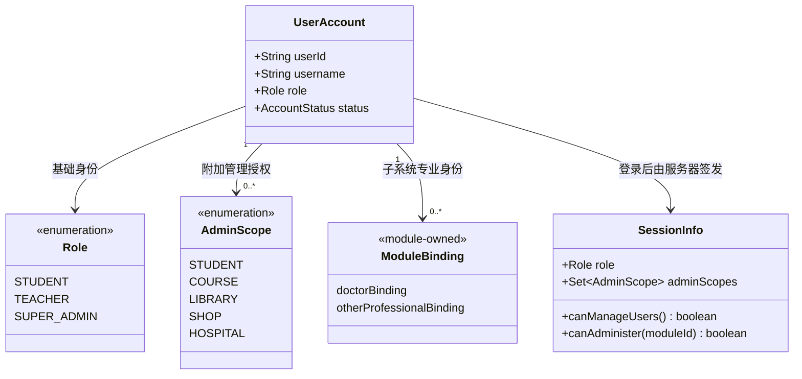
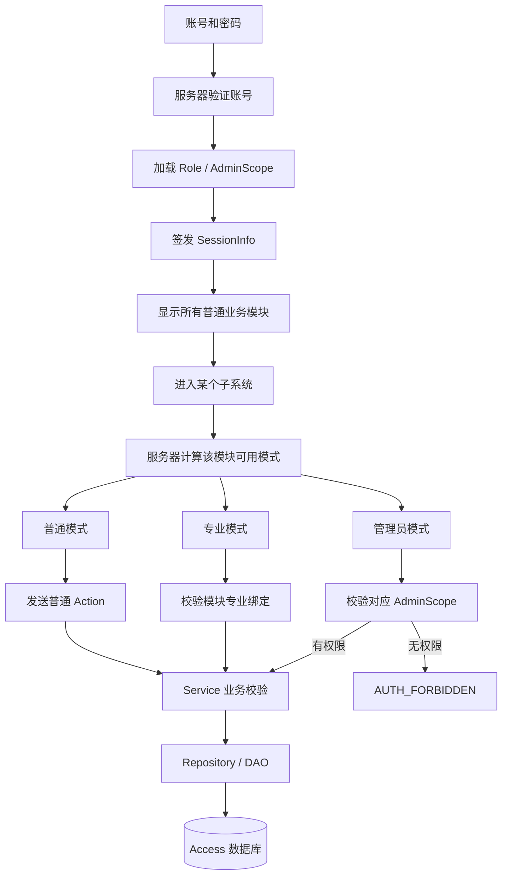
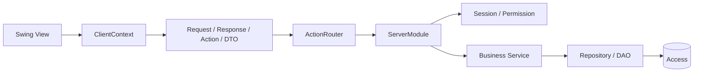

# 虚拟校园系统现行设计总览

> 本文是开发阶段的系统设计唯一入口（source of truth）。代码、评审和模块设计不得与本文冲突。重大决定的理由写入 ADR，表字段写入数据字典，完成进度写入进度文档。

## 1. 核心设计原则

1. **一人一个账号。** 登录时只输入账号和密码，不选择“学生、教师、医生或管理员”。
2. **基础身份与附加能力分离。** `Role` 表示基础身份，当前为 `STUDENT`、`TEACHER`、`SUPER_ADMIN`；`AdminScope` 表示可管理的业务模块。
3. **管理员不是第二个账号，也不是覆盖基础身份的新身份。** 例如医院管理员可以是 `STUDENT + HOSPITAL`，所以同一账号既能作为患者使用医院，也能进入医院管理工作台。
4. **专业身份由子系统维护。** 医生资格由医院的有效医生绑定决定，不由全局 `Role` 或 `AdminScope` 推断；其他模块的专业身份也采用相同原则。
5. **模式属于子系统界面，不属于全局账号。** 系统不设置全局 `USER / MANAGEMENT` 模式。每个子系统根据当前账号的普通身份、专业绑定和管理范围显示自己的模式入口。
6. **服务器是权限边界。** 客户端隐藏按钮只用于改善体验；每个管理请求都必须在对应 `ServerModule / Service` 中再次校验会话和 `AdminScope`。
7. **客户端不访问数据库。** 数据链路固定为 `Swing → ClientContext → Action/DTO → ServerModule → Service → Repository/DAO → Access`。

## 2. 身份、授权与工作模式

三类概念不能混用：

| 概念 | 回答的问题 | 示例 |
|---|---|---|
| `Role` | 这个人在校园中的基础身份是什么 | 学生、教师、超级管理员 |
| `AdminScope` | 这个账号可以维护哪些模块的数据 | `HOSPITAL`、`COURSE` |
| 模块绑定 | 这个人在某模块是否具有专业业务身份 | 有效医生、任课教师 |
| 当前模式 | 用户这一次准备使用哪个工作台 | 患者、医生、医院管理员 |

### 医院模式是标准示例

| 账号能力 | 患者模式 | 医生模式 | 管理员模式 |
|---|---:|---:|---:|
| 普通学生 | 是 | 否 | 否 |
| 有效医生绑定的教师 | 是 | 是 | 否 |
| `STUDENT + HOSPITAL` | 是 | 否 | 是 |
| `SUPER_ADMIN`、无医生绑定 | 是 | 否 | 是 |

进入某个模式不会改变账号权限，只会切换当前工作台。医生模式检查医院绑定，管理员模式检查 `session.canAdminister(HOSPITAL)`。

## 3. 登录、导航和服务器鉴权

导航规则：

- 所有已登录账号都能看到学籍、选课、图书馆、商店和医院等普通业务模块。
- 用户管理入口只对 `SUPER_ADMIN` 显示。
- 子系统管理员仍能使用其他模块的普通功能，但只能管理 `AdminScope` 中的模块。
- 超级管理员隐式拥有全部 `AdminScope`，但不会因此自动获得医生等专业绑定。

## 4. 各子系统的模式边界

| 子系统 | 普通/专业模式 | 管理模式授权 | 当前实现状态 |
|---|---|---|---|
| 用户管理 | 登录、当前会话、退出 | 仅 `SUPER_ADMIN` | 基础登录和会话已实现；账号维护待开发 |
| 学生学籍 | 学生查看个人学籍 | `AdminScope.STUDENT` | 学籍查询链路已实现 |
| 选课系统 | 学生查看选课批次、后续选退课 | `AdminScope.COURSE` | 批次列表已实现；具体选退课待开发 |
| 图书馆 | 读者检索、借阅和归还 | `AdminScope.LIBRARY` | 待开发 |
| 商店 | 顾客浏览、购物车和订单 | `AdminScope.SHOP` | 待开发 |
| 医院 | 患者模式；有效医生绑定可进入医生模式 | `AdminScope.HOSPITAL` | 三模式入口及患者号源查询已实现 |

每个模块负责人需要在自己的 Epic 和 PR 中明确：

- 有哪些模块内模式，以及每个模式的进入条件；
- 普通 Action、专业 Action、管理 Action 分别需要什么服务器校验；
- DTO、错误码、数据表和业务约束；
- 至少一条正常流程、异常流程和越权流程的自动测试。

## 5. 分层和模块依赖

- `vcampus-common` 只保存双方共享、可序列化且稳定的契约。
- `vcampus-client` 负责界面、交互状态和网络调用，不保存权威权限或数据库规则。
- `vcampus-server` 负责认证、授权、业务规则、并发控制和持久化。
- 模块不能直接修改其他模块的数据表；跨模块能力通过经过评审的接口或只读查询提供。

## 6. 文档分别写在哪里

| 内容 | 唯一维护位置 |
|---|---|
| 当前整体架构、身份模型、权限和模块边界 | 本文 `docs/design/SYSTEM_DESIGN.md` |
| 某项重要决定的背景、备选方案和理由 | `docs/decisions/ADR-xxxx.md` |
| 某模块的需求、页面、Action 和验收清单 | 对应 GitHub Epic 正文 |
| 表、字段、主外键、索引和约束 | `database/schema/<module>.md` |
| 当前完成情况和下一步 | `docs/progress/CURRENT_STATUS.md` |
| 已发生的重要事件 | `docs/progress/PROJECT_LOG.md`，只追加不改写历史 |
| 最终课程设计报告 | `docs/design/SOFTWARE_DESIGN_DRAFT.md`，定期从上述来源同步 |
| 安装、运行、Git 和 PR 操作 | 根目录 `README.md` |

当设计发生变化时，先修改本文和对应 ADR，再在同一 PR 中同步代码、测试以及受影响的数据字典。不要只在聊天、Issue 评论或某个页面代码里留下设计决定。

## 7. 相关详细资料

- [管理员权限与模块模式详细图](ADMIN_PERMISSION_AND_MODE.md)
- [ADR-0009：超级管理员与子系统管理员权限模型](../decisions/ADR-0009-超级管理员与子系统管理员权限模型.md)
- [总体架构与接口约定](../03-总体架构与接口约定.md)
- [软件设计说明书持续草稿](SOFTWARE_DESIGN_DRAFT.md)
- [用户数据字典](../../database/schema/user.md)
