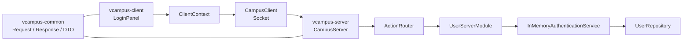
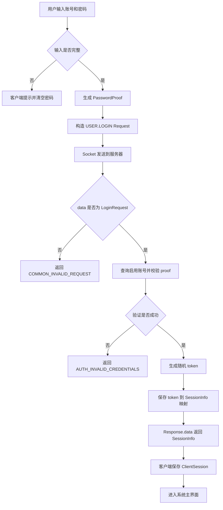
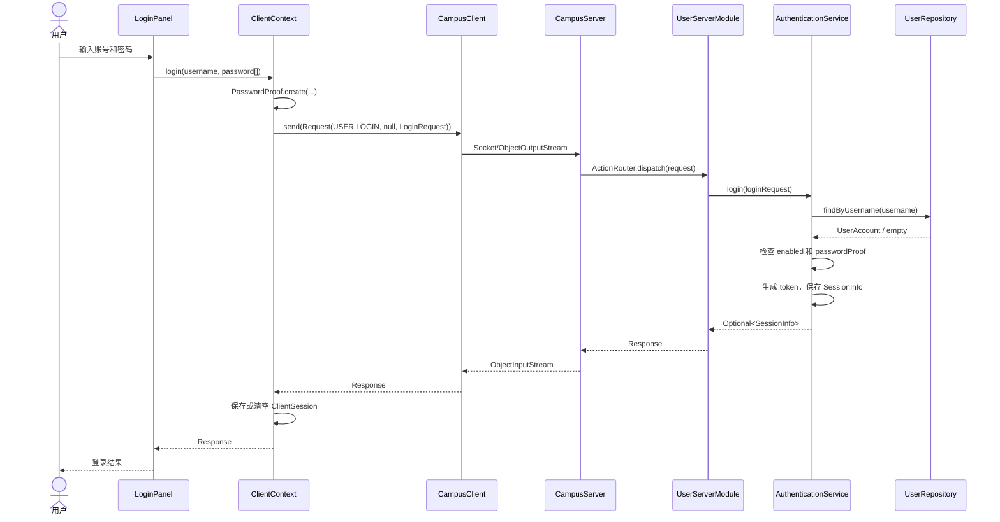
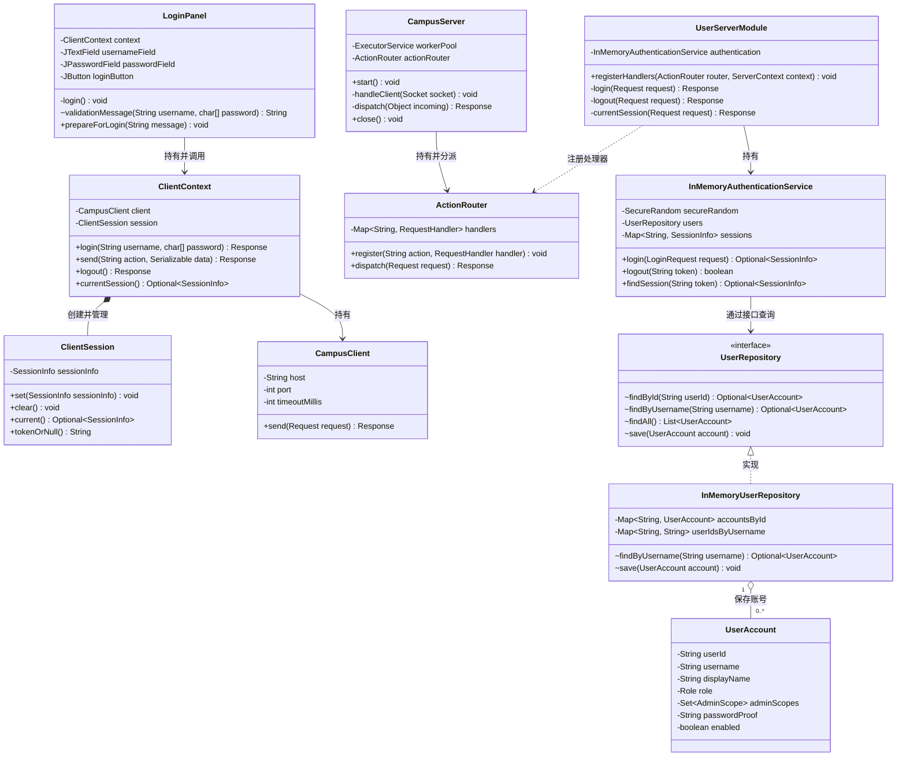
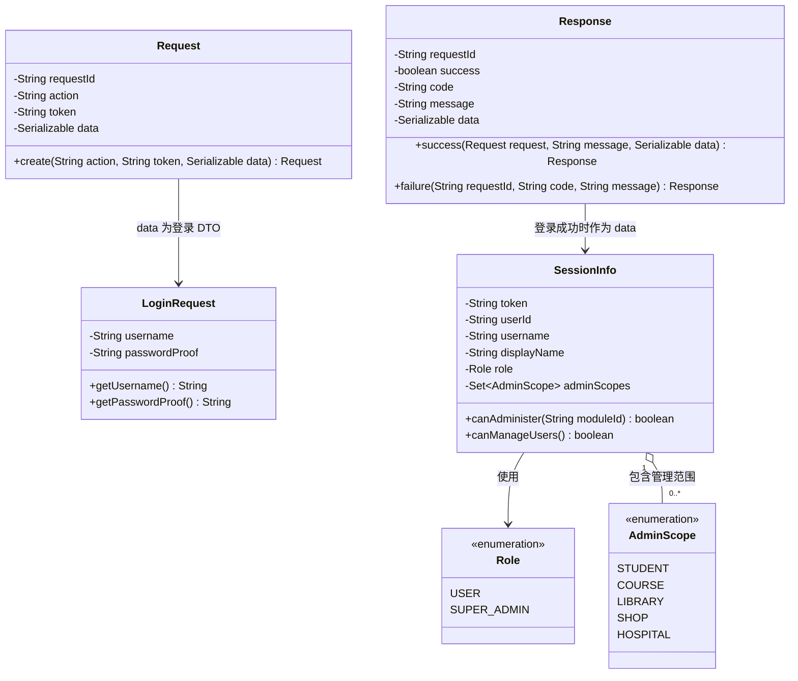
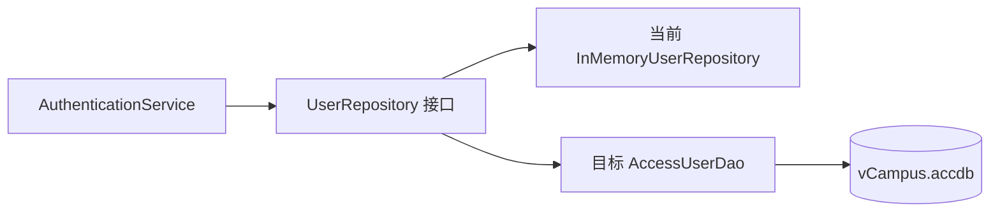

# 虚拟校园系统软件设计说明书（用户登录模块）

| 项目 | 内容 |
|---|---|
| 软件名称 | 虚拟校园系统（JAVA Virtual Campus） |
| 文档范围 | 用户登录、会话校验与退出登录 |
| 版本号 | V1.0 |
| 文档状态 | 与当前代码同步 |
| 撰稿人 | 吴尚扬 |
| 日期 | 2026-08-30 |

## 修改记录

| 修改日期 | 版本号 | 修改人 | 修改内容 |
|---|---|---|---|
| 2026-08-30 | V1.0 | 吴尚扬 | 根据当前代码整理用户登录、会话与主界面导航设计 |

## 1. 引言

### 1.1 编写目的

本文说明虚拟校园系统用户登录模块的详细设计，使开发者能够理解：

- 用户输入账号和密码后，客户端、服务器分别做什么；
- `Request`、`LoginRequest`、`Response` 和 `SessionInfo` 如何在网络中传输；
- 服务器如何验证账号、创建 token、保存会话并处理退出登录；
- 其他子系统如何通过 token 获取当前用户信息；
- 当前内存实现与后续 Access 数据库实现之间的边界。

预期读者为本项目全体开发成员、代码评审人员和课程验收人员。本文只描述登录、会话校验和退出登录，不包含注册、账号管理及各业务子系统的详细设计。

### 1.2 项目背景

虚拟校园系统是一个基于 Java 的客户端/服务器（C/S）课程实践项目。系统包含用户、学籍、选课、图书馆、商店和医院等模块。所有用户从统一登录界面进入系统，登录成功后使用同一个账号访问获准使用的功能。

- 任务提出者：课程指导教师。
- 开发者：虚拟校园系统第 1 小组。
- 使用者：课程演示用户及项目开发人员。
- 运行位置：Windows 客户端和 Java 服务器；验收数据库计划使用 Access `vCampus.accdb`。

### 1.3 术语与定义

| 术语 | 定义 |
|---|---|
| C/S | Client/Server，客户端/服务器结构。Swing 客户端通过 Socket 请求 Java 服务器。 |
| Action | 网络业务操作名称，例如 `USER.LOGIN`，服务器据此选择处理逻辑。 |
| DTO | Data Transfer Object，数据传输对象，只负责携带一次请求或响应的数据。 |
| Request | 所有客户端请求的统一外壳，包含 `requestId`、`action`、`token` 和 `data`。 |
| Response | 所有服务器响应的统一外壳，包含请求编号、结果状态、结果码、提示和数据。 |
| token | 登录成功后由服务器随机生成的会话凭证。后续请求通过它表明属于哪次登录会话。 |
| SessionInfo | 登录成功后的会话信息，包含 token、用户标识、显示名称、全局角色和管理范围。 |
| Role | 账号级权限，只取 `USER` 或 `SUPER_ADMIN`。 |
| AdminScope | 账号可以管理的业务模块范围，例如 `COURSE`、`HOSPITAL`。 |
| Repository | 服务器访问账号数据的抽象边界；当前以内存实现，后续可替换为 Access DAO。 |
| DAO | Data Access Object，封装 JDBC 数据库读写的对象。 |

### 1.4 参考资料

1. 教师提供的《软件设计说明书 DEMO（20250825）》；
2. 仓库根目录 `README.md`；
3. `docs/design/SYSTEM_DESIGN.md`；
4. `database/schema/user.md`；
5. 当前 `vcampus-common`、`vcampus-client` 和 `vcampus-server` 源代码与测试。

### 1.5 小组成员

| 学号 | 姓名 | 职务 | 负责模块 |
|---|---|---|---|
| 61524H29 | 吴尚扬 | 组长 | 用户登录、账号与权限、公共架构及项目协调 |
| 61524134 | 吴昊哲 | 组员 | 图书馆模块 |
| 61524129 | 廖俊杰 | 组员 | 医院模块 |
| 61524H20 | 施天琦 | 组员 | 学籍模块 |
| 61524540 | 葛丰玮 | 组员 | 商店模块 |
| 61524437 | 杨凯涵 | 组员 | 选课模块 |

## 2. 程序系统分析

### 2.1 可行性分析

#### 2.1.1 技术可行性

项目使用 JDK 25 标准库即可完成 Swing 界面、Socket 通信、对象序列化、密码摘要和并发会话存储。登录模块已具备端到端实现，并有自动化测试覆盖登录成功、密码错误、会话查询和退出登录。

后续 Access 持久化可以通过 JDBC DAO 替换 `InMemoryUserRepository`，公共 Action 和 DTO 无需改变，因此迁移风险可控。

#### 2.1.2 操作可行性

用户只需输入账号和密码，不需要自行选择“学生”“医生”或“管理员”等身份。服务器根据账号记录返回用户标识和权限，避免用户在客户端伪造身份。

#### 2.1.3 安全可行性

当前实现不会把密码明文放入 `LoginRequest`，客户端先生成开发期 SHA-256 proof；服务器使用固定时间比较方式校验 proof，并用安全随机数产生 token。但该方案没有 TLS，也不是正式密码存储方案，只适合课程开发阶段。最终版本应使用加密传输和带盐慢哈希。

### 2.2 需求分析

#### 2.2.1 功能需求

| 编号 | 功能 | 说明 |
|---|---|---|
| LOGIN-01 | 输入校验 | 账号或密码为空时，客户端直接提示，不发送请求。 |
| LOGIN-02 | 身份验证 | 服务器根据规范化用户名查找启用账号并校验密码 proof。 |
| LOGIN-03 | 创建会话 | 验证成功后生成随机 token，在服务器保存 `token → SessionInfo`。 |
| LOGIN-04 | 返回身份 | 登录成功时通过 `Response.data` 返回 `SessionInfo`。 |
| LOGIN-05 | 保存会话 | 客户端把 `SessionInfo` 保存到 `ClientSession`。 |
| LOGIN-06 | 携带凭证 | 登录后的请求由 `ClientContext` 自动携带 token。 |
| LOGIN-07 | 查询会话 | 服务器可通过 token 查询当前 `SessionInfo`。 |
| LOGIN-08 | 退出登录 | 服务器删除 token，客户端无论服务器结果如何都清除本地会话。 |
| LOGIN-09 | 统一失败提示 | 账号不存在、被停用或密码错误均返回同一种凭据错误，避免泄露账号状态。 |

#### 2.2.2 非功能需求

- 网络请求和响应必须实现 `Serializable`，供 Java 对象流传输。
- 客户端连接和读取超时均为 5 秒，不能无限等待。
- 登录网络操作不得阻塞 Swing 事件分派线程。
- 会话存储和账号内存仓库必须支持多个服务器工作线程并发访问。
- token 必须由安全随机数生成，不能由用户名、时间或顺序编号推算。
- 密码字符数组使用后必须清零；服务器响应不得包含密码或密码 proof。
- 服务器异常不得把内部堆栈和实现细节返回客户端。

### 2.3 开发设计环境

| 项目 | 当前约定 |
|---|---|
| 开发语言 | Java 25 |
| 构建工具 | Apache Maven 3.9.16 |
| 开发工具 | IntelliJ IDEA Community（也可使用兼容 Java 25 的 IDE） |
| 客户端界面 | Java Swing |
| 网络通信 | TCP Socket + `ObjectInputStream` / `ObjectOutputStream` |
| 测试框架 | JUnit Jupiter 5.13.1 |
| 当前账号存储 | 服务器内存 `ConcurrentHashMap` |
| 验收目标数据库 | Microsoft Access `vCampus.accdb`，通过 JDBC DAO 访问 |

## 3. 程序系统结构

项目分为三个 Maven 模块：

| Maven 模块 | 登录相关职责 |
|---|---|
| `vcampus-common` | 定义客户端和服务器共同使用的 Action、Request、Response、DTO、SessionInfo 和枚举。 |
| `vcampus-client` | 显示登录界面、校验输入、发送请求、保存会话和展示结果。 |
| `vcampus-server` | 接收请求、路由 Action、验证账号、创建/删除会话并返回安全响应。 |

## 4. 用户登录模块设计说明

### 4.1 模块背景

用户登录模块是所有业务模块的统一入口。它只确认“当前账号是谁、具有哪些账号级权限和模块管理范围”，不在全局判断教师、医生、读者等业务资格。各业务模块得到 `userId` 后，再查询本模块的数据完成专业身份判断。

### 4.2 用例设计

#### 4.2.1 登录成功

前置条件：服务器已启动，账号存在、处于启用状态，密码正确。

基本流程：

1. 用户在登录界面输入账号和密码并点击“登录”。
2. 客户端完成非空校验并生成密码 proof。
3. 客户端发送 `USER.LOGIN` 请求，此时 token 为 `null`。
4. 服务器验证请求 DTO、账号状态和密码 proof。
5. 服务器生成 token，保存会话并返回 `SessionInfo`。
6. 客户端保存 `SessionInfo`，主界面根据会话显示可访问入口。

后置条件：服务器和客户端均持有本次会话；后续请求自动携带 token。

#### 4.2.2 登录失败

| 场景 | 处理结果 |
|---|---|
| 账号为空 | 客户端提示“请输入账户名”，不发送网络请求。 |
| 密码为空 | 客户端提示“请输入密码”，不发送网络请求。 |
| 用户名格式无效 | 请求构造失败，界面给出通用输入或连接提示。 |
| 请求数据不是 `LoginRequest` | 返回 `COMMON_INVALID_REQUEST`。 |
| 账号不存在、已停用或密码错误 | 返回 `AUTH_INVALID_CREDENTIALS`，不创建会话。 |
| 服务器无法连接或响应无效 | 客户端提示检查服务器状态。 |

#### 4.2.3 退出登录

1. 客户端发送 `USER.LOGOUT`，请求携带当前 token。
2. 服务器从会话表中删除 token。
3. 删除成功时返回成功响应；token 无效时返回 `AUTH_REQUIRED`。
4. 客户端在 `finally` 中清除本地 `ClientSession`，回到登录界面。

### 4.3 界面设计

登录行为由 `LoginPanel` 实现，布局与样式集中在 `LoginPanelDesign`，避免视觉代码和网络登录逻辑混在一起。界面采用与主界面一致的青绿色主题，左侧仅保留系统英文标识，右侧提供登录表单和开发期测试账号。

主要控件如下：

| 控件 | 组件类型 | 名称 | 作用 |
|---|---|---|---|
| 账户名输入框 | `JTextField` | `login.username` | 输入登录账号。 |
| 密码输入框 | `JPasswordField` | `login.password` | 输入密码，避免以普通字符串读取。 |
| 登录按钮 | `JButton` | `login.submit` | 发起登录，也可在密码框按回车触发。 |
| 状态文本 | `JLabel` | `login.status` | 显示校验、登录中、成功或失败信息。 |
| 测试账号区 | `JPanel` | `login.testAccounts` | 开发阶段展示公开的虚构测试账号。 |
| 显示密码 | `JCheckBox` | `login.showPassword` | 临时显示或隐藏密码输入内容。 |

登录期间输入框和按钮会被禁用，网络请求通过 `SwingWorker` 在后台线程执行，完成后回到界面线程更新状态，避免窗口卡死。密码框在校验失败或请求结束后清空。账号和密码输入框获得焦点时优先使用英文输入，减少测试账号误输入中文的情况。

登录成功后由 `MainFrame` 展示统一工作区：

- 顶部显示系统名称、当前账号类型和“退出登录”；
- 中间仅显示当前会话有权访问的模块卡片；
- 点击模块后进入模块页面，并可返回校园服务首页；
- 底部显示服务器连接状态，“测试服务器连接”只执行 `PING`，不会改变会话或模块权限；
- 模块入口的隐藏只用于改善体验，服务器仍需对每个受保护 Action 再次鉴权。

### 4.4 登录流程图

### 4.5 登录时序图

### 4.6 类分析

下图只保留登录流程的核心类，并列出理解设计所需的主要属性和方法。`+` 表示 `public`，`-` 表示 `private`，`~` 表示包内可见。

#### 4.6.1 核心登录类图

#### 4.6.2 网络 DTO 类图

网络 DTO 单独绘制，避免和核心业务类混在一张图中。它们只负责携带数据，不负责数据库查询或业务判断。

本节使用的关系符号如下：

| 符号 | UML 关系 | 本文含义 |
|---|---|---|
| `-->` | 单向关联 | 一个类长期持有或可以导航到另一个类。 |
| `..>` | 依赖 | 一个类在参数、返回值或方法内部临时使用另一个类。 |
| `*--` | 组合 | 左侧对象创建并管理右侧对象的生命周期。 |
| `o--` | 聚合 | 左侧对象保存若干右侧对象，但右侧类型也可独立使用。 |
| `<|..` | 接口实现 | 虚线和空心三角指向接口，实现类位于另一端。 |
| `1`、`0..*` | 多重性 | 一个对象对应零个或多个对象。 |

#### 4.6.3 客户端类

| 类 | 主要职责 | 登录相关方法 |
|---|---|---|
| `LoginPanel` | 登录表单、输入校验、异步调用和结果提示 | `login()`、`validationMessage()`、`prepareForLogin()` |
| `ClientContext` | 封装登录、带 token 请求和退出操作 | `login()`、`send()`、`logout()`、`currentSession()` |
| `ClientSession` | 保存当前客户端会话 | `set()`、`clear()`、`current()`、`tokenOrNull()` |
| `CampusClient` | 建立 Socket 并完成一次请求/响应 | `send(Request)` |

#### 4.6.4 服务器端类

| 类/接口 | 主要职责 | 登录相关方法 |
|---|---|---|
| `CampusServer` | 监听连接、读取 Request、分派并写回 Response | `start()`、`handleClient()`、`dispatch()`、`close()` |
| `ActionRouter` | 将 `USER.LOGIN` 映射到唯一处理器 | `register()`、`dispatch()` |
| `UserServerModule` | 校验登录 DTO，组织成功或失败响应 | `registerHandlers()`、`login()`、`logout()`、`currentSession()` |
| `InMemoryAuthenticationService` | 验证账号、创建/删除/查询会话 | `login()`、`logout()`、`findSession()` |
| `UserRepository` | 定义账号存取边界 | `findById()`、`findByUsername()`、`findAll()`、`save()` |
| `InMemoryUserRepository` | 当前线程安全的内存账号实现 | 实现 `UserRepository` |
| `UserAccount` | 服务器内部账号记录，不向客户端暴露密码 proof | 只读字段方法及不可变更新方法 |

## 5. 公共模块设计说明

公共模块位于 `vcampus-common`。下列对象会同时被客户端和服务器使用，并实现 `Serializable`；服务器内部的 `UserAccount`、Repository 和 Service 不参与网络传输。

### 5.1 Action

| Action | 请求 token | 请求 data | 成功响应 data | 说明 |
|---|---|---|---|---|
| `USER.LOGIN` | `null` | `LoginRequest` | `SessionInfo` | 验证账号并创建新会话。 |
| `USER.CURRENT_SESSION` | 必填 | `null` | `SessionInfo` | 检查 token 是否仍有效。 |
| `USER.LOGOUT` | 必填 | `null` | `null` | 删除服务器会话。 |

### 5.2 Request

| 字段 | 类型 | 约束 | 说明 |
|---|---|---|---|
| `requestId` | `String` | 非空，由客户端生成 UUID | 关联请求、响应和日志。 |
| `action` | `String` | 非空 | 业务操作名称。 |
| `token` | `String` | 登录前可为 `null` | 会话凭证。 |
| `data` | `Serializable` | 可为 `null` | 对应 Action 的请求 DTO。 |

### 5.3 LoginRequest

| 字段 | 类型 | 约束 | 说明 |
|---|---|---|---|
| `username` | `String` | 去首尾空格并转小写；匹配 `[a-z0-9_]{3,32}` | 规范化登录名。 |
| `passwordProof` | `String` | 64 位小写十六进制 SHA-256 值 | 开发期密码证明，不是原始密码。 |

`PasswordProof.create()` 当前计算内容为领域标记、规范化用户名和密码的 SHA-256 摘要。它降低了原始密码进入请求对象的风险，但在没有 TLS 时仍可能被截获并重放，因此不能视为最终安全协议。

### 5.4 Response

| 字段 | 类型 | 约束 | 说明 |
|---|---|---|---|
| `requestId` | `String` | 与请求一致 | 客户端据此检查响应是否匹配。 |
| `success` | `boolean` | 必填 | 请求是否成功。 |
| `code` | `String` | 必填 | `SUCCESS` 或标准错误码。 |
| `message` | `String` | 必填 | 可安全展示给用户的提示。 |
| `data` | `Serializable` | 可为 `null` | 登录成功时为 `SessionInfo`。 |

### 5.5 SessionInfo

| 字段 | 类型 | 说明 |
|---|---|---|
| `token` | `String` | 32 个安全随机字节经 Base64 URL 无填充编码形成的会话凭证。 |
| `userId` | `String` | 全系统稳定用户标识，业务模块用它查询自己的业务资料。 |
| `username` | `String` | 登录账号。 |
| `displayName` | `String` | 界面显示名称，不作为权限依据。 |
| `role` | `Role` | `USER` 或 `SUPER_ADMIN`。 |
| `adminScopes` | `Set<AdminScope>` | 允许管理的业务模块集合。 |

token 已经是 `SessionInfo` 的字段。登录响应不是分别返回两份“SessionInfo 和 token”，而是 `Response.data` 返回一个包含 token 的 `SessionInfo`。

### 5.6 主要响应码

| 响应码 | 含义 | 出现场景 |
|---|---|---|
| `SUCCESS` | 操作成功 | 登录、会话查询或退出成功。 |
| `COMMON_INVALID_REQUEST` | 请求数据不符合接口约定 | `USER.LOGIN` 的 data 类型错误。 |
| `AUTH_INVALID_CREDENTIALS` | 登录凭据无效 | 账号不存在、停用或密码错误。 |
| `AUTH_REQUIRED` | 需要有效登录 | 会话查询或退出时 token 为空/无效。 |
| `COMMON_UNKNOWN_ACTION` | Action 未注册 | 客户端发送未知操作。 |
| `COMMON_SERVER_ERROR` | 服务器无法完成请求 | 处理器抛出未预期运行时异常。 |

## 6. 网络模块设计说明

### 6.1 客户端

`CampusClient.send()` 每次请求新建一个 Socket，连接服务器后按以下顺序处理：

1. 连接服务器地址和端口；
2. 设置连接及读取超时 5 秒；
3. 先创建并刷新 `ObjectOutputStream`，再创建 `ObjectInputStream`；
4. 序列化写出 `Request`；
5. 读取并检查返回对象必须为 `Response`；
6. 校验响应 `requestId` 必须等于请求 `requestId`；
7. 关闭对象流和 Socket。

### 6.2 服务器端

`CampusServer` 默认监听 8888 端口。服务器接收一个连接后，将处理任务提交到固定大小的工作线程池。每个连接当前只处理一个 Request 和一个 Response，然后关闭连接。

服务器收到对象后先检查是否为 `Request`，再交给 `ActionRouter`。路由器根据 `action` 找到 `UserServerModule` 注册的处理方法，并将返回值写回客户端。

### 6.3 网络数据边界

允许跨网络传输：`Request`、`Response`、`LoginRequest`、`SessionInfo`、枚举及其他显式 DTO。

禁止跨网络传输：`UserAccount`、密码 proof 存储记录、Repository、DAO、数据库连接、服务器异常堆栈。

## 7. 多线程模块设计说明

### 7.1 客户端线程

Swing 组件必须在事件分派线程中创建和更新。登录网络请求由 `SwingWorker.doInBackground()` 执行，结果由 `done()` 返回界面线程处理，从而避免网络等待阻塞界面。

`ClientSession.sessionInfo` 使用 `volatile`，保证界面和后台线程读取到最新会话引用。

### 7.2 服务器线程

`CampusServer` 使用一个接收线程监听连接，使用固定线程池并发处理客户端请求。并发共享对象采用线程安全结构：

- 会话：`ConcurrentHashMap<String, SessionInfo>`；
- 内存账号：`ConcurrentHashMap<String, UserAccount>`；
- Action 注册表：`ConcurrentHashMap<String, RequestHandler>`。

`SessionInfo` 和 `UserAccount` 采用不可变对象设计，减少并发修改风险。

## 8. 数据库设计说明

### 8.1 当前实现

当前登录模块尚未连接 `vCampus.accdb`：

- `DemoUserAccounts` 在服务器启动时创建公开测试账号；
- `InMemoryUserRepository` 在内存中保存账号；
- `InMemoryAuthenticationService` 在内存中保存会话；
- 服务器重启后，内存账号修改和全部 token 都会丢失。

因此，当前代码中的 Repository 是可运行的开发替身，不应表述为“已经使用 Access 数据库”。

### 8.2 目标结构

接入 Access 后，由服务器中的 JDBC DAO 实现 `UserRepository`，客户端不得直接连接数据库。登录流程的 Action、DTO 和界面不变，只替换服务器的数据访问实现。

### 8.3 登录相关表

#### 8.3.1 `tblUser`

| 字段 | Access 类型 | 必填 | 约束/默认值 | 登录用途 |
|---|---|---|---|---|
| `userId` | Short Text(36) | 是 | 主键 | 写入 `SessionInfo.userId`。 |
| `username` | Short Text(50) | 是 | 唯一索引 | 查找登录账号。 |
| `passwordHash` | Short Text(255) | 是 | 带盐慢哈希 | 校验正式密码。 |
| `passwordSalt` | Short Text(255) | 是 | 每个账号独立 | 防止相同密码产生相同哈希。 |
| `displayName` | Short Text(100) | 是 | 非空 | 写入会话供界面显示。 |
| `roleCode` | Short Text(20) | 是 | `USER` / `SUPER_ADMIN` | 写入会话角色。 |
| `status` | Short Text(20) | 是 | 默认 `ACTIVE` | 非启用账号拒绝登录。 |
| `passwordChangedAt` | Date/Time | 是 | 当前时间 | 支持密码策略和会话失效。 |
| `createdAt` | Date/Time | 是 | 当前时间 | 账号审计。 |
| `updatedAt` | Date/Time | 是 | 当前时间 | 账号审计。 |

#### 8.3.2 `tblUserAdminScope`

登录成功时可通过 `userId` 查询该账号的管理范围，并写入 `SessionInfo.adminScopes`。

| 字段 | Access 类型 | 必填 | 约束 | 说明 |
|---|---|---|---|---|
| `userAdminScopeId` | AutoNumber | 是 | 主键 | 范围记录编号。 |
| `userId` | Short Text(36) | 是 | 外键 | 对应登录账号。 |
| `moduleCode` | Short Text(20) | 是 | 与 `userId` 联合唯一 | `STUDENT`、`COURSE`、`LIBRARY`、`SHOP` 或 `HOSPITAL`。 |
| `grantedByUserId` | Short Text(36) | 是 | 外键 | 授权人。 |
| `grantedAt` | Date/Time | 是 | 当前时间 | 授权时间。 |

### 8.4 会话存储

第一阶段会话不写入 Access，而由用户服务器进程中的 `ConcurrentHashMap` 保存。其他服务器模块通过 `ServerContext.sessions()` 提供的只读 `SessionLookup` 查询 token；客户端不能调用 `ServerContext`，也不能直接读取服务器会话表。

后续如需会话过期、跨进程共享或服务器重启后保持登录，应单独设计过期时间、撤销策略和持久化方案，不能直接把完整 token 写入普通日志或审计表。

## 9. 安全与异常设计

### 9.1 当前安全措施

- 登录失败统一返回“账号或密码错误”，不暴露账号是否存在或是否停用；
- token 使用 `SecureRandom` 生成 32 字节随机值；
- 密码以 `char[]` 接收，并在使用后清零；
- 密码和密码 proof 不写入 `SessionInfo` 或服务器响应；
- 后续请求的权限以服务器会话为准，不相信客户端自报身份；
- ActionRouter 捕获未预期运行时异常，只返回通用服务器错误。

### 9.2 已知限制与改进方向

| 当前限制 | 后续改进 |
|---|---|
| Socket 未使用 TLS | 在真实网络部署前增加 TLS，防止凭据 proof 和 token 被窃听。 |
| 开发期 proof 为确定性 SHA-256 | 数据库改用 PBKDF2 等带盐慢哈希；网络认证方案需结合 TLS 重新设计。 |
| token 没有过期时间 | 增加创建时间、最后访问时间、空闲过期和绝对过期。 |
| 登录失败没有限速与锁定 | 增加失败计数、短时限流和可审计的锁定/解锁流程。 |
| 会话只存在内存 | 明确服务器重启后要求重新登录；需要持久化时另行评审。 |

## 10. 测试与验收

### 10.1 已有自动化测试

| 测试类 | 覆盖内容 |
|---|---|
| `AuthenticationIntegrationTest` | 正确登录、会话查询、退出、退出后 token 失效、错误密码、子系统管理员范围。 |
| `LoginPanelTest` | 登录界面控件、开发测试账号展示、账号和密码非空校验。 |

### 10.2 登录模块验收条件

- [ ] 正确账号和密码能够登录，响应数据为 `SessionInfo`。
- [ ] 登录请求不携带 token，成功后 token 非空且不可预测。
- [ ] 错误密码、未知账号和停用账号均不能创建会话。
- [ ] 客户端保存会话后，`USER.CURRENT_SESSION` 可以返回同一个 `userId`。
- [ ] 退出后客户端会话为空，原 token 再次查询返回 `AUTH_REQUIRED`。
- [ ] 登录过程不冻结 Swing 界面，密码输入在使用后被清空。
- [ ] Response 不包含密码、密码 proof 或服务器异常堆栈。
- [ ] `mvn clean verify` 全部通过。

## 11. 源代码位置索引

| 内容 | 文件位置 |
|---|---|
| 登录行为 | `vcampus-client/src/main/java/edu/seu/vcampus/client/module/user/LoginPanel.java` |
| 登录界面布局与样式 | `vcampus-client/src/main/java/edu/seu/vcampus/client/module/user/LoginPanelDesign.java` |
| 登录后主界面与模块导航 | `vcampus-client/src/main/java/edu/seu/vcampus/client/view/MainFrame.java` |
| 客户端登录与会话入口 | `vcampus-client/src/main/java/edu/seu/vcampus/client/application/ClientContext.java` |
| 客户端会话保存 | `vcampus-client/src/main/java/edu/seu/vcampus/client/application/ClientSession.java` |
| Socket 客户端 | `vcampus-client/src/main/java/edu/seu/vcampus/client/infrastructure/CampusClient.java` |
| 公共请求和响应 | `vcampus-common/src/main/java/edu/seu/vcampus/common/protocol/Request.java`、`Response.java` |
| 登录 DTO 与密码 proof | `vcampus-common/src/main/java/edu/seu/vcampus/common/user/LoginRequest.java`、`PasswordProof.java` |
| 会话 DTO | `vcampus-common/src/main/java/edu/seu/vcampus/common/user/SessionInfo.java` |
| 用户 Action | `vcampus-common/src/main/java/edu/seu/vcampus/common/user/UserActions.java` |
| Socket 服务器 | `vcampus-server/src/main/java/edu/seu/vcampus/server/infrastructure/CampusServer.java` |
| Action 路由 | `vcampus-server/src/main/java/edu/seu/vcampus/server/infrastructure/ActionRouter.java` |
| 用户服务器入口 | `vcampus-server/src/main/java/edu/seu/vcampus/server/module/user/UserServerModule.java` |
| 身份认证与会话存储 | `vcampus-server/src/main/java/edu/seu/vcampus/server/module/user/InMemoryAuthenticationService.java` |
| 账号 Repository | `vcampus-server/src/main/java/edu/seu/vcampus/server/module/user/UserRepository.java` |
| 当前内存账号实现 | `vcampus-server/src/main/java/edu/seu/vcampus/server/module/user/InMemoryUserRepository.java` |
| 子系统会话查询接口 | `vcampus-server/src/main/java/edu/seu/vcampus/server/security/SessionLookup.java` |
| 用户数据库设计 | `database/schema/user.md` |

## 12. 说明

本文以当前代码为准。若登录 Action、DTO、SessionInfo 字段、会话策略或数据库字段发生变化，应同步更新本文；界面文案或内部私有方法的小调整不必改变公共接口章节。
