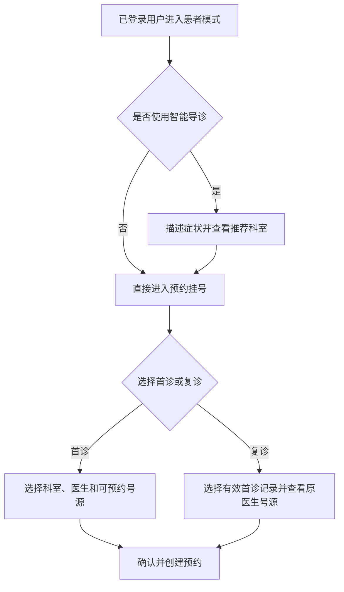
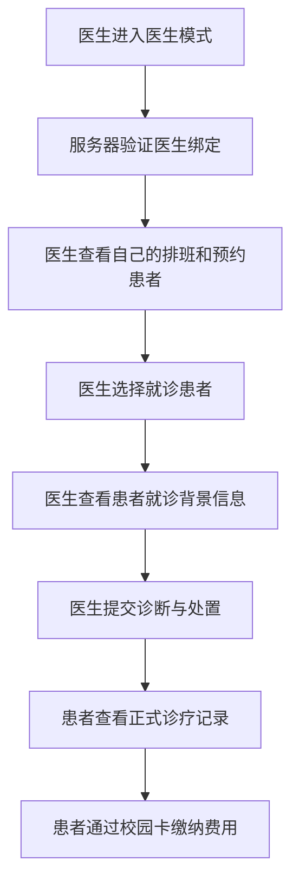
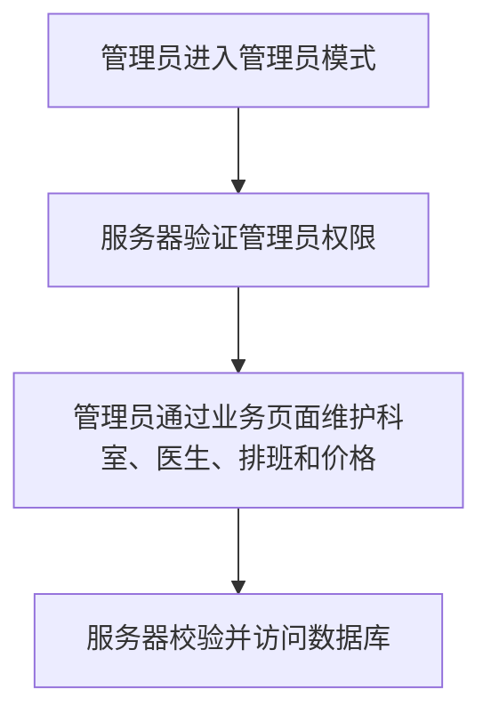
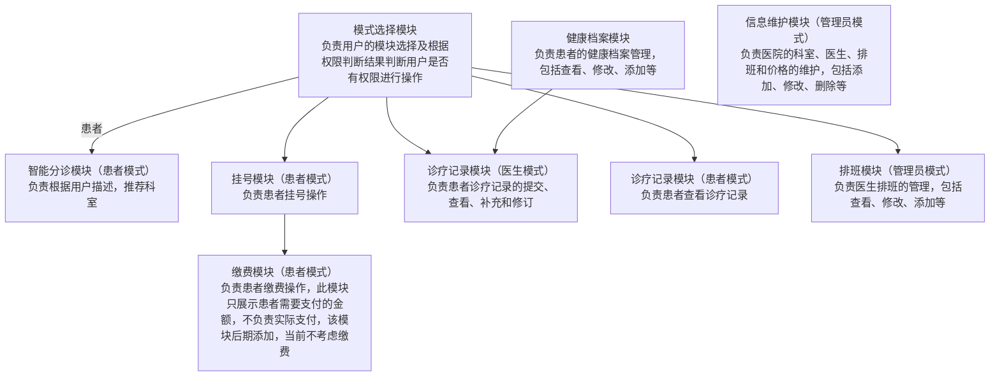
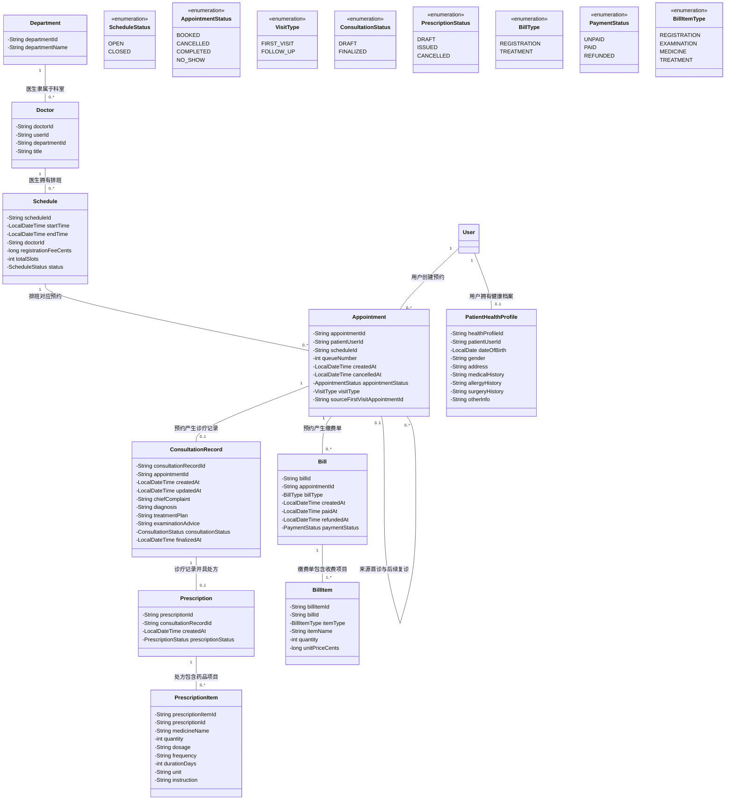

# 医院模块设计0.2

> 文档状态：2026-09-11 已补充规则安全层与 AI 多轮追问导诊；原“首诊/复诊二分法”由第 10 节的“诊疗阶段、检查结果回诊、复诊”模型取代。
>
> 本版只整理已经确认的决定和评审约束，不代表接口字段、数据库表或 Java 类已经冻结。

## 1. 产品设计
### 1.1 核心目标
模拟校园中医院的整个运转流程，包括挂号、就诊、缴费、诊疗记录管理等。
### 1.2 面向用户
- 患者
- 医生
- 管理员
> 注意：三种使用模式可以重叠，例如医生本人也可以作为患者就诊。所有已登录用户都可以进入患者模式；医生模式和管理员模式必须由服务器根据登录会话和实际权限判断。
### 1.3 功能模块
- 患者模块
  - 所有已登录用户都可以选择“患者”模式进入系统
  - 患者可以直接预约挂号，也可以先通过智能导诊获取科室建议；智能导诊不是挂号的必经步骤
  - 患者选择首诊或复诊，查看符合条件的医生排班并挂号
  - 患者查看缴费清单和缴费状态，并通过校园卡子系统完成扣款与退款
  - 患者能够看到自己的诊疗记录
  - 患者可以从就医指南了解初诊、普通复诊、检查结果回诊的不同入口及就诊准备
- 医生模块
  - 医生选择“医生”身份进入系统
  - 医生查看自己的排班
  - 医生能够查看患者的诊疗记录和健康档案
  - 医生能够开诊疗单并添加到患者的诊疗记录中，包括诊断、处置和处方单；医生提交后，患者可以查看，系统可以据此生成校园卡待缴费用
  - 医生提交后的正式诊疗记录不直接删除；需要更正时通过补充或修订记录处理
- 管理员模块
  - 管理员选择“管理员”身份进入系统
  - 管理员通过服务器业务接口维护医院的科室、医生、排班和价格，客户端不能直接访问或修改数据库

### 1.4 范围分级

#### 必须交付

- 查询科室、医生和号源
- 预约挂号、取消预约和查看我的预约
- 服务器登录与权限校验
- 重复预约、过期号源、号满和并发校验
- 管理员最小排班维护

#### 目标闭环

- 医生查看自己的预约患者
- 医生查看患者就诊背景信息
- 医生提交诊断与处置
- 患者查看自己的诊疗记录
- 患者维护简化健康档案

#### 展示亮点

- 规则安全层与 AI 逐层追问结合的智能导诊
- 高风险症状提示
- 自动生成预问诊摘要
- 简化模拟费用清单

#### 暂不实施

- 银行/医保等外部支付、医保结算和真实药房
- 完整电子病历
- 患者修改医生诊断
- 管理员直接编辑数据库
- AI 确诊、治疗或自动开方

## 2. 业务流程
### 2.1 患者挂号

### 2.2 患者就诊与医生诊断

### 2.3 管理员修改医院信息


### 2.4 首诊与复诊规则（历史方案，已被第 10 节取代）

> 本节保留用于记录早期设计过程，不再作为实现依据。尤其是“一次首诊最多一次复诊”“复诊必须在 7 天内找原医生”等规则，把检查结果回诊和疾病复诊混为一谈，不能继续直接编码。

#### 首诊

- 预约类型为 `FIRST_VISIT`。
- 不要求存在历史诊疗记录。
- 患者可以自行选择科室、医生和号源。
- 智能导诊只能提供科室建议，不替患者确诊或自动预约。

#### 复诊

- 预约类型为 `FOLLOW_UP`。
- 患者必须从自己的已完成首诊记录中选择一条来源记录。
- 复诊只能预约该次首诊的原接诊医生。
- 复诊排班的开始时间不得晚于医生提交首诊诊疗记录的时间加 7 天。
- 首诊和复诊挂号价格相同。
- 一次首诊最多产生一次有效复诊。
- 已预约或已完成的复诊会占用该首诊的复诊资格。
- 复诊预约取消后，只要仍在 7 天有效期内，可以重新预约。
- 超过 7 天，或原医生在有效期内没有可预约号源时，不能继续以该首诊记录发起复诊；患者可以重新选择普通首诊挂号。
- 诊疗记录页面需要显示该次就诊属于“首诊”还是“复诊”。

#### 复诊关系

```text
首诊预约
→ 首诊诊疗记录
→ 复诊预约（引用首诊诊疗记录）
→ 复诊诊疗记录
```

## 3. 模块划分

## 4. 接口设计

> 状态说明：4.1—4.10 是最初的接口想法，暂时保留用于记录设计过程，但不能直接作为编码契约。下一轮由设计者根据以下约束重新设计具体操作、输入、输出和错误情况。

### 4.0 已确认的接口约束

- 客户端只传用户选择和业务数据；真实用户身份必须由服务器从登录 token/session 获取。
- 患者模式对所有已登录用户开放；医生和管理员操作必须在每次请求时由服务器重新校验。
- 业务关联使用稳定 ID，例如 `departmentId`、`doctorId`、`scheduleId`、`appointmentId` 和 `consultationId`，不能用姓名作为唯一标识。
- 查询号源不返回医生手机号等与预约无关的个人信息。
- 当前日期和复诊截止时间由服务器计算，不能相信客户端传来的“当前日期”。
- 修改类操作不能只返回 `true/false`，还要能表达成功数据、错误码和安全提示。
- 挂号必须校验登录、排班状态、剩余号源、重复预约、过期时间和并发抢号。
- 复诊挂号必须校验来源首诊记录、患者归属、原医生、7 天期限和复诊资格。
- 患者只能查看自己的正式诊疗记录，不能添加、修改或删除医生诊断。
- 管理员客户端只能调用服务器业务接口，不能直接访问数据库。

### 4.1 权限判断接口
- 接口描述：根据用户选择的身份类型和从数据库中调取的用户身份，判断用户是否有权限进入该模块。
- 输入参数：从数据库中调取的用户身份（患者、医生、管理员）、用户选择的身份类型（患者、医生、管理员）
- 输出参数：是否允许用户进入该模块（true或false）
- 可能失败：与数据库交互失败，例如数据库连接失败、查询失败等
- 失败后处理：返回错误码，提示访问数据库失败
### 4.2 号源查看接口
- 接口描述：根据用户选择的挂号科室，查看该科室下最近一周的可预约医生排班。
- 输入参数：用户选择的挂号科室（科室名称），当前日期（yyyy-MM-dd）
- 输出参数：该科室下最近一周的可预约医生排班（包含医生姓名、手机号、排班时间、排班状态），即每个医生的号数和排班时间
- 可能失败：与数据库交互失败，例如数据库连接失败、查询失败等
- 失败后处理：返回错误码，提示访问数据库失败
### 4.3 挂号接口
- 接口描述：根据用户选择的挂号科室和医生，进行挂号操作。
- 输入参数：用户选择的挂号科室（科室名称）、用户选择的挂号医生（医生姓名），挂号时间（yyyy-MM-dd HH:mm:ss）
- 输出参数：挂号成功（true）或挂号失败（false），该医生当日号数减一
- 可能失败：与数据库交互失败，例如数据库连接失败、查询失败等
- 失败后处理：返回错误码，提示访问数据库失败

### 4.4 缴费接口
- 接口描述：根据患者选择的诊疗单，生成缴费清单。
- 输入参数：患者选择的诊疗单（包含单号、处置、处方单）
- 输出参数：缴费清单（包含单号、处置、处方单、金额）
- 可能失败：与数据库交互失败，例如数据库连接失败、查询失败等
- 失败后处理：返回错误码，提示访问数据库失败

### 4.5 导诊接口

- 动作：`HOSPITAL.GET_TRIAGE_RECOMMENDATION`，仍要求登录。
- 当前客户端输入：`TriageChatRequest`，携带按顺序排列的患者原话与助手回复（`TriageChatMessage`）。每条患者消息最多 300 字，一次会话最多 40 条消息，超限提示重新开始，不静默截断历史。
- 输出：`TriageChatResult`，包括自然语言回复、可核对的信息摘要、仍需了解的信息以及 `TriageResultView` 科室/安全选项。患者可以持续补充、询问问题含义，并修改任一历史患者消息；修改会移除该消息及其后回复，再重新计算。
- 模型每轮读取完整原话；通过结构化 `facts` 区分已报告、明确否认的信息，未知信息单列为 `missingInformation`。事实附患者消息编号和原文证据，服务器拒绝引用助手推测或患者未说过的文字。摘要展示通过校验的原话证据，不将模型自由生成的摘要作为事实。
- 服务器把患者每条自由描述按标点拆成待覆盖的原话片段，并随模型请求发送。模型只有在每个片段都形成同消息编号的有效事实后才能结束追问；若模型漏掉“咳嗽，同时牙疼”中的任一独立描述，服务器撤下科室推荐并要求患者确认遗漏项。明确更正后的旧描述、固定安全题答案和“什么意思”等交互文本不作为新症状。
- 安全处理：每轮先运行本地红旗规则和相关固定安全题。选项直接出现在聊天中，文字框保持可用；能明确对应固定题的文字答案也可以直接接受。询问“某词是什么意思”不直接当作肯定症状。模型可补充提示线下风险，但必须引用患者证据，不能凭空编造；本地已命中的风险不被模型降级。
- 推荐前先核对信息，点击“描述无误，查看科室”后展示科室和号源入口。补充/修改信息或新请求发送时，原推荐入口立即撤下。候选必须属于当前启用且可挂号科室；没有合适科室时不强行补全模型候选。
- 模型未启用、超时、限流或响应结构错误时显示对话不可用提示，并提供明确标注的本地科室参考。网络请求失败保留输入；重新开始、离开页面或账号切换后，过期回复不能覆盖当前会话。
- 数据边界：会话仅在客户端内存与请求处理中保留，不写入 Access，不作为健康档案、医生签署记录或管理员资料。配置启用模型后，完整导诊会话会发送到配置的模型服务。
- 兼容：旧 `TriageRequest` + `TriageResultView` 问卷协议继续支持旧客户端，原来的四轮普通追问上限仅属于旧协议。
- 当前限制：证据字符串匹配只能防止无来源的信息，不能证明医学含义正确；否定识别、规则覆盖和模型判断仍需真实病例评估。历史明确危险描述若是笔误，需要通过“修改这条”纠正源消息；追加一句否认不会自动清除此前本地警示。

#### 4.5.1 红旗征象判定

红旗征象指可能不适合等待普通预约的危险信号，而不是疾病诊断。`HospitalRedFlagEngine` 在每次调用模型之前检查原始描述和全部追问答案，覆盖以下核心类别：

- 呼吸困难、窒息或口唇发紫；
- 持续或剧烈胸痛、晕厥或意识丧失；
- 意识改变、抽搐、突发口角歪斜、言语不清、单侧肢体无力或突发视力丧失；
- 大量或无法停止的出血、呕血、咳血、严重头颈脊柱创伤或大面积烧伤；
- 唇、舌或咽喉突然肿胀等严重过敏信号；
- 突然剧烈腹痛、持续严重呕吐或腹泻；
- 误食毒物、过量服药、一氧化碳或农药中毒；
- 明确的自杀、自伤或伤害他人意图；
- 明确体温达到 `40.5℃` 或更高。

规则识别常见否定表达，例如“没有呼吸困难”不能触发急诊提示。对于咳嗽、发热、胸痛、神经异常、过敏、腹部不适、受伤和自伤风险等情况，服务器使用面向患者的固定选项题进一步筛查；神经相关选项明确列出突发剧烈头痛、晕倒、抽搐或无法唤醒等患者可观察表现。每个选项只表达一种严重程度，避免把“咳嗽”和“呼吸困难”等轻重表现混在同一个“是/否”问题中。客户端提交的问题编号和选项编号必须与服务器目录匹配，伪造编号不能跳过筛查。命中危险选项后服务器不再调用 AI，也不返回普通科室和号源建议。

旧问卷协议的普通 AI 追问使用患者可观察、日常化的表达，一次只问一件事，不询问服务器负责的安全项目。新的连续对话协议允许解释这些问题和补充风险线索，但不能覆盖本地已触发的安全警示；固定安全题仍由服务器定义。

#### 4.5.2 AI 导诊配置

AI 默认关闭，因此没有网络或 API Key 时仍可继续使用本地规则导诊。当前推荐并默认使用阿里云百炼 `qwen3.7-flash-2026-07-15`，服务端通过 OpenAI 兼容的 Chat Completions 接口调用，并要求严格 JSON Schema 输出。

日常开发只需修改仓库根目录下的 `config/hospital-ai.properties`：

```properties
enabled=true
apiKey=填写自己的百炼APIKey
baseUrl=https://填写WorkspaceId.cn-beijing.maas.aliyuncs.com/compatible-mode/v1
model=qwen3.7-flash-2026-07-15
```

保存后重新启动服务器即可生效，不需要修改客户端或重新编译。该文件已被 `.gitignore` 排除，禁止强制添加到 Git；团队共享的字段模板是 `config/hospital-ai.example.properties`。服务器必须从仓库根目录启动；若从其他工作目录启动，可用 `VCAMPUS_TRIAGE_AI_CONFIG` 指定配置文件路径。

若账户仍支持公共北京端点，可将 Base URL 改为 `https://dashscope.aliyuncs.com/compatible-mode/v1`。环境变量仍可用于部署，并且优先级为 JVM 参数、环境变量、本地文件、程序默认值；客户端无需配置，也不应获得 API Key。自动化测试使用本地假模型服务，不访问真实模型、不消耗额度。

单个服务器实例最多同时执行 2 个外部模型请求；额度已满时直接返回本地规则结果，避免导诊慢请求占满校园服务器工作线程。模型调用上限为 6 秒，患者端导诊请求使用 15 秒响应超时，其他业务请求保持原有超时。模型输出上限为 700 tokens；超时后明确降级，不把未完成的模型判断包装成安全结论。

### 4.6 诊疗记录接口（医生）
- 接口描述：医生诊疗后，添加诊疗记录。
- 输入参数：患者姓名（字符串）、处置（字符串）、处方单（字符串）、诊断（字符串）
- 输出参数：添加成功（true）或添加失败（false）
- 可能失败：与数据库交互失败，例如数据库连接失败、查询失败等
- 失败后处理：返回错误码，提示访问数据库失败
### 4.7 诊疗记录接口（患者）
- 接口描述：患者查看自己的诊疗记录。
- 输入参数：用户选择的诊疗记录类型（查看、修改、添加）
- 输出参数：根据选择的类型，展示不同的功能（查看、修改、添加）
- 可能失败：与数据库交互失败，例如数据库连接失败、查询失败等
- 失败后处理：返回错误码，提示访问数据库失败
### 4.8 健康档案接口
- 接口描述：患者添加并查看自己的健康档案。
- 输入参数：用户选择的健康档案类型（查看、修改、添加）
- 输出参数：根据选择的类型，展示不同的功能（查看、修改、添加）
- 可能失败：与数据库交互失败，例如数据库连接失败、查询失败等
- 失败后处理：返回错误码，提示访问数据库失败
### 4.9 排班接口（管理员）
- 接口描述：管理员添加、修改、删除医生排班。
- 输入参数：医生姓名（字符串）、排班时间（yyyy-MM-dd HH:mm:ss）、排班状态（排班状态）
- 输出参数：排班成功（true）或排班失败（false）
- 可能失败：与数据库交互失败，例如数据库连接失败、查询失败等
- 失败后处理：返回错误码，提示访问数据库失败
### 4.10 信息维护接口（管理员）
- 接口描述：管理员维护医院的科室、医生、排班和价格。
- 输入参数：用户选择的维护类型（添加、修改、删除）
- 输出参数：根据选择的类型，展示不同的功能（添加、修改、删除）
- 可能失败：与数据库交互失败，例如数据库连接失败、查询失败等
- 失败后处理：返回错误码，提示访问数据库失败
## 5. 数据设计

> 状态说明：5.1—5.5 是初始业务对象清单，还不是最终数据库表。下一轮需要由设计者重新确定实体、ID、关系、状态和约束。

### 5.0 已确认的数据约束

- 必须存在独立预约实体，用于关联患者、排班、预约状态和创建/取消时间。
- 医生和排班是不同实体：一名医生可以拥有多条排班，排班时间不能直接放在医生信息中。
- 表之间通过稳定 ID 关联，姓名只用于显示。
- 预约记录需要表达 `FIRST_VISIT` 或 `FOLLOW_UP`。
- 复诊预约需要引用来源首诊记录；首诊预约的来源记录为空。
- 诊疗记录通过预约关联患者、医生和就诊类型，避免重复保存互相矛盾的身份信息。
- 金额使用统一的数值类型和单位，不能同时定义为整数和字符串。
- 诊疗记录与费用清单属于相关但不同的数据，应避免把全部费用状态直接塞进诊疗记录。
- 健康档案、诊疗记录和联系方式属于隐私数据，查询必须受患者归属和医生接诊关系限制。

### 5.1 科室信息
- 科室名称（字符串）
- 科室代码（字符串）
### 5.2 医生信息
- 医生姓名（字符串）
- 手机号（字符串）
- 科室名称（字符串）
- 排班时间（yyyy-MM-dd HH:mm:ss）（若无排班，则为空）
- 价格（整数）（元/次）（字符串）
### 5.3 患者健康档案
- 患者姓名（字符串）
- 手机号（字符串）
- 性别（字符串）
- 出生日期（yyyy-MM-dd）
- 地址（字符串）
- 联系电话（字符串）
- 索引号（字符串）
- 疾病史（字符串）
- 过敏史（字符串）
- 手术史（字符串）
- 其他信息（字符串）
### 5.4 诊疗记录
- 患者姓名（字符串）
- 医生姓名（字符串）
- 诊疗时间（yyyy-MM-dd HH:mm:ss）
- 诊断（字符串）
- 处置（字符串）
- 处方单（字符串）
- 金额（整数）（元/次）（若无金额，则为空）
### 5.5 排班记录
- 排班时间（yyyy-MM-dd HH:mm:ss）
- 排班状态（排班状态）
- 医生姓名（字符串）
- 科室名称（字符串）
## 6. UI设计

当前患者端线框图见工作区中的 `原型.pdf`。

已确认的 UI 规则：

- 模式选择只切换工作界面，不能提升真实权限。
- 医院页面以当前窗口的可用空间为准，不假定固定分辨率；多栏卡片按最小可读宽度自动从三栏或两栏降为单栏。
- 长内容必须提供纵向滚动，不能依赖扩大窗口才能看到表单底部按钮；医院页面不使用横向滚动作为日常浏览方式。
- 宽屏下正文最大宽度为 1200 像素并居中，避免卡片随窗口无限拉宽；局部时间、候诊号等信息块可以保留稳定尺寸。
- 二级页面统一把“返回上一级”放在页头左侧，标题和说明位于其右侧；窄窗口下页头说明允许自动换行，不以固定标签宽度裁切文字。
- 确认、警告和操作结果统一使用医院主题对话框，不直接使用操作系统默认弹窗；危险操作使用橙色提示面，普通操作沿用深青色主按钮。
- 子页面统一使用左上角返回按钮、标题和可换行副标题；确认、警告、成功提示及首次指南统一使用医院主题对话框，不混用操作系统默认弹窗。
- 智能导诊和直接预约是两个并列入口。
- 保留“首诊挂号”和“复诊挂号”。
- 首诊页面允许选择科室、医生和号源。
- 复诊页面先选择仍在有效期内的首诊记录，再只显示原医生符合期限的号源。
- 诊疗记录列表和详情需要显示“首诊/复诊”。
- 正式实现时还要补充加载中、空结果、输入错误、权限不足和网络失败状态。
- 医生端和管理员端原型仍待设计。

### 6.1 第一次提交的患者端 UI 方案

第一次提交采用医院小程序常见信息结构的桌面化版本，不直接复制手机界面：

```text
医院首页
├─ 预约挂号（本次可用）
├─ 智能导诊（规则安全层 + 可选 AI 逐层追问，可直达推荐科室号源）
├─ 诊疗记录（显示后续开放）
├─ 缴费记录（显示后续开放）
└─ 个人中心（显示后续开放）

预约挂号页
├─ 首诊挂号（本次可用）
├─ 复诊挂号（保留入口，等待诊疗记录功能）
├─ 左侧科室列表
├─ 顶部未来 7 天日期栏
├─ 可选医生筛选
├─ 医生号源卡片列表
└─ 页面内状态提示
```

号源卡片显示：

- 科室名称
- 医生姓名与职称
- 开始时间和结束时间
- 挂号价格
- 总号数和剩余号数
- `AVAILABLE` 或 `FULL` 状态

卡片内部保留但不直接显示 `scheduleId`、`departmentId` 和 `doctorId`，为后续预约接口使用。

### 6.2 UI 数据与交互规则

- 科室列表通过服务器查询获得，客户端不硬编码科室名称。
- 第一次进入挂号页时加载科室；未登录时不发送业务查询并提示先登录。
- 选择科室后查询该科室未来 7 天的号源；医生筛选可选。
- 服务器一次返回未来 7 天数据，日期栏在客户端按天筛选展示。
- 显示已满号源并禁用后续预约操作；管理员关闭的号源不向患者返回。
- 加载期间禁用会重复触发请求的控件。
- 网络请求在 `SwingWorker.doInBackground()` 中执行，控件更新在 `done()` 中完成。
- 初始、加载、有数据、空结果、未登录和网络失败都有明确页面状态。
- 第一次提交只实现查询，不创建预约、不扣减号源。

### 6.3 第一次可运行链路

```text
患者点击预约挂号
→ 客户端查询服务器科室列表
→ 患者选择科室和可选医生
→ 客户端发送首诊号源查询
→ 服务器校验登录和请求
→ 服务器查询未来 7 天内存虚构号源
→ 客户端收到结果
→ 按日期展示医生号源卡片
```

## 7. 我的接口重设计草稿

### 7.1 查询号源接口

#### 使用者

患者模式

#### 目的

用户调用该接口查询到接下来一周内（包括今天）可以预约的号源。

#### 查询条件

- 查询接下来一周内（包括今天）
- 科室/医生必选
- 首诊不限制医生，复诊需要选择原首诊记录医生
- 复诊查询需要选择一条原首诊记录

#### 返回结果

每一条号源需要显示：

-  科室名称（字符串）
-  医生姓名（字符串）
-  日期（yyyy-MM-dd）
-  时间（HH:mm:ss）
-  价格（整数）（元/次）（字符串）
-  总号数（整数）
-  剩余号数（整数）
-  是否已满或关闭（布尔值）

#### 正常流程

1.  用户在页面上选择查询条件（日期、科室/医生）
2.  客户端向接口发送查询请求
3.  服务器检查请求参数
4.  服务器返回查询结果
5.  页面显示查询结果

#### 无结果

空列表，提示“没有符合条件的号源”。

#### 可能失败

- 没有登录
- 日期不合法
- 科室不存在
- 医生不存在
- 复诊记录不符合条件
- 服务器或数据库不可用

#### 权限和隐私

- 服务器确认当前用户
- 仅显示当前用户所属医生的号源
- 其他用户信息不能显示

#### 是否修改数据

查询不修改数据

### 7.2 确认挂号并使用校园卡支付接口

#### 使用者

患者模式下的所有用户
#### 目的
用户确认挂号并通过校园卡支付挂号费。
#### 客户端提交的信息
- scheduleId：用户选择的排班 ID
- visitType：用户选择的挂号类型（首诊/复诊）
- sourceFirstVisitAppointmentId：如果是复诊，需要提供原首诊预约 ID

#### 服务器自行取得的信息
- patientUserId：当前登录用户的 ID
- doctorId：从排班记录中获取医生 ID
- 挂号价格：从排班记录中获取挂号价格
- 当前时间：服务器当前时间
- 预约状态：服务器决定为BOOKED
- 缴费状态：服务器决定为PAID
#### 返回结果
- appointmentId：生成的预约 ID
- queueNumber：该排班内的候诊序号
- appointmentStatus：预约状态
- registrationBillId
- paymentStatus
- amountCents：挂号价格（分）
- doctorName：从排班记录中获取医生姓名
- departmentName：从排班记录中获取科室名称
- startTime
- endTime
- createdAt
- paidAt
#### 正常流程
1. 服务器验证用户登录状态
2. 服务器查询并锁定所选排班
3. 重新检查剩余号源
4. 校验首诊和复诊规则
5. 分配当前可用的最小候诊序号并创建 BOOKED 预约
6. 生成挂号缴费单
7. 创建 REGISTRATION 类型的 BillItem
8. 缴费单直接设为PAID
9. 记录创建和支付时间
10. 一起提交并返回结果
#### 服务器校验
- 当前用户是否已登录
- scheduleId 和 visitType 是否合法
- 排班是否存在，关联的医生和科室是否有效
- 排班是否开放且尚未开始
- 排班是否还有剩余号源
- 当前用户没有重复预约该排班
- 不检查当前用户在其他排班中的时间是否重叠；不同排班的重叠预约允许存在
- 首诊不能提供来源首诊预约 ID
- 复诊必须提供有效来源首诊
- 来源预约必须是已经完成的首诊，且诊疗记录已经正式提交
- 复诊医生必须是原医生
- 复诊排班开始时间不晚于首诊诊疗记录 finalizedAt 加 7 天
- 来源首诊属于当前用户
#### 可能失败
未登录
请求参数不合法
排班不存在
排班已关闭
排班已经开始
号源已满
发生并发抢号冲突
当前用户已经预约该排班
首诊错误地提供了来源预约
复诊没有提供来源首诊
来源预约不是已完成的首诊
来源首诊不属于当前用户
复诊医生不是原医生
复诊超过一周期限
服务器或数据库操作失败
#### 是否修改数据
1. 创建带有候诊序号的 BOOKED Appointment
2. 创建 PAID REGISTRATION Bill
3. 创建对应的 REGISTRATION BillItem
4. 不单独保存 remainingSlots，它由有效预约数量计算
#### 原子性要求
排班号源校验、Appointment、Bill 和 BillItem
必须在同一个服务器事务中处理。

全部成功时一起保存；
任何一步失败时全部回滚；
不能只创建其中一部分。
#### 权限和隐私
patientUserId 必须从服务器会话取得，客户端不能指定；
当前用户只能为自己挂号；
服务器不接受客户端传入的价格、医生、患者或支付状态；
返回结果不能包含其他患者的信息。

#### 并发规则

- 服务器为每个 scheduleId 维护一个稳定的锁对象，并通过 ConcurrentHashMap 保存锁对象
- 预约、取消预约以及管理员修改同一排班时，必须对同一个锁对象使用 synchronized
- 服务器取得锁后必须重新查询排班、有效预约数量和重复预约情况，不能相信客户端之前看到的剩余号源
- 候诊序号在同一个排班锁内分配：从 `1` 到 `totalSlots` 选择未被 BOOKED、COMPLETED 或 NO_SHOW 预约占用的最小序号
- CANCELLED 预约释放候诊序号；后续预约可以重新使用该序号
- 同一排班的并发修改按顺序执行，不同排班可以并行处理
- synchronized 负责当前单服务器进程内的互斥，数据库事务负责 Appointment、Bill 和 BillItem 全部成功或全部回滚
- 客户端禁用重复提交按钮只用于改善体验，不能替代服务器端的加锁和校验

#### Java 请求类设计

类名：BookAppointmentRequest

| 属性 | Java 类型 | 是否必需 | 含义 | 校验规则 |
|---|---|---|---|---|
| `scheduleId` | `String` | 是 | 用户选择的排班 ID | 不能为 `null`、空字符串或纯空格 |
| `visitType` | `VisitType` | 是 | 首诊或复诊 | 不能为 `null` |
| `sourceFirstVisitAppointmentId` | `String` | 条件必需 | 来源首诊预约 ID | 首诊时必须为空；复诊时不能为空或空白 |

#### Java 返回类设计

类名：AppointmentBookingView

| 属性 | Java 类型 | 含义 | 数据来源 |
|---|---|---|---|
| `appointmentId` | `String` | 预约 ID | `Appointment.appointmentId` |
| `queueNumber` | `int` | 当前排班内的候诊序号 | `Appointment.queueNumber` |
| `appointmentStatus` | `AppointmentStatus` | 预约状态 | `Appointment.appointmentStatus` |
| `registrationBillId` | `String` | 挂号缴费单 ID | `Bill.billId` |
| `paymentStatus` | `PaymentStatus` | 缴费状态 | `Bill.paymentStatus` |
| `amountCents` | `long` | 挂号金额，单位为分 | `REGISTRATION BillItem` |
| `doctorName` | `String` | 医生姓名 | `Doctor` 关联的 `User.displayName` |
| `departmentName` | `String` | 科室名称 | `Doctor` 关联的 `Department.departmentName` |
| `startTime` | `LocalDateTime` | 排班开始时间 | `Schedule.startTime` |
| `endTime` | `LocalDateTime` | 排班结束时间 | `Schedule.endTime` |
| `createdAt` | `LocalDateTime` | 预约创建时间 | `Appointment.createdAt` |
| `paidAt` | `LocalDateTime` | 校园卡支付时间 | `Bill.paidAt` |

#### 业务错误码设计

| 错误码 | 发生条件 | 客户端提示 |
|---|---|---|
| `HOSPITAL_SCHEDULE_NOT_FOUND` | 排班不存在 | 未找到所选排班 |
| `HOSPITAL_SCHEDULE_CLOSED` | 排班已被管理员关闭 | 该排班已关闭 |
| `HOSPITAL_SCHEDULE_STARTED` | 当前时间不早于排班开始时间 | 该排班已经开始，不能再挂号 |
| `HOSPITAL_SLOT_FULL` | 有效预约数量已经达到总号数 | 该排班号源已满 |
| `HOSPITAL_DUPLICATE_APPOINTMENT` | 当前用户已经预约该排班 | 你已经预约过该排班 |
| `HOSPITAL_FIRST_VISIT_WITH_SOURCE` | 首诊错误地提供了来源预约 | 首诊不能提供来源预约 |
| `HOSPITAL_FOLLOW_UP_WITHOUT_SOURCE` | 复诊没有提供来源首诊 | 复诊必须选择一条来源首诊 |
| `HOSPITAL_FOLLOW_UP_SOURCE_INVALID` | 来源预约不是当前用户已经完成的首诊，或不存在正式诊疗记录 | 所选首诊记录不能用于复诊 |
| `HOSPITAL_FOLLOW_UP_DOCTOR_MISMATCH` | 复诊排班医生不是原首诊医生 | 复诊只能预约原接诊医生 |
| `HOSPITAL_FOLLOW_UP_WINDOW_EXPIRED` | 复诊排班超过首诊完成后一周期限 | 该首诊已超过一周复诊期限 |
| `HOSPITAL_BOOKING_CONFLICT` | 锁等待或事务并发导致本次预约无法完成 | 号源状态已变化，请刷新后重试 |

未登录、请求对象或字段组合错误、未知服务器异常分别复用现有的 `AUTH_REQUIRED`、`COMMON_INVALID_REQUEST` 和 `COMMON_SERVER_ERROR`。
## 8. 类图设计草稿

### 8.1 核心业务类

#### 科室 Department

- 这个类代表：医院科室
- 需要保存的信息：departmentName,departmentId
- 与其他类的关系：
  - 包含多个医生

#### 医生 Doctor

- 这个类代表：医生
- 需要保存的信息：doctorId,userId,departmentId,title
- 与其他类的关系：
  - 包含排班
  - 包含于科室

#### 排班 Schedule

- 这个类代表：医生的排班信息
- 需要保存的信息：scheduleId,startTime,endTime,doctorId,registrationFeeCents,totalSlots,status
- 时间表示：startTime 和 endTime 均为 LocalDateTime，共同表示一段排班时间区间
- 与其他类的关系：
  - 包含于医生

#### 预约 Appointment

- 这个类代表：患者的预约信息
- 需要保存的信息：appointmentId,patientUserId,scheduleId,queueNumber,createdAt,cancelledAt,appointmentStatus,visitType,sourceFirstVisitAppointmentId
- 与其他类的关系：
  - 关联一条排班记录
### 8.2 第一版核心类图


### 8.3 诊疗业务类
#### 患者健康档案 PatientHealthProfile

- 这个类代表：患者的健康档案
- 需要保存的信息：patientUserId,healthProfileId,dateOfBirth,gender,address,medicalHistory,allergyHistory,surgeryHistory,otherInfo
- 与其他类的关系：
  - 通过patientUserId关联用户
  - 一个User最多拥有一份PatientHealthProfile
- 哪些信息由患者填写：dateOfBirth, gender, address, medicalHistory,allergyHistory, surgeryHistory, otherInfo
- 哪些信息允许医生只读：medicalHistory,allergyHistory,surgeryHistory,otherInfo

#### 诊疗记录 ConsultationRecord

- 这个类代表：患者的诊疗记录
- 需要保存的信息：consultationRecordId,createdAt,chiefComplaint,diagnosis,treatmentPlan,examinationAdvice,consultationStatus,finalizedAt,appointmentId
- 与其他类的关系：
  - 通过appointmentId关联预约
  - 一个预约最多有一条诊疗记录
- 由谁创建：医生
- 什么时候可以修改：医生在诊疗过程中可以修改
### 8.4 处方业务类

#### 处方 Prescription

- 这个类代表：患者的处方
- 需要保存的信息：prescriptionId,createdAt,consultationRecordId,status
- 与其他类的关系：
  - 通过consultationRecordId关联诊疗记录
  - 一个诊疗记录最多有一条处方
- 由谁创建：医生
- 什么时候可以修改：医生在处方过程中可以修改
- 患者什么时候可以查看：患者在处方完成后可以查看

#### 处方项目 PrescriptionItem

- 这个类代表： 处方中的单个项目
- 需要保存的信息：prescriptionItemId,prescriptionId,medicineName,quantity,dosage,frequency,durationDays,unit,instruction,quantity
- 与其他类的关系：
  - 通过prescriptionId关联处方
  - 一个处方项目必须有一条处方
  - 一个处方可以有多个项目
### 8.5 缴费业务类

#### 缴费单 Bill

- 这个类代表：患者的缴费单
- 需要保存的信息：billId, appointmentId, billType, createdAt, paidAt, refundedAt, paymentStatus
- 与其他类的关系：
  - 通过 appointmentId 关联预约
  - 一个预约可以有零到多张缴费单
  - 同一个预约、同一种 billType 最多只能有一张缴费单
- 什么时候生成：
  - REGISTRATION：患者确认挂号时，服务器先按账单编号通过校园卡网关幂等扣款，再创建 BOOKED 预约和 PAID 挂号缴费单并记录 paidAt；医院保存失败时执行幂等补偿退款
  - TREATMENT：诊疗记录正式提交后，如果存在检查、治疗或药品费用，生成 UNPAID 诊疗缴费单
- 谁可以查看：患者
- 怎样完成校园卡支付：
  - REGISTRATION：挂号确认时使用 `registration:<billId>` 作为扣款引用；重复请求不会重复扣款，医院保存失败会按同一原交易补偿退款
  - EXAMINATION / TREATMENT：患者点击“校园卡缴费”，确认后服务器检查缴费单仍为 UNPAID，以每次支付尝试的唯一引用扣款，并将状态改成 PAID、记录 paidAt；医院保存失败时退回本次扣款
- 取消预约后如何处理：
  - 先取消预约，再将原挂号扣款退回患者校园卡；成功后缴费单从 PAID 改为 REFUNDED 并记录 refundedAt
  - 网关暂时失败时保留 CANCELLED + PAID，重复取消只重试退款，防止恢复预约或重复退款
  - 诊疗缴费单不参与取消预约流程，因为生成诊疗缴费单时预约已经完成

#### 收费项目 BillItem

- 这个类代表：缴费单中的单个项目
- 需要保存的信息：billItemId,billId,itemName,itemType,quantity,unitPriceCents
- 与其他类的关系：
  - 通过billId关联缴费单
  - 一个缴费单有至少一个收费项目
- 项目金额怎样计算：项目金额 = 数量 * 单价
- 缴费单总金额怎样计算：总金额 = 该缴费单全部收费项目金额之和
## 9. 状态与业务规则

### 9.1 预约状态 AppointmentStatus

#### 状态含义

- BOOKED：挂号成功，已经占用一个号源，等待就诊
- CANCELLED：患者在排班开始前取消预约，号源已经释放
- COMPLETED：医生已经正式提交诊疗记录，本次就诊完成
- NO_SHOW：排班已经结束，患者未到诊且没有正式诊疗记录，由该排班医生标记为爽约

#### 状态变化表

| 当前状态 | 用户操作或业务事件 | 允许条件 | 新状态 | 连带影响 |
|---|---|---|---|---|
| 不存在 | 患者确认挂号并使用校园卡支付 | 当前用户已经登录；排班开放且尚未开始；还有剩余号源；当前用户没有重复预约该排班；不限制其他排班的时间重叠；首诊或复诊条件合法；校园卡余额充足 | BOOKED | 校园卡幂等扣款；分配当前可用的最小候诊序号并占用一个号源；创建 BOOKED 预约和 PAID 挂号缴费单；医院保存失败时补偿退款 |
| BOOKED | 患者取消预约 | 当前用户是预约本人；预约为 BOOKED；当前时间早于排班开始时间 | CANCELLED | 释放一个号源和候诊序号；将原挂号扣款退回患者校园卡；成功后挂号缴费单改为 REFUNDED 并记录 refundedAt |
| BOOKED | 医生正式提交诊疗记录 | 当前用户是该排班对应的医生；诊疗记录已经存在且处于 DRAFT；预约尚未取消或完成 | COMPLETED | 诊疗记录从 DRAFT 改为 FINALIZED；号源不增加；存在收费项目时生成 UNPAID 诊疗缴费单 |
| BOOKED | 医生标记患者爽约 | 当前用户是该排班对应的医生；当前时间晚于排班 endTime；预约没有诊疗记录或只有未提交的 DRAFT | NO_SHOW | 候诊序号保留为历史凭证；挂号缴费单保持 PAID；不生成诊疗缴费单；若有 DRAFT 则禁止继续提交 |

#### 禁止的变化

- CANCELLED 不能恢复为 BOOKED
- CANCELLED 不能变为 COMPLETED
- CANCELLED 不能变为 NO_SHOW
- COMPLETED 不能取消
- COMPLETED 不能重复完成
- COMPLETED 不能变为 NO_SHOW
- NO_SHOW 不能恢复为 BOOKED、不能取消、不能完成，也不能作为有效首诊发起复诊
- 排班开始后患者不能取消预约
- 非预约本人不能取消预约
- 非接诊医生不能完成预约
### 9.2 诊疗记录状态 ConsultationStatus

#### 状态含义

- DRAFT：草稿状态，医生正在编辑诊疗记录，未正式提交
- FINALIZED：正式状态，诊疗记录已正式提交，患者可以查看；如果存在待缴费单，患者可以另行使用校园卡支付

#### 状态变化表

| 当前状态 | 操作或业务事件 | 允许条件 | 新状态 | 连带影响 |
|---|---|---|---|---|
| 不存在 | 医生开始接诊 | 预约状态为 BOOKED；当前时间处于排班 startTime 和 endTime 之间；当前医生是该排班对应的医生；该预约尚不存在诊疗记录 | DRAFT | 创建一条 DRAFT 诊疗记录；记录 createdAt；预约仍保持 BOOKED |
| DRAFT | 医生保存草稿 | 当前用户是该排班对应的医生；诊疗记录已经存在且处于 DRAFT；预约尚未取消或完成 | DRAFT | 保存诊疗内容；更新 updatedAt |
| DRAFT | 医生提交诊疗记录并完成接诊 | 当前用户是该排班对应的医生；诊疗记录处于 DRAFT；预约为 BOOKED；chiefComplaint 和 diagnosis 不为空；treatmentPlan 或 examinationAdvice 至少填写一项；如果存在处方，处方至少包含一个合法药品项目 | FINALIZED | 记录 finalizedAt；预约变为 COMPLETED；存在处方时将其改为 ISSUED；存在收费项目时生成 UNPAID 诊疗缴费单；号源不增加；所有变化在同一次原子操作中完成 |

#### 查看和修改权限

- 患者：在预约状态为 COMPLETED 后，可以查看诊疗记录和已开具处方
- 接诊医生：预约为 BOOKED、诊疗记录为 DRAFT 时可以查看和编辑；诊疗记录为 FINALIZED 后只能查看
- 其他医生：不能查看和编辑其他排班和医生的诊疗记录
- 管理员：管理员可以在授权情况下查看诊疗记录，用于系统维护和审计；
不能直接修改已经 FINALIZED 的诊疗记录。

#### 禁止的变化

- FINALIZED 不能变回 DRAFT
- FINALIZED 不能重复提交
- FINALIZED 不能直接修改或删除
- CANCELLED 预约不能创建诊疗记录
- COMPLETED 预约不能再次创建诊疗记录
- 非接诊医生不能创建或修改诊疗记录
- 患者不能创建或修改诊疗记录
- 同一预约不能创建第二条诊疗记录

## 10. 真实业务调研后的诊疗连续性设计（2026-09-04）

### 10.1 为什么必须修订

当前代码只有 `FIRST_VISIT` 和 `FOLLOW_UP`，医生一提交诊断处置就把预约变为 `COMPLETED`。这个模型无法表达下面的真实过程：

```text
患者初次接诊
→ 医生暂时不能完成诊断，开具检查/检验项目
→ 患者完成检查并等待报告
→ 报告出具
→ 患者回到医生处，由医生解读结果并继续处置
→ 本轮诊疗才真正结束
```

卫生健康部门公开指引通常把上述返回处理称为“续诊”或“检查结果回看”。“回诊”是患者容易理解的界面用语，但并非全国统一的正式术语。本项目界面统一显示“检查结果回诊（续诊）”，代码使用 `RESULT_REVIEW`，避免与疾病复诊混淆。

### 10.2 三种就诊关系

| 类型 | 代码 | 是否属于原诊疗过程 | 是否重新收挂号费 | 来源要求 |
|---|---|---:|---:|---|
| 初次就诊 | `FIRST_VISIT` | 新建诊疗过程 | 是 | 无 |
| 检查结果回诊（续诊） | `RESULT_REVIEW` | 是 | 否 | 必须引用尚未结束且正在等待结果的原诊疗过程 |
| 复诊 | `FOLLOW_UP` | 否，视为之后的一次新就诊 | 是 | 可关联既往诊疗过程，用于说明同一疾病的后续治疗 |

具体规则：

- 初次就诊不代表此前从未到过医院，只表示这一次新的诊疗过程从这里开始。
- 检查结果回诊只用于“本次诊疗因为检查结果未出而尚未完成”。它不是免费的普通复诊机会。
- 原接诊医生有排班时优先回到原医生；原医生无法接诊时，允许由同诊疗组或同科室医生承接。课程项目第一版可先实现“原医生优先、同科室兜底”。
- 续诊期限应由医院规则配置。演示环境可以默认 3 个工作日，但不能把 `3` 或 `7` 永久写死在客户端。
- 已经明确诊断并完成处方、处置的就诊，之后再次就医属于复诊，不属于检查结果回诊。
- 因新症状或需要跨科室就医，应新建初次就诊，不能借用原回诊资格。

### 10.3 “预约完成”和“诊疗完成”必须分开

排班预约表示患者占用并完成了一个接诊时段；诊疗过程表示这个健康问题是否已经处理完。两者不是同一种状态：

```text
预约 BOOKED
→ 医生接诊并开检查
→ 原预约 COMPLETED              （本次排班接诊结束）
→ 诊疗过程 WAITING_FOR_RESULTS  （整个问题尚未结束）
→ 检查报告 RESULT_READY
→ 创建零挂号费 RESULT_REVIEW 预约
→ 医生回看结果并作最终处置
→ 回诊预约 COMPLETED
→ 诊疗过程 COMPLETED
```

因此不能通过让原预约长期保持 `BOOKED` 来等待检查结果，否则候诊队列、排班统计和实际诊疗状态都会混乱。

### 10.4 医生实际怎样查看患者以前的接诊信息

医生不能在系统中任意输入患者账号搜索全部病历。正确入口是当前合法接诊关系：

```text
我的排班
→ 候诊队列
→ 选择患者
→ 患者接诊主页
   ├─ 本次接诊
   ├─ 健康档案
   ├─ 历史就诊
   │  └─ 历史记录列表 → 单条记录详情
   └─ 检查报告
      └─ 报告列表 → 单份报告详情
```

- 患者接诊主页只展示摘要和风险提醒，例如过敏史、长期用药、最近诊断；不直接铺开全部历史文本。
- “历史就诊”默认按时间倒序，可按科室和就诊类型筛选；每条记录点击后进入独立详情页。
- “检查报告”按检查单分组，显示 `已开立 / 待结果 / 结果已出 / 已回看`，点击后进入报告详情。
- 服务器每次都要根据登录医生、当前预约和排班关系重新鉴权，不能相信客户端上传的患者 ID。
- 当前接诊结束后，医生仍可查看自己签署的记录；是否继续查看患者其他记录应按授权策略处理。课程第一版只允许“当前待接诊/回诊患者”查看完整背景，范围最清楚。

### 10.5 患者健康档案的跳转式页面

“健康档案”不是单独一张数据库表的同义词，而是患者看到的聚合界面。页面从多个受控数据源读取信息：

```text
医院首页
→ 我的健康档案
   ├─ 健康摘要
   │  └─ 编辑患者自述信息
   ├─ 过敏与长期用药
   │  └─ 编辑患者自述信息
   ├─ 历史就诊
   │  └─ 记录列表 → 记录详情
   └─ 检查报告
      └─ 报告列表 → 报告详情
```

- 患者只能编辑“患者自述”部分，例如过敏、既往情况和长期用药。
- 医生签署的诊疗记录、检查结果和处方是只读资料，患者不能在个人档案页面修改。
- 第一版 Swing 实现继续使用 `CardLayout`：每一级是完整页面，保留明确返回路径，不把四类内容压缩到一个三栏页面。

### 10.6 开检查后的回诊闭环

医生在“本次接诊”页不能只有一个“提交并完成”按钮，而应有两个明确动作：

1. **完成本次诊疗**：诊断和处置已经明确，签署本次记录并关闭诊疗过程。
2. **开检查并等待回诊**：保存阶段诊疗记录，创建结构化检查单，将诊疗过程改为 `WAITING_FOR_RESULTS`。

后续流程：

1. 患者在“待办事项/检查单”页面查看检查项目和状态。
2. 课程项目不连接真实 LIS/PACS，由演示操作生成文字型检查报告并标记 `RESULT_READY`。
3. 结果未出时不能完成结果回诊；结果出具后，患者或系统创建一次 `RESULT_REVIEW` 回诊安排。
4. 回诊进入正常候诊队列，但挂号账单金额为 0，并引用原诊疗过程。
5. 回诊医生打开患者时，页面优先展示本轮检查单和结果，同时仍可跳转历史就诊与健康档案。
6. 医生记录“结果解读、最终/修正诊断、处置意见”；若无需继续检查，则关闭诊疗过程。

当前课程版支持同一诊疗过程中的多轮“开检查—出报告—结果回诊”。结果回诊医生可以完成诊疗，也可以签署本轮报告解读并开具下一轮检查；上一张检查单标记为已解读，新检查单继续归属同一个 episode。系统仍只提供文字型演示报告，不连接真实 LIS/PACS。

### 10.7 对当前代码的具体影响

当前 `DoctorConsultationContextView.previousConsultations` 已经能返回既往记录，但 UI 只展示最近三条摘要；应保留数据能力，改为“历史就诊列表 → 详情”的独立跳转页面。

当前 `SubmitConsultationRequest` 一提交就同时创建最终记录并完成预约，只适用于“完成本次诊疗”。下一阶段需要新增“开检查并等待回诊”操作，不能继续复用同一个提交语义。

建议按以下顺序实施：

1. 先重构医生和患者的 `CardLayout` 页面导航，不改变现有数据。
2. 增加诊疗过程、检查单和检查报告领域对象及状态。
3. 将“完成诊疗”和“等待检查结果”拆成两个服务器操作。
4. 增加零挂号费的 `RESULT_REVIEW` 回诊预约和队列。
5. 最后再把这些对象持久化到 Access，并补充跨重启测试。

### 10.8 调研依据

- 国家卫生健康委员会《电子病历应用管理规范（试行）》：门诊病历包含病历记录、化验报告和医学影像检查资料，电子病历系统需进行身份识别、权限和时间记录。
- 国家卫生健康委员会《电子病历共享文档规范》：门诊病历、处方、检查报告、检验报告和治疗记录是不同的业务文档，支持本项目拆分数据实体和页面。
- 国家卫生健康委员会《医疗机构病历管理规定》：检验报告和医学影像资料应归入病历，患者诊疗相关医务人员方可查阅，并应保护隐私。
- 广州市卫生健康委员会《“一次挂号管三天”十问十答（2026版）》：因检查检验结果未出导致本次诊疗未完成时可安排一次免费“续诊号”，用于结果解读及后续处置；医生与期限由医院结合实际制定。
- 国家卫生健康委员会《互联网诊疗监管细则（试行）》：复诊建立在既往已有明确诊断资料的基础上；病情变化或不适合线上处理时应转实体医疗机构。这一语境与“等待本次检查结果的续诊”不同。

### 10.9 医生停用与历史保留

医生“删除”不使用物理删除，而是受审批的业务停用：

```text
医院管理员选择在岗医生并填写原因
→ 总管理员查看停用申请
→ 服务器复查未开始的已发布排班与待接诊预约
→ 无阻塞项时在同一事务内批准申请并将医生设为停用
→ 回收医生模式权限，保留原账号与所有诊疗历史
```

- 存在未开始的已发布排班或 `BOOKED` 预约时，批准被阻止并显示待处理数量。
- 停用与新排班/发布排班共用医生粒度的服务器锁，防止审批通过的同时又产生新号源。
- 医生停用不等于校园账号禁用；是否保留其他模块权限仍由用户总表决定。
- 医院管理员使用独立“医生申请管理”页面发起新增/停用申请并查看历史，不再使用零散系统弹窗。
- “医生名单”是管理工作台下的独立跳转页面；每次进入都从服务器读取当前数据库中的医生档案，并按科室自动分组。每组显示总人数、在岗人数和已停用人数，组内医生卡片随窗口宽度自动换行。
- 申请管理页保留“查看医生名单”快捷入口；只有在岗医生进入停用申请与新建排班的候选列表。

### 10.10 检查缴费门槛与患者姓名显示

- 医生开具检查后，系统生成与开单预约关联的检查费。检查单处于 `ORDERED` 时，患者必须先在“费用清单”使用校园卡完成缴费，服务器才允许课程演示用的检查报告生成操作。
- 检查详情同时返回费用状态；未缴费时只显示“前往费用清单缴费”，不显示“模拟完成检查”。客户端提示不能替代服务器校验，直接发送未缴费报告请求同样会被拒绝。
- 多轮检查分别归属各自的开单预约和检查账单，因此每一轮都需要完成对应检查费后才能出具该轮演示报告。
- 医生工作台通过总用户目录把患者内部 `userId` 解析为姓名。候诊队列、患者详情、健康档案、诊疗跟进、已签署记录和确认弹窗均显示患者姓名；内部编号仍仅用于权限校验和数据关联。
- 智能导诊每次请求都读取当前启用且可挂号的科室白名单。AI 可返回管理员后续新增科室的 `departmentId`，客户端按该编号进入号源页；停用或不可挂号科室会被服务器过滤。无 AI 时的本地规则只能覆盖已编码的常见科室映射。
