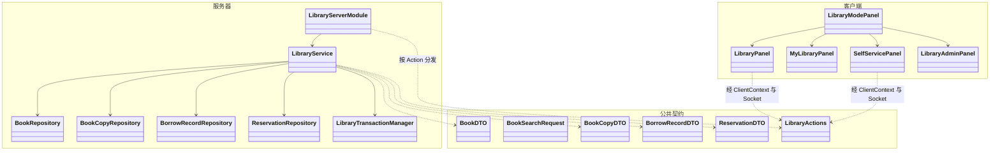
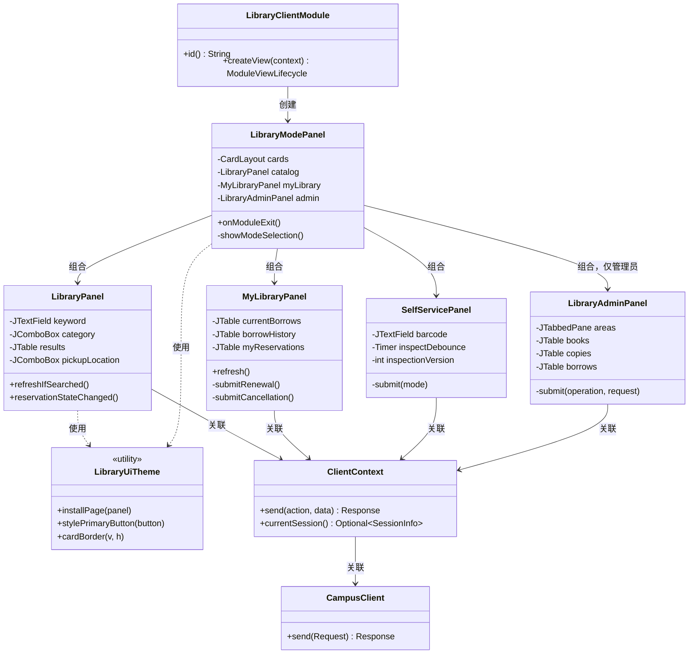
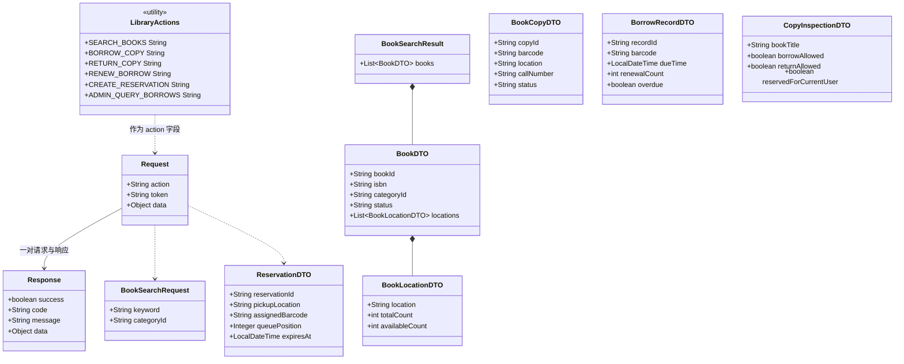
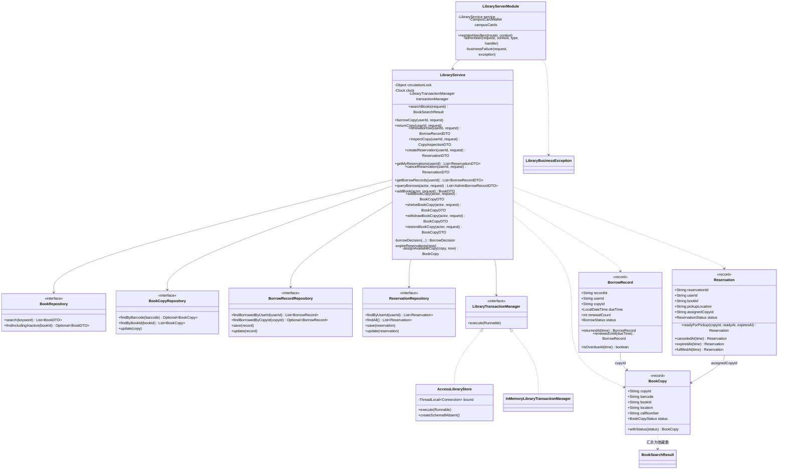
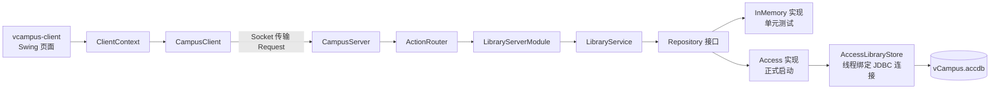
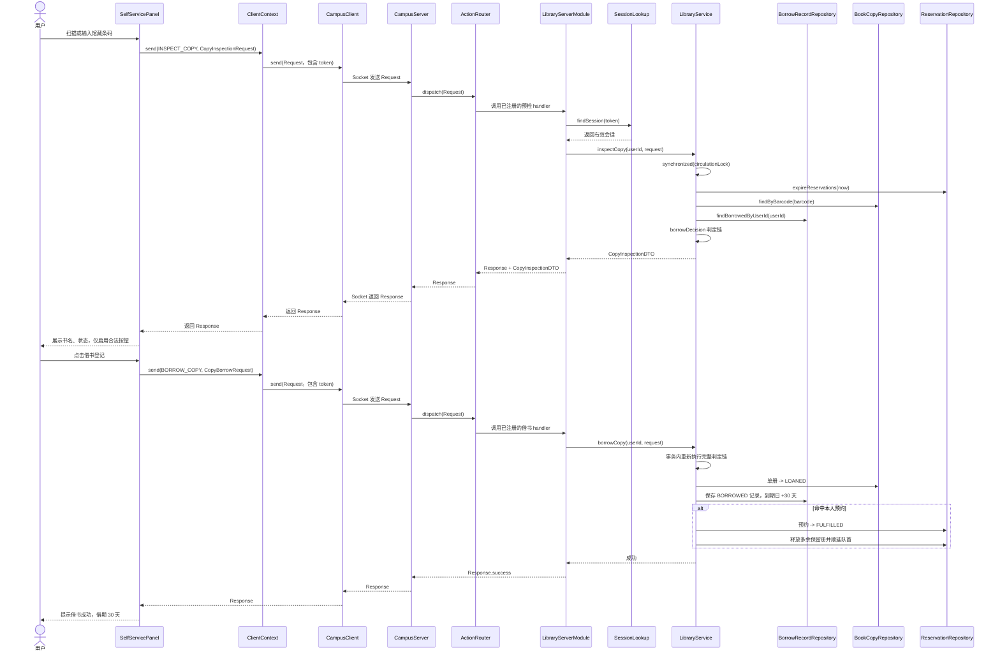
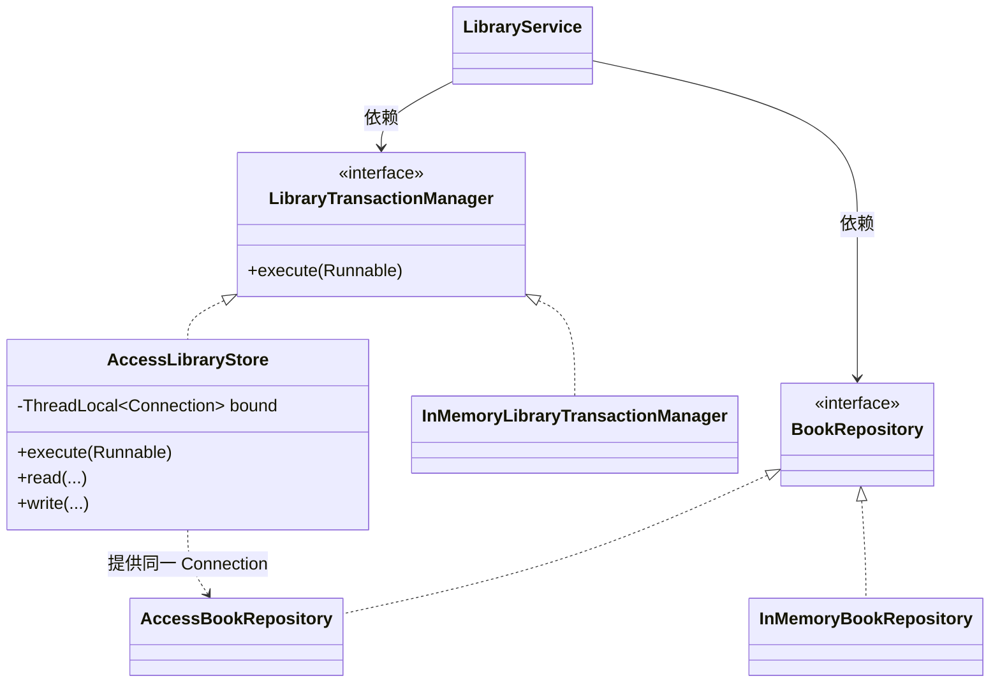

# 图书馆模块 UML 设计

> 本文是图书馆模块的类结构与调用关系设计记录。模块的功能规则、Action 契约与数据字典见
> [借阅归还交付说明](library-borrow-return.md)、[管理员维护说明](library-admin-maintenance.md)
> 与 [图书馆数据字典](../../database/schema/library.md)。

## 1. 设计目标

图书馆模块实现的是一条完整的馆藏流通链路：管理员维护书目与实体单册，读者按关键词与分类检索馆藏，
线上预约并到模拟终端扫码取书，归还后由管理员确认归架。核心设计判断有三条：

1. **书目与实体单册分离**。`BookDTO` 只描述书目元数据，`BookCopy` 才是可借还的物理对象。
   馆藏数与可借数不落库，由未注销单册的状态按馆藏地实时汇总，避免两套事实来源。
2. **读者检索与借还分离**。检索结果页不提供借书按钮，实体书必须走到模拟自助终端扫描条码，
   模拟真实图书馆"线上预约、到馆取书"的流程。
3. **服务层单一临界区**。全部业务规则集中在 `LibraryService`，由一把 `circulationLock`
   串行化，管理操作与流通操作不交错；持久化由 `LibraryTransactionManager` 抽象，
   Access 实现让一次业务中的多个 Repository 复用同一个 JDBC 连接。

正式启动使用 Access 持久化，普通单元测试仍注入 InMemory Repository。两套实现共享同一组
Repository 接口与同一套业务规则。

## 2. UML 类图

### 2.1 投屏讲解版

这张图只保留跨层主干，适合课堂交流和答辩投屏。各类的职责见表 3。

### 2.2 完整类图（分区展示）

#### 2.2.1 客户端类图

`LibraryMessages` 提供错误码到中文文案的映射，`LibraryCategories` 提供分类下拉的占位选项，
两者都是无状态的工具类型，图中省略。

#### 2.2.2 公共契约类图

`LibraryActions` 共定义 22 个常量（10 个读者与通用、12 个管理），完整清单见
[借阅归还交付说明](library-borrow-return.md) 与 [管理员维护说明](library-admin-maintenance.md)。

#### 2.2.3 服务器类图

Repository 接口各有两套实现：`InMemory*Repository` 用于单元测试与 `ServerModules.createRouter()`
创建的普通测试服务器，`Access*Repository` 用于正式启动。两套实现共享同一组接口与同一套业务规则。

#### 2.2.4 跨层关系图

## 3. 类的职责

### 客户端

- `LibraryClientModule`：图书馆客户端模块入口，实现统一的 `ClientModule` 接口。
- `LibraryModePanel`：模式选择与容器。三张入口卡片分别对应线上图书馆、图书管理员工作台和模拟终端；
  管理员入口只在 `canAdminister(LIBRARY)` 时创建。离开模块时复位到模式选择页。
- `LibraryPanel`：馆藏查询与线上预约。收集关键词与分类、展示按馆藏地汇总的馆藏详情、提交预约。
- `MyLibraryPanel`：我的图书馆。当前借阅、历史借阅、我的预约三个页签，含续借与取消预约。
- `SelfServicePanel`：模拟自助终端。条码输入带 350 毫秒防抖与版本号，预检结果决定借书/归还按钮的启用。
- `LibraryAdminPanel`：图书管理员工作台。书目维护、实体单册、借阅查询三个页签。
- `LibraryUiTheme`：统一的色板、卡片、按钮与表格状态着色。
- `ClientContext`：为业务页面提供带当前登录 token 的统一发送方法。
- `CampusClient`：负责底层 Socket 请求与响应传输。

### 公共契约

- `LibraryActions`：定义 22 个稳定的公开操作名。
- `BookSearchRequest` / `BookSearchResult`：检索请求与结果外壳。
- `BookDTO` / `BookLocationDTO`：书目元数据与按馆藏地汇总的馆藏数/可借数。
- `BookCopyDTO` / `CopyInspectionDTO`：单册资料与终端预检结论。
- `BorrowRecordDTO` / `AdminBorrowRecordDTO`：读者视角与管理视角的借阅记录。
- `ReservationDTO`：预约状态、排队位次、分配条码与取书截止时间。
- `Request`、`Response`：所有模块共用的网络消息外壳。

借还类请求 DTO **不包含 `userId`**：当前用户一律由 `Request.token` 推导，防止越权代操作。

### 服务器

- `CampusServer`：监听 Socket、读取公共 `Request`，并把合法请求交给 `ActionRouter`。
- `ActionRouter`：根据 Action 将公共请求分发给对应 handler，并兜底异常。
- `LibraryServerModule`：注册 22 个 handler，完成身份验证、请求 DTO 类型校验、管理动作鉴权与响应组织。
- `LibraryService`：承载全部业务规则，是唯一持有 `circulationLock` 的临界区；不依赖 Socket 或 Swing。
- 五个 Repository 接口：定义书目、单册、分类、借阅记录与预约的数据边界。
- `AccessLibraryStore`：实现 `LibraryTransactionManager`，在事务开始时把同一个 JDBC Connection
  绑定到当前线程，供本模块全部 Access Repository 复用。
- `InMemoryLibraryTransactionManager`：通过快照与补偿维持内存实现的事务语义。
- `BookCopy` / `BorrowRecord` / `Reservation`：不可变领域记录，状态流转由 `withStatus`、
  `returnedAt`、`renewedUntil`、`readyForPickup`、`canceledAt`、`expiredAt`、`fulfilledAt`
  等方法派生新实例，不提供原地修改。

## 4. 类之间的关系

| 关系 | 类 | 含义 |
|---|---|---|
| 接口实现 | `LibraryClientModule` → `ClientModule` | 所有客户端模块使用统一入口加载页面 |
| 接口实现 | `LibraryServerModule` → `ServerModule` | 所有服务器模块使用统一入口注册 handler |
| 接口实现 | `AccessLibraryStore` → `LibraryTransactionManager` | Access 事务上下文的具体实现 |
| 接口实现 | `Access*Repository` → `*Repository` | 生产数据源实现统一的数据边界 |
| 组合 | `LibraryModePanel` → 四个业务面板 | 模式容器拥有全部子面板并负责切换 |
| 关联 | 全部业务面板 → `ClientContext` | 页面长期持有公共客户端上下文 |
| 创建依赖 | 业务面板 → 请求 DTO | 每次操作时创建请求对象 |
| 组合 | `BookSearchResult` → `BookDTO` → `BookLocationDTO` | 检索结果逐层包含馆藏汇总 |
| 组合 | `LibraryServerModule` → `LibraryService` | 服务器模块拥有图书馆业务服务 |
| 关联 | `CampusServer` → `ActionRouter` | Socket 服务器持有路由器并分发请求 |
| 接口依赖 | `LibraryService` → 五个 Repository 接口 | 业务规则只依赖数据边界，不依赖存储方式 |
| 接口依赖 | `LibraryService` → `LibraryTransactionManager` | 业务只声明事务边界，不关心实现 |
| 引用 | `BorrowRecord` → `BookCopy`（`copyId`） | 借阅记录关联具体单册，不直接保存 `bookId` |
| 引用 | `Reservation` → `BookCopy`（`assignedCopyId`） | 待取预约占用一份被保留的单册 |
| 调用依赖 | `LibraryServerModule` → `ServerContext` | 处理请求时查询 token 是否有效 |

图中 `<|..` 表示接口实现，`-->` 表示关联或持有，`*--` 表示组合，`..>` 表示临时依赖或调用。

## 5. 条码借书时序图

选择这条链路是因为它同时覆盖了身份校验、临界区、状态机、事务与预约联动。

预检与正式提交复用同一条 `borrowDecision` 判定链：预检只返回结论供界面控制按钮，
正式提交在事务内重新执行全部校验，因此客户端的按钮状态不构成安全边界。

## 6. 设计理由

1. **书目与实体单册分离**：`BookDTO` 不含库存字段，`totalCount` / `availableCount` 由单册状态
   按馆藏地实时汇总。这样"某馆藏地还有几本可借"永远只有一个事实来源，不会出现库存与实际单册不一致。
2. **界面与网络分离**：业务面板不直接操作 Socket，而是通过 `ClientContext` 发送请求。
3. **客户端与服务器共享契约**：请求与响应 DTO 位于 `vcampus-common`，双方使用同一份定义。
4. **统一路由扩展方式**：图书馆模块通过 `ServerModule.registerHandlers` 注册自己的 Action，
   服务器核心不需要知道模块内部细节。
5. **服务器负责安全校验**：客户端隐藏入口、禁用按钮只用于改善体验；服务器对每个 Action
   独立校验 token、管理权与业务规则，借还身份只从会话推导。
6. **业务与数据分离**：`LibraryService` 只依赖 Repository 接口与事务抽象。
7. **单一临界区**：全部读写都在 `circulationLock` 内串行执行，管理操作与流通操作共用同一临界区，
   避免"管理员注销单册"与"读者借同一单册"交错破坏状态。
8. **事务边界显式化**：多表写入通过 `LibraryTransactionManager.execute` 声明为一个事务，
   Access 实现让多个 Repository 复用同一连接，任一步失败整体回滚。

## 7. 数据源与事务设计

数据源替换已经完成：正式启动使用 `AccessLibraryStore`，单元测试仍用内存实现。
两者共享同一组 Repository 接口。

`LibraryServerModule.createAccessBacked(databasePath)` 是生产组装点：它创建
`AccessLibraryStore`，用同一 store 构造五个 Access Repository，再注入 `LibraryService`。
`ServerModules.createRouter()` 则用内存实现组装普通测试服务器。

需要替换存储方式时，只需新增一组 Repository 实现与一个事务管理器实现，并在组装点替换；
`LibraryService`、客户端页面与公共 DTO 都不需要改动。
