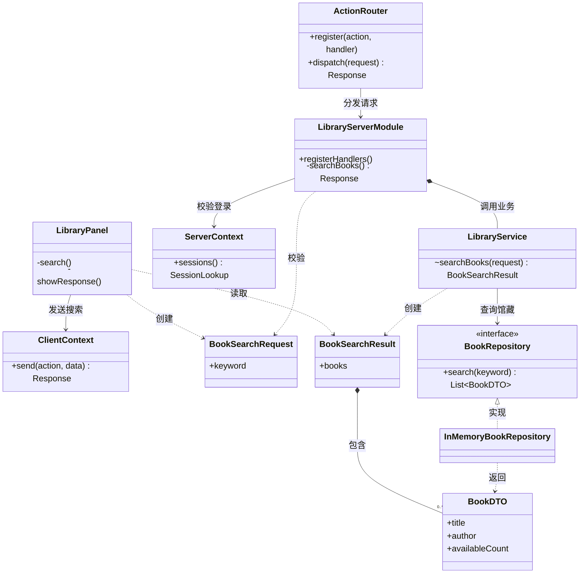
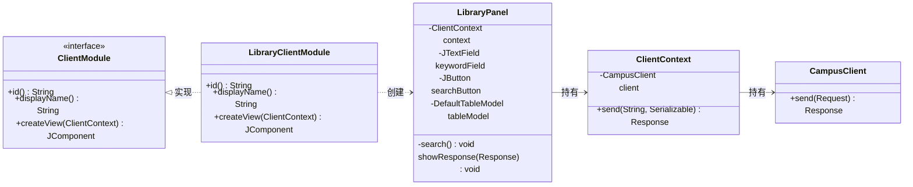
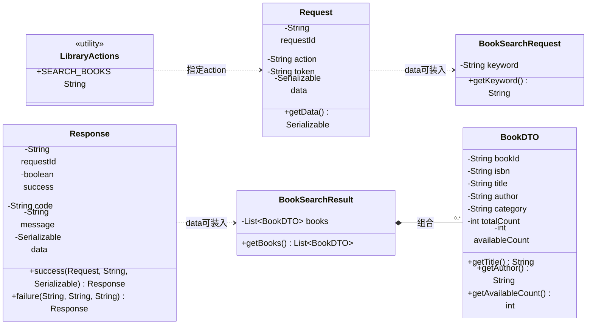
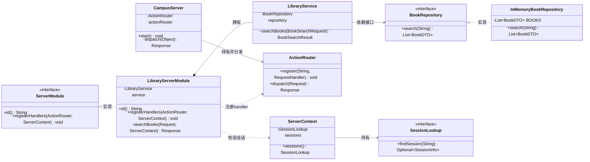
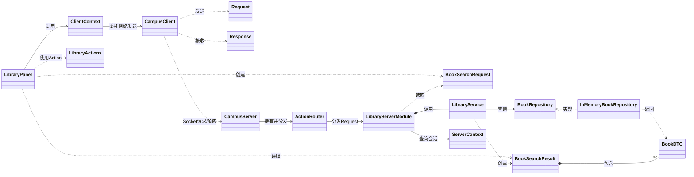
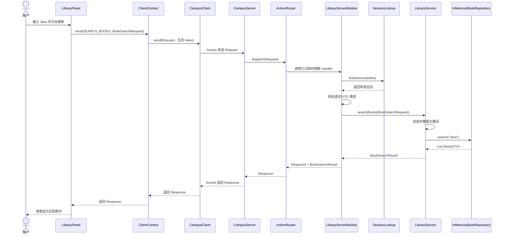
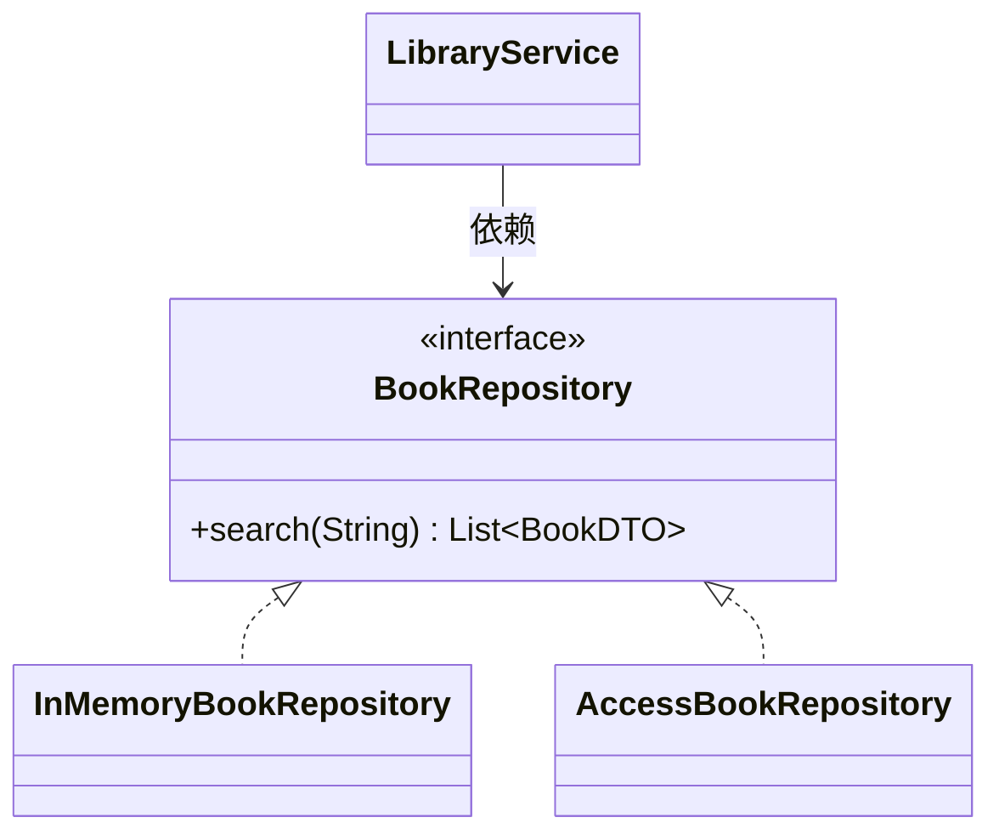

# 图书馆检索功能 UML 设计

## 1. 设计目标

第一轮实现一条小而完整的图书检索链路：已登录用户在 Swing 页面输入关键词，客户端通过 Socket 发送请求，服务器完成身份与参数校验后查询馆藏，并将结果返回页面显示。

当前使用内存馆藏完成演示。后续接入 Access 数据库时，主要替换数据访问实现，客户端页面和公共请求协议不需要大幅修改。

## 2. UML 类图

### 2.1 投屏讲解版

这张图只保留检索功能的核心类，适合课堂交流和投屏讲解。

### 2.2 完整类图（分区展示）

以下四张子图合起来构成完整类图。拆分只改变展示方式，不省略实际类或跨层关系。

#### 2.2.1 客户端类图

#### 2.2.2 公共契约类图

#### 2.2.3 服务器类图

#### 2.2.4 跨层关系图

## 3. 类的职责

### 客户端

- `LibraryClientModule`：图书馆客户端模块入口，实现统一的 `ClientModule` 接口并创建检索页面。
- `LibraryPanel`：收集关键词、异步发送请求、处理响应并把图书数据显示到表格。
- `ClientContext`：为业务页面提供带当前登录 token 的统一发送方法。
- `CampusClient`：负责底层 Socket 请求和响应传输。

### 公共契约

- `LibraryActions`：定义稳定的公开操作名 `LIBRARY.SEARCH_BOOKS`。
- `BookSearchRequest`：封装用户输入的检索关键词。
- `BookSearchResult`：封装一次检索返回的图书集合。
- `BookDTO`：描述一本图书的基础信息和馆藏数量。
- `Request`、`Response`：所有模块共用的网络消息外壳。

### 服务器

- `CampusServer`：监听 Socket、读取公共 `Request`，并把合法请求交给 `ActionRouter`。
- `LibraryServerModule`：注册搜索 handler，完成身份验证、请求 DTO 类型校验、业务调用和响应组织。
- `LibraryService`：完成关键词非空、非空白、长度和去除首尾空格等业务参数校验，并组织搜索结果；它不依赖 Socket 或 Swing。
- `BookRepository`：定义馆藏查询的数据边界，后续可由 Access/JDBC 实现。
- `InMemoryBookRepository`：保存第一轮演示数据，并按书名、作者、ISBN 或分类进行匹配。
- `ActionRouter`：根据 Action 将公共请求分发给对应 handler。
- `ServerContext`：向业务模块提供共享的会话查询能力。
- `SessionLookup`：根据 token 查找当前登录用户。

## 4. 类之间的关系

| 关系 | 类 | 含义 |
|---|---|---|
| 接口实现 | `LibraryClientModule` → `ClientModule` | 所有客户端模块使用统一入口加载页面 |
| 接口实现 | `LibraryServerModule` → `ServerModule` | 所有服务器模块使用统一入口注册 handler |
| 创建依赖 | `LibraryClientModule` → `LibraryPanel` | 进入图书馆模块时创建检索页面 |
| 关联 | `LibraryPanel` → `ClientContext` | 页面长期持有公共客户端上下文 |
| 创建依赖 | `LibraryPanel` → `BookSearchRequest` | 每次搜索时创建请求 DTO |
| 组合 | `BookSearchResult` → `BookDTO` | 一次搜索结果包含零到多本图书 |
| 组合 | `LibraryServerModule` → `LibraryService` | 服务器模块拥有图书馆业务服务 |
| 关联 | `CampusServer` → `ActionRouter` | Socket 服务器持有路由器，并把读取到的公共请求交给它分发 |
| 接口依赖 | `LibraryService` → `BookRepository` | 业务规则只依赖数据边界，不依赖具体存储方式 |
| 接口实现 | `InMemoryBookRepository` → `BookRepository` | 内存数据源实现统一查询接口 |
| 调用依赖 | `LibraryServerModule` → `ServerContext` | 处理请求时查询 token 是否有效 |
| 调用依赖 | `LibraryServerModule` → `ActionRouter` | 初始化时登记搜索 handler |

图中 `<|..` 表示接口实现，`-->` 表示关联或持有，`*--` 表示组合，`..>` 表示临时依赖或调用。

## 5. 搜索时序图

## 6. 设计理由

1. **界面与网络分离**：`LibraryPanel` 不直接操作 Socket，而是通过 `ClientContext` 发送请求。
2. **客户端与服务器共享契约**：请求和响应 DTO 位于 `vcampus-common`，避免双方使用不同的数据格式。
3. **统一路由扩展方式**：图书馆模块通过 `ServerModule.registerHandlers` 注册自己的 Action，服务器核心不需要知道模块内部细节。
4. **服务器负责安全校验**：即使客户端页面只能在登录后进入，服务器仍会独立校验 token 和关键词，不能依赖客户端保证安全。
5. **业务与数据分离**：`LibraryService` 只依赖 `BookRepository` 接口。当前使用内存实现，后续接入 Access/JDBC 时不需要改变页面、公共协议或业务服务。

## 7. 数据源替换设计

当前已经通过 `BookRepository` 隔离数据来源。接入数据库时，主要新增一个数据库实现，并在服务端组装处替换当前内存实现：

`LibraryServerModule` 依赖 `LibraryService`，`LibraryService` 通过构造方法接收 `BookRepository`。当前默认构造函数组装的是 `new LibraryService(new InMemoryBookRepository())`。正式接入数据库时，需要新增 `AccessBookRepository`（或 JDBC 实现），并在这一服务端组装处替换 Repository 实现；`LibraryService`、客户端页面和公共 DTO 不需要因存储方式而大幅修改。
