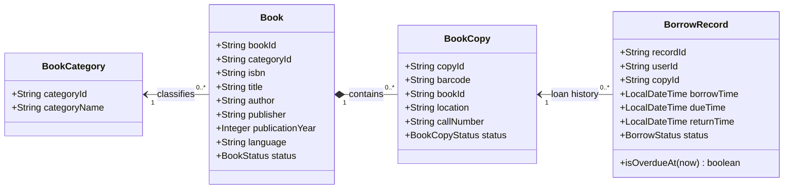
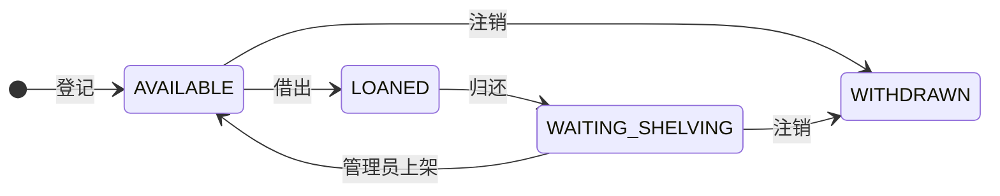
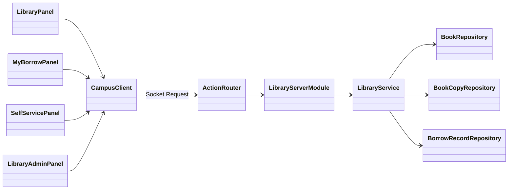

# 图书馆 V2 精简设计提案

> **状态：本提案已全部落地。** 下文"本版只做什么 / 不进入本版"记录的是提出时的范围，
> 其后模块继续扩展，新增了预约队列、续借、条码预检、可恢复注销与可扩展分类。
> 阅读时请以 [借阅归还交付说明](library-borrow-return.md)、
> [管理员维护说明](library-admin-maintenance.md) 与
> [SRS 第 8 章](../design/SOFTWARE_DESIGN_SPECIFICATION.md) 为准。  
> 目标：在现有架构和 Epic #6 范围内，把“按数量借书”升级为“借具体实体单册”。

## 1. 本版只做什么

1. 管理员维护书目，并登记带唯一条码的实体单册；
2. 用户按关键词、分类检索，查看馆藏位置、馆藏数和可借数；
3. 用户在“自助借还”页输入条码，模拟扫描实体书；
4. 借书关联具体单册，归还后由管理员确认重新上架；
5. 用户查看自己的当前借阅、历史记录和逾期状态；
6. 图书管理员查看全馆借阅记录并筛选逾期记录。

提出时约定：预约、委托、书评、书架、续借、荐购、欠款、采购、盘点、遗失赔偿、消息通知和
真实扫码硬件均不进入本版，学期末提醒只保留为后续需求。

> 后续变化：**预约与续借已在本版之后实现**（预约含 24 小时保留、稳定 FIFO 队列、
> 7 天爽约冷却与取消顺延；续借为一次、从原到期日顺延 30 天）。其余项目仍不在范围内。

## 2. 为什么不在搜索结果中直接借书

搜索结果代表书目，例如《白夜行》，不能证明用户已经拿到某一本实体书。
真实借阅必须识别一个具体条码。因此本项目把借还入口放到独立的“自助借还”页，
用输入条码模拟自助机扫描；当前读者仍然从 `Request.token -> SessionInfo.userId` 获取，
请求中不允许提交 userId。

数智东南截图中的“预约”和“委托”都是取得图书的申请，不等于完成借阅：

- 没有可借馆藏时可以预约；
- 其他馆藏地有书时可以委托取书；
- 真正形成借阅记录仍需要处理具体实体书。

## 3. 核心类



- `Book`：书名、ISBN、作者等书目信息；
- 每个 `Book` 在 V2 中只属于一个 `BookCategory`，通过 `categoryId` 关联；
- `BookCopy`：馆里某一本实体书，条码唯一；
- `BorrowRecord`：某用户借过某个具体单册；
- `Book` 不再保存可手工修改的 `totalCount/availableCount`，数量由单册统计。

## 4. 状态

书目状态：

```text
ACTIVE      开放借阅
INACTIVE    停止借阅，但保留馆藏和历史，可以重新开放
```

单册状态：



> 注：本图是提出时的状态机。预约落地后新增 `RESERVED` 状态，流转扩展为
> `AVAILABLE -> RESERVED`（预约分配）、`RESERVED -> LOANED`（本人取书）、
> `RESERVED -> AVAILABLE`（取消或过期并顺延队首）；同时新增误注销恢复边
> `WITHDRAWN -> AVAILABLE`。`LOANED` 与 `RESERVED` 均不可注销。
> 完整状态机见 [图书馆数据字典](../../database/schema/library.md)。

规则：

- 只有 `Book.status == ACTIVE` 且 `BookCopy.status == AVAILABLE` 才能借；
- 已借出的单册不能重复借或注销；
- 归还后先进入 `WAITING_SHELVING`，管理员上架后才恢复可借；
- `WITHDRAWN` 是保留历史的逻辑注销，不物理删除；
- 书目变为 `INACTIVE` 不影响已有借阅正常归还。UI 使用“开放借阅/停止借阅”，
  避免与实体单册的“待上架”混淆。

汇总数量：

```text
馆藏数 = 非 WITHDRAWN 单册数
可借数 = 书目 ACTIVE 且单册 AVAILABLE 的数量
```

## 5. 继续沿用现有分层



暂不拆成多个 Service，减少重构量：

- `LibraryServerModule` 负责路由、会话校验、DTO 类型校验和 Response 转换；
- `LibraryService` 负责检索、借还、维护和所有业务规则；
- Repository 负责数据访问；
- InMemory 阶段继续使用同一把服务锁；接入 Access 后，跨 Repository 写入使用同一 JDBC 事务。
- Access 实现必须由同一事务边界向相关 Repository 提供同一个 JDBC `Connection`；
  Repository 不得在一次借还业务中各自打开连接、独立提交或关闭共享连接。
  具体采用 TransactionManager、显式传递 Connection 或统一 Library DAO，在实现 Access 时决定。

## 6. 借还规则

借书时，服务器在同一临界区/事务内：

1. 从 session 取得当前 userId；
2. 按条码找到 BookCopy 和 Book；
3. 检查书目 ACTIVE、单册 AVAILABLE；
4. 查询用户当前所有 BORROWED 记录及其单册；
5. 检查最多同时借 5 本、没有逾期未还，并且不存在相同 `bookId` 的未归还记录；
6. 创建 30 天借期的 BORROWED 记录；
7. 将单册改为 LOANED；
8. 两步必须同时成功或同时失败。

归还时，服务器在同一临界区/事务内：

1. 从 session 取得当前 userId；
2. 按条码找到当前 BORROWED 记录，并验证属于当前用户；
3. 写入 returnTime，将记录改为 RETURNED；
4. 将单册改为 WAITING_SHELVING；
5. 两步必须同时成功或同时失败。

逾期仍由 `status == BORROWED && dueTime < now` 动态计算，不保存永久的 overdue 字段。

领域不变量：

```text
BorrowRecord.status == BORROWED  => returnTime == null
BorrowRecord.status == RETURNED  => returnTime != null

一个 BookCopy 同一时刻最多存在一条 BORROWED 记录
BookCopy.status == LOANED
<=> 存在该 copyId 对应的 BORROWED 记录
```

这些不变量必须由 Service 校验，并通过 Repository/事务保证并发下仍成立。

## 7. 最小接口变化

以下接口已全部实现（最终交付 22 个 Action，本表只列当时计划的核心部分）。

### 普通用户

| Action | 请求 | 说明 |
|---|---|---|
| `SEARCH_BOOKS` | keyword、categoryId | 返回书目及按馆藏地分组的馆藏/可借汇总 |
| `GET_BORROW_RECORDS` | 无 data | 只返回当前用户记录 |
| `BORROW_COPY` | barcode | session 用户借具体单册 |
| `RETURN_COPY` | barcode | session 用户归还自己的单册 |

### 图书管理员

| Action | 说明 |
|---|---|
| `ADMIN_SEARCH_BOOKS` | 查询全部书目，包括 INACTIVE |
| `ADD_BOOK` / `UPDATE_BOOK` | 新增、修改书目 |
| `SET_BOOK_STATUS` | 上架或下架书目 |
| `ADD_BOOK_COPY` | 登记条码、所属书目、位置和索书号 |
| `UPDATE_BOOK_COPY` | 只修改 location、callNumber |
| `SHELVE_BOOK_COPY` | 待上架变为可借 |
| `WITHDRAW_BOOK_COPY` | 注销未借出的单册 |
| `ADMIN_QUERY_BORROWS` | 查询全馆当前、历史及逾期记录 |

所有管理 Action 在服务器检查图书管理范围。管理员查询 DTO 可以返回稳定 userId；
姓名和学号只有在用户模块提供经过评审的只读查询接口后再增加。

`UPDATE_BOOK_COPY` 不得修改 `copyId`、`bookId`、`barcode` 或 `status`。条码登记后不可修改；
状态只能由借书、归还、`SHELVE_BOOK_COPY` 和 `WITHDRAW_BOOK_COPY` 等专用业务操作改变，
禁止通过通用更新绕过状态机。

搜索结果不在 `BookDTO` 中放一个单值 location，而是使用分组结构：

```text
BookLocationDTO
├─ location
├─ totalCount
└─ availableCount
```

每条书目结果包含 `List<BookLocationDTO>`。同一书目分布在多个馆藏地时分别统计，
例如“九龙湖馆 3F：馆藏 2、可借 1”和“四牌楼馆 2F：馆藏 1、可借 1”。

## 8. 页面

```text
普通用户
├─ 图书检索：关键词、分类、馆藏地、馆藏/可借
├─ 自助借还：输入条码，借书或归还
└─ 我的借阅：当前、历史、应还日期、逾期提示

图书管理员
├─ 书目管理：新增、编辑、上下架
├─ 单册管理：条码、位置、待上架、注销
└─ 借阅管理：当前、历史、逾期
```

## 9. 实施顺序

1. 先评审本设计并更新 Epic；
2. 只实现领域模型、InMemory Repository 和按馆藏地搜索汇总，并完成测试；
3. 确认 `Book -> BookCopy` 关系与统计结果后，再把借阅记录从 `bookId` 改为 `copyId`；
4. 实现条码借还、待上架和相应业务规则测试；
5. 最后改造普通用户与管理员页面，并补权限、并发、失败回滚和 Socket UI 测试；
6. 接入 Access，用事务保证借阅记录与单册状态一致。

## 10. 最小演示流程

```text
管理员新增书目并登记两个条码
→ 用户搜索：馆藏 2 / 可借 2
→ 用户在自助借还页输入一个条码
→ 搜索变为：馆藏 2 / 可借 1
→ 我的借阅出现具体单册和应还日期
→ 用户输入条码归还：单册待上架
→ 管理员确认上架：可借数恢复
```
